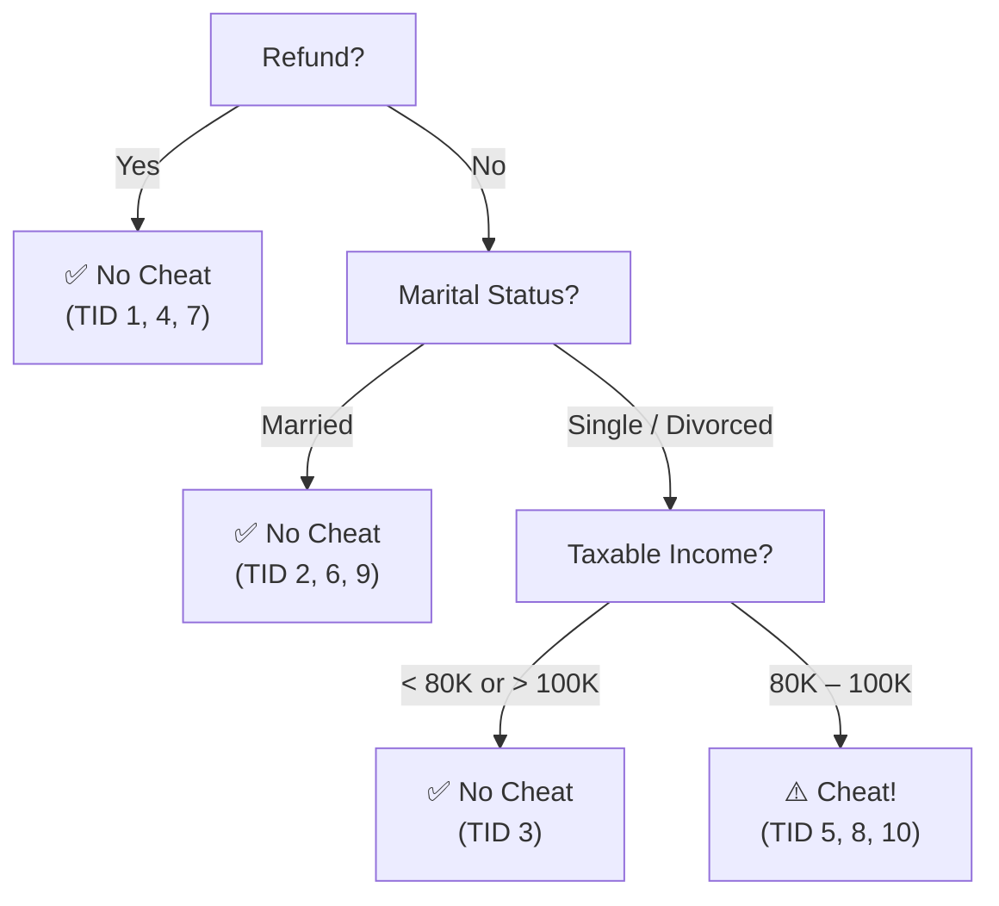

# Supervised Learning & Decision Trees
### GenAI Batch-2 — Session Notes

---

## 1. Quick Recap: Evaluation Metrics (Previous Session)

### Confusion Matrix

|  | Predicted Positive | Predicted Negative |
|---|---|---|
| **Actual Positive** | TP (True Positive) | FN (False Negative) |
| **Actual Negative** | FP (False Positive) | TN (True Negative) |

### Key Metrics Derived

| Metric | Formula | Focus | Want |
|---|---|---|---|
| **Precision** | TP / (TP + FP) | Quality of positive predictions | FP → 0 |
| **Recall / Sensitivity** | TP / (TP + FN) | Coverage of actual positives | FN → 0 |
| **F1 Score** | 2 × (P × R) / (P + R) | Harmonic mean of P & R | Both high |
| **Accuracy** | (TP + TN) / All | Overall correctness | Both FP, FN → 0 |
| **Specificity** | TN / (TN + FP) | Coverage of actual negatives | FP → 0 |
| **False Positive Rate** | FP / (TN + FP) | Rate of wrong positive calls | Low |
| **False Negative Rate** | FN / (TP + FN) | Rate of wrong negative calls | Low |

> **Precision vs Recall Trade-off**: Inverse relationship — you can't maximize both simultaneously. F1 score gives a balanced view.

### ROC Curve

```
TPR (Sensitivity)
1.0 |      *
    |    *
    |  * ← Ideal: curve hugs top-left corner
    | *
0.0 +--------→ FPR (1 - Specificity)
    0.0      1.0
```

- **AUC (Area Under Curve)**: Higher = better model. Ideal ≈ 1.0.

---

## 2. Supervised Learning

```
┌────────────────────────────────────────────────────┐
│              SUPERVISED LEARNING                   │
│                                                    │
│  Training Data                                     │
│  ┌──────────────────────────────┐                  │
│  │  X₁  X₂  X₃  ... Xₙ  │  Y  │  ← Class Label   │
│  │  (independent variables)    │  (dependent)     │
│  └──────────────────────────────┘                  │
│           │                                        │
│           ▼                                        │
│     Learn Function F: F(X) = Y                     │
│           │                                        │
│           ▼                                        │
│     Classifier Model                               │
│           │                                        │
│           ▼                                        │
│  Unseen Data (no Y) → Predict Y                    │
└────────────────────────────────────────────────────┘
```

**Why "supervised"?** — Because class labels (Y) are *given* in training data.

**Analogy: The Talking Parrot**

| Parrot | Classifier |
|---|---|
| Memorizes Q&A pairs | Learns from training data |
| Answers learned questions correctly | Predicts seen patterns correctly |
| Fails on new questions | Fails on unseen patterns not in training data |

---

## 3. Classification Task

**Goal**: Learn function `F` such that `F(X) = Y`

### Workflow

```
Training Data (X + Y)
       │
       ▼
  Build Classifier ──────────────────────────────────────────────┐
       │                                                          │
       ▼                                                          │
  Test Data (X + Y)   ← used to evaluate, not to train           │
       │                                                          │
       ▼                                                          │
  Compare predicted Y vs actual Y → Accuracy                     │
       │                                                          │
       ▼                                                          │
  Accuracy OK? ──Yes──→ Deploy: predict on unseen data           │
       │                                                          │
       No ──────────────────────────────────────────────────────→ ┘
                         (rebuild / adjust)
```

### Why enough training data matters

For `Y = mX + c` (simplest possible classifier):
- 1 data point → cannot solve for `m` and `c`
- 2 data points → solvable
- Real models need much more data to learn a complex `F`

---

## 4. Decision Tree — Structure

```
                    ┌─────────────┐
                    │  Root Node  │  ← No incoming edges
                    │  (Refund?)  │
                    └──────┬──────┘
                   Yes /       \ No
                      /         \
             ┌────────┐       ┌────────┐
             │Internal│       │Internal│  ← One incoming, ≥1 outgoing
             │  Node  │       │  Node  │
             └────┬───┘       └────┬───┘
                  │                │
           ┌──────┴──────┐   ┌─────┴──────┐
           │  Leaf Node  │   │  Leaf Node │  ← No outgoing edges
           │  Class = 0  │   │  Class = 1 │    Holds the prediction
           └─────────────┘   └────────────┘
```

| Node Type | Incoming | Outgoing | Purpose |
|---|---|---|---|
| Root | 0 | ≥ 1 | Entry point |
| Internal | 1 | ≥ 1 | Test an attribute |
| Leaf | 1 | 0 | Store predicted class |

> Trees are **not unique**. Many valid trees can be built from the same data. The algorithm finds the most optimal one.

---

## 5. Hunt's Algorithm

**Idea**: Recursively split records to make subsets progressively purer.

### Dataset (Income Tax Cheating)

| TID | Refund | Marital Status | Taxable Income | Cheat? |
|---|---|---|---|---|
| 1 | Yes | Single | 125K | No |
| 2 | No | Married | 100K | No |
| 3 | No | Single | 70K | No |
| 4 | Yes | Married | 120K | No |
| 5 | No | Divorced | 95K | Yes |
| 6 | No | Married | 60K | No |
| 7 | Yes | Divorced | 220K | No |
| 8 | No | Single | 85K | Yes |
| 9 | No | Married | 75K | No |
| 10 | No | Single | 90K | Yes |

**Pre-processing (fixed before building tree):**
- `Taxable Income` → `[80K–100K]` vs `< 80K or > 100K`
- `Marital Status` → `Married` vs `Single/Divorced`
- `Refund` → `Yes` vs `No`

---

### Step-by-Step Tree Construction

**Step 1** — Root: 10 records, mixed (7 No, 3 Yes). Split on **Refund**.

```
                   [Refund?]
                  /          \
            Yes               No
         TID:1,4,7          TID:2,3,5,6,8,9,10
         All → No ✅          Mix → split again
```

**Step 2** — Refund=No: 7 records, still mixed. Split on **Marital Status**.

```
           [Marital Status?]
          /                  \
     Married             Single/Divorced
    TID:2,6,9              TID:3,5,8,10
    All → No ✅             Mix → split again
```

**Step 3** — Single/Divorced: 4 records, still mixed. Split on **Taxable Income**.

```
           [Taxable Income?]
          /                   \
   <80K or >100K             80K–100K
      TID:3                   TID:5,8,10
      No ✅                    All → Yes ✅
```

---

### Final Decision Tree



### Predicting an Unseen Record

```
New record: Refund=No, Marital=Single, Income=88K

Root          → Refund = No         → go to Marital Status node
Marital Status → Single             → go to Taxable Income node
Taxable Income → 88K in [80K–100K] → LEAF: Cheat = Yes ⚠️
```

---

## 6. Which Split is Best?

Starting point: 20 records, 10 × C0, 10 × C1.

### Option A — Own Car (Yes/No)

```
           [Own Car?]
          /           \
        Yes             No
    C0=6, C1=4      C0=4, C1=6
    
    ❌ Both sides ~50-50. No clarity gained.
```

### Option B — Car Type (Family/Sports/Luxury) ✅

```
              [Car Type?]
          /       |        \
      Family   Sports     Luxury
     C0=1,C1=3  C0=8,C1=0  C0=1,C1=7
     
     ✅ Each group has a clear dominant class.
```

### Option C — Student ID (unique per person)

```
       [Student ID?]
      /  |   |  ... \
   ID1  ID2  ID3   ID20
    1    1    1  ...  1 record each
    
    ❌ "Pure" but useless — no grouping, pure overfitting.
```

### Comparison Table

| Option | Groups | Majority Exists? | Good? |
|---|---|---|---|
| A — Own Car | 2 | No (50-50) | ❌ |
| B — Car Type | 3 | Yes, clearly | ✅ Best |
| C — Student ID | 20 | Yes (trivially) | ❌ Worst |

> **Rule**: Best split = creates subsets where **one class dominates**. Measuring this formally uses **Information Gain** or **Gini Impurity** (next session).

---

## 7. Edge Cases

### Case 1 — Same attributes, different class labels

```
Record A: Refund=No, Single, 70K  →  Cheat = No
Record B: Refund=No, Single, 70K  →  Cheat = Yes
           ← identical attributes →    ← different labels!
```

All attributes exhausted. Tree **cannot converge**.

**Solutions:**
1. During pre-processing: assign a default class label for such conflicts
2. Don't use a decision tree — choose another algorithm

---

### Case 2 — Empty leaf node

```
Leaf: Refund=No, Single/Divorced, Income < 80K or > 100K
→ No training record reaches this node
```

**What to do**: Keep the node. Real-world data might reach it.
Assign label = parent node's majority class, or a default label.

---

### Case 3 — All records on one path

If all samples share the same attribute values → single-path tree.
No branching → no useful classification. **Don't use decision tree.**

---

## 8. Binary vs Multi-way Splits

```
Binary Split (2 branches)          Multi-way Split (n branches)
─────────────────────────          ────────────────────────────
      [Income]                            [Weight]
     /         \                         /    |    \
 < 80K       ≥ 80K                   Light Medium Heavy

  Simpler, fewer nodes              Shallower depth, wider breadth
  sklearn default                   Allowed but less common
```

---

## 9. Pre-processing Is a One-Way Door

```
Raw Data
    │
    ▼  ← EXPENSIVE on millions of records
Pre-processing
    │  • Discretize continuous attributes (bins / ranges)
    │  • Encode categoricals
    │  • Handle missing values
    │  • Drop duplicates / outliers
    ▼
Processed Data ──→ Build Model ──→ Evaluate ──→ Deploy
                        ▲
                        │ Poor accuracy?
                        │ Redo pre-processing? Very costly.
                        └── Better: explore data FIRST
```

**Best practice before pre-processing:**
- Check unique value distributions per column
- Find rows with identical attribute combinations but different class labels
- Use a **stratified sample** to prototype discretization cheaply before applying to full dataset

---

## 10. Cheat Sheet

```
┌──────────────────────────────────────────────────────────────┐
│                   DECISION TREES AT A GLANCE                 │
├────────────────────────┬─────────────────────────────────────┤
│ BUILD                  │ Training data → Hunt's → tree        │
│ PREDICT                │ Unseen record → root to leaf         │
│ STOP SPLITTING WHEN    │ All records at node = same class     │
│                        │ No attributes left                   │
│ BEST SPLIT             │ Clearest class majority in subsets   │
│ MEASURE (next session) │ Information Gain / Gini Impurity     │
├────────────────────────┼─────────────────────────────────────┤
│ STRENGTHS              │ WEAKNESSES                           │
│ • Interpretable        │ • Overfits if too deep               │
│ • Fast prediction      │ • Fails on non-unique attribute pairs│
│ • Available in sklearn │ • Multiple valid trees exist         │
├────────────────────────┼─────────────────────────────────────┤
│ Python                 │ sklearn.tree.DecisionTreeClassifier  │
│ Key params             │ max_depth, min_samples_split,        │
│                        │ criterion ('gini' or 'entropy')      │
├────────────────────────┼─────────────────────────────────────┤
│ NEXT UP                │ Random Forest = ensemble of N trees  │
│                        │ Final prediction = majority vote     │
└────────────────────────┴─────────────────────────────────────┘
```

---

*Previous notes: `ML_Similarity_Metrics_Notes.md`, `library_reference.md`*
*Next session topics: Information Gain, Gini Impurity, Random Forest*
