# ML Class Notes — KNN & Random Forest
**Course**: GenAI Batch-2 | **Instructor**: Durga Toshniwal (Theory) + Ashish Kumar (Hands-on)

---

## Table of Contents
1. [Recap — Decision Trees & Classifiers](#1-recap--decision-trees--classifiers)
2. [Eager Learners vs Lazy Learners](#2-eager-learners-vs-lazy-learners)
3. [Instance-Based Classifiers](#3-instance-based-classifiers)
4. [Rote Learner](#4-rote-learner)
5. [K-Nearest Neighbor (KNN)](#5-k-nearest-neighbor-knn)
6. [Choosing the Right K](#6-choosing-the-right-k)
7. [KNN — Key Characteristics](#7-knn--key-characteristics)
8. [Eager vs Lazy — When to Use Which](#8-eager-vs-lazy--when-to-use-which)
9. [Hands-on — Decision Tree Hyperparameter Tuning](#9-hands-on--decision-tree-hyperparameter-tuning)
10. [Hands-on — Random Forest](#10-hands-on--random-forest)
11. [Summary Comparison Table](#11-summary-comparison-table)

---

## 1. Recap — Decision Trees & Classifiers

In the previous session:
- **Classifiers** map input attributes → output class variable (the dependent variable)
- **Decision Tree Induction**: grow tree by selecting attributes one-by-one using entropy-based **Information Gain**
- Key concepts: underfitting, overfitting, tree pruning, attribute selection
- **Random Forest**: ensemble of decision trees (bagging — multiple trees trained on random subsets)

---

## 2. Eager Learners vs Lazy Learners

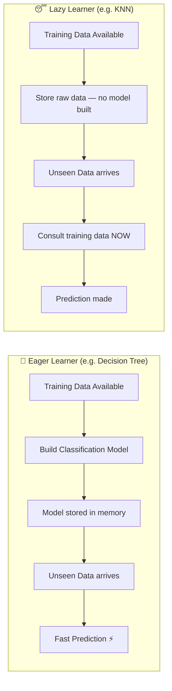

| Property | Eager Learner | Lazy Learner |
|---|---|---|
| Model building | At **training** time | At **prediction** time |
| Training time | **High** | Very Low |
| Prediction time | **Very Low** | High (depends on data size) |
| Global vs Local | Global model | Local model |
| Example | Decision Tree, Random Forest | KNN |

> **Analogy**: An eager learner is like a student who reads the material as soon as it is available and keeps the understanding ready before the exam. A lazy learner is a student who just sits on the material and only starts going through it when the exam is about to happen.

---

## 3. Instance-Based Classifiers

Instance-based classifiers are the canonical family of **lazy learners**:

- **Do not build any model** on the training data upfront
- Simply **store all training records**
- At prediction time, **consult the stored records** to classify an unseen data point

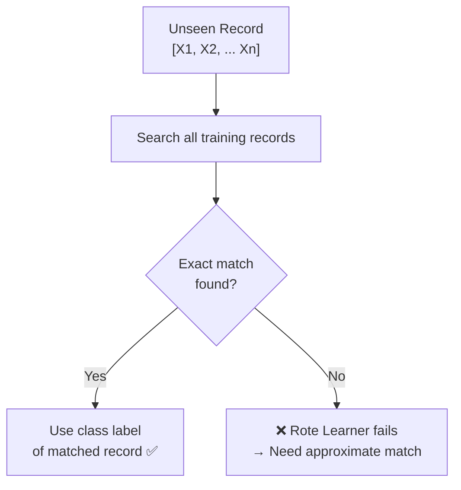

---

## 4. Rote Learner

A **Rote Learner** is the simplest instance-based classifier. It performs classification **if and only if** there is an **exact attribute-value match** between the unseen record and a training record.

### Limitation

| Scenario | Outcome |
|---|---|
| Exact attribute match found | Correct class label inferred ✅ |
| No exact match (any attribute differs) | Classifier cannot make prediction ❌ |
| Noisy data (noise point happens to match) | Wrong prediction ❌ |

With many attributes, an exact match is often impossible — the classifier fails silently.

**Solution → Approximate Matching → K-Nearest Neighbor**

Rather than requiring dissimilarity = 0 (exact match), KNN allows **tolerable positive dissimilarity** (approximate match).

---

## 5. K-Nearest Neighbor (KNN)

KNN is a **lazy, instance-based classifier** that classifies an unseen record by finding the **K closest training points** and taking a majority vote of their class labels.

> **Core Intuition**: If a person moves around with a group that has certain characteristics, that person likely shares those characteristics. If an animal looks like a duck, walks with ducks, and quacks like a duck — it probably is a duck.

### How KNN Works Step-by-Step

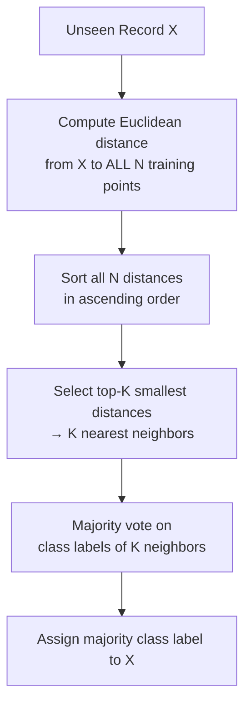

### Three Requirements for KNN

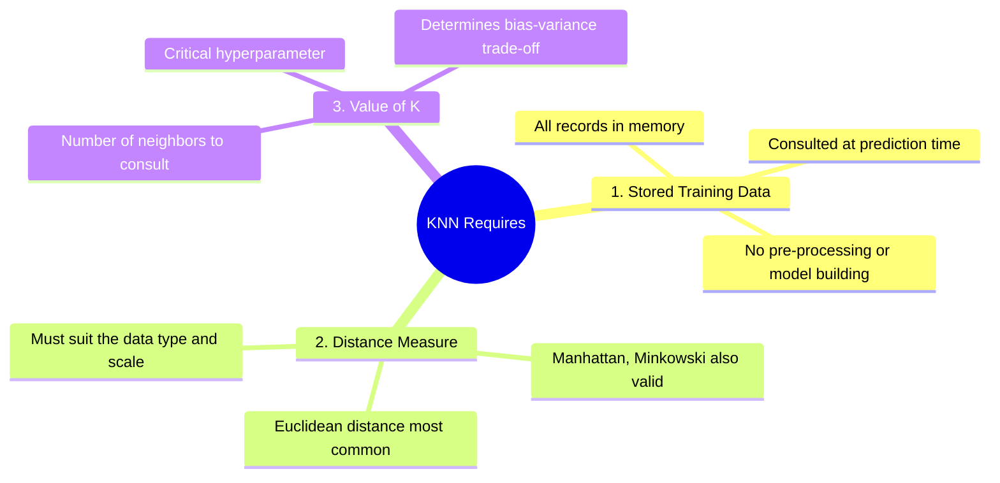

### Euclidean Distance

For two points **P** and **Q** in **D-dimensional** space (D = number of attributes):

$$d(P, Q) = \sqrt{\sum_{i=1}^{D} (p_i - q_i)^2}$$

**Worked example** with 3 attributes (X, Y, Z):

```
P = (X1, Y1, Z1)
Q = (X2, Y2, Z2)

d(P, Q) = √[ (X2−X1)² + (Y2−Y1)² + (Z2−Z1)² ]
```

Other distance measures (Manhattan, cosine similarity, etc.) can be used depending on the data — the choice of distance measure critically affects the notion of similarity.

### Computational Cost

> Whether K = 1 or K = 30, the **number of distance computations is identical**. The algorithm has no visual intuition — it must compute the distance from the unseen point to **every single training point**, then sort and pick the top-K. The value of K only affects how many of those sorted distances are used.

**Cost** = O(N × D) per prediction, where N = training set size, D = number of features.

---

## 6. Choosing the Right K

K is a **hyperparameter** that must be tuned. Incorrect K leads to overfitting or underfitting.

### Effect of K on the Decision Boundary

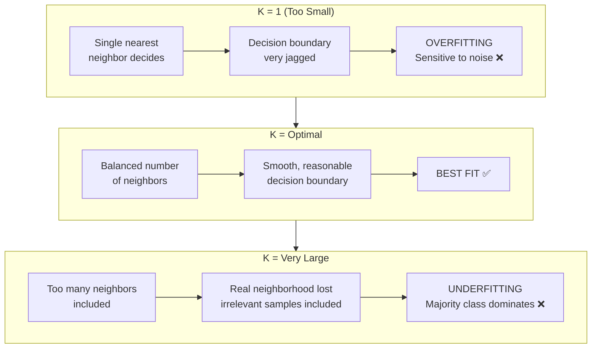

### K=1: Overfitting Example

Suppose the unseen record is surrounded mostly by **positive** class points, but one **noise point** with a **negative** label happens to be the closest:

- K=1 → picks the noise point → predicts **Negative** ← **Wrong!**
- K=5 → picks 4 positives + 1 noise → majority vote → **Positive** ← **Correct!**

### K=Large: Underfitting Example

If the true neighborhood is 5 points but K=30, the algorithm includes 25 extra irrelevant points from a region dominated by the opposite class — the true local signal is **drowned out**.

### Finding Optimal K — Elbow Method

Plot **performance metric** (accuracy, F1, recall, AUC) vs **K value** on a validation set:

```
Accuracy
   ↑
   |        ●—●—●
   |      ●         ●—●
   |    ●                 ●
   |  ●
   +——————————————————————→ K
      1   3   5   7  10  20
             ↑
         Optimal K
         (plateau begins)
```

- Performance is low for small K (overfit to noise)
- Rises to a **plateau** — the optimal range
- May decline again for very large K (underfit)
- **Select K at the start of the plateau** — beyond which increasing K no longer improves performance meaningfully

---

## 7. KNN — Key Characteristics

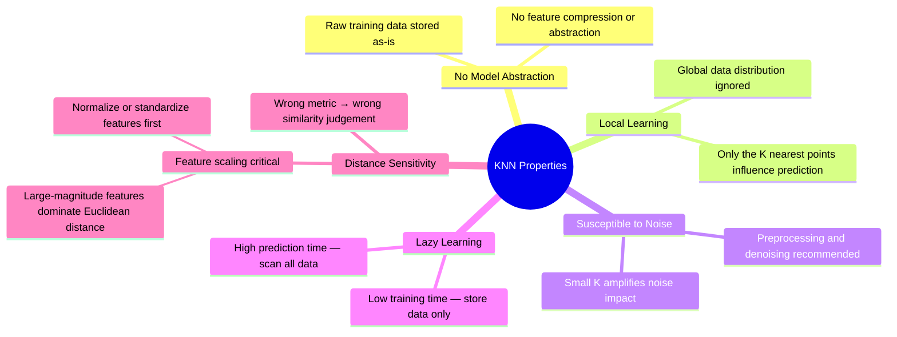

### Important Practical Considerations

1. **Feature Scaling**: Always normalize/standardize features before KNN. A feature in thousands (e.g. income) will dominate a feature in units (e.g. age) in Euclidean distance.

2. **Noisy Data**: Because KNN uses only local information, noisy neighbors can corrupt predictions — consider data cleaning or using a larger K.

3. **High Dimensionality**: As D (number of features) grows, "nearest" becomes meaningless (the **curse of dimensionality**) — consider dimensionality reduction (PCA) before KNN.

4. **Memory**: All training data must reside in memory at prediction time.

---

## 8. Eager vs Lazy — When to Use Which

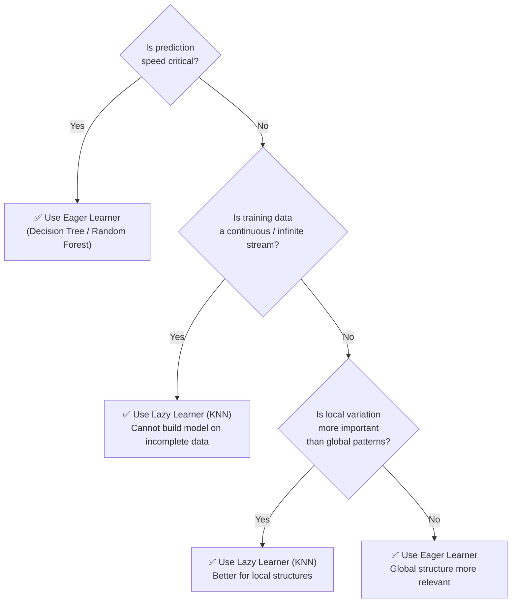

### Real-World Use Cases

| Use Case | Best Choice | Reason |
|---|---|---|
| Missile targeting / object detection | **Eager Learner** | Prediction must be instantaneous |
| Real-time safety-critical systems | **Eager Learner** | Model pre-built; no time to consult data |
| Streaming IoT sensor data (temperature prediction) | **Lazy Learner** | Training data never ends — no final model possible |
| Regional anomaly detection (specific district only) | **Lazy Learner** | Local patterns matter more than global |
| Large-scale batch image classification | **Eager Learner** | Low prediction latency needed at scale |

### Trade-off Summary

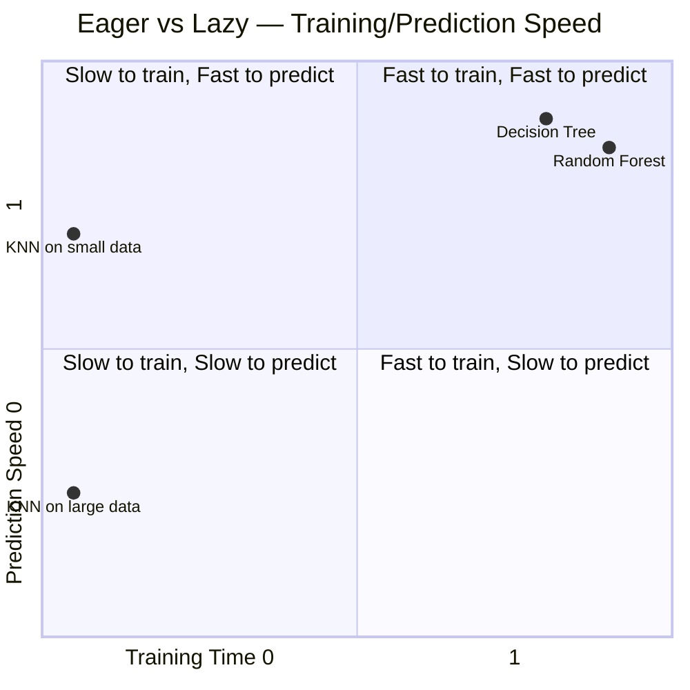

> **Accuracy / Quality**: Neither is universally better. Eager learners capture **global structure**; lazy learners capture **local variations**. The winner depends entirely on the data and the problem.

---

## 9. Hands-on — Decision Tree Hyperparameter Tuning

### Dataset
- **Telco Customer Churn** dataset
- Target variable: `churn` (binary: 0 or 1)
- ~7,032 samples, 29 features
- Problem type: **Binary classification**

### Full Pipeline

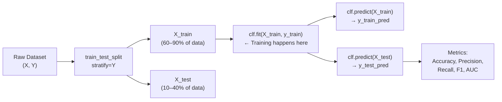

### `stratify=y` — Why It Matters

```mermaid
block-beta
    columns 1
    block:orig["Original Dataset — Class 0: 73% | Class 1: 26%"]:1
    end
    space
    block:split["After stratify=y split"]:1
        block:tr["Train Set — Class 0: 73% | Class 1: 26%"]
        end
        block:te["Test Set — Class 0: 73% | Class 1: 26%"]
        end
    end
```

Without `stratify=y`, random chance could skew class proportions in train/test splits. With it, the **original class distribution is preserved** in both subsets — this is critical for imbalanced datasets.

### Key Code Pattern — Finding Optimal Depth

```python
from sklearn.model_selection import train_test_split
from sklearn.tree import DecisionTreeClassifier
from sklearn.metrics import accuracy_score

# Split (60% train, 40% test), preserve class distribution
X_train, X_test, y_train, y_test = train_test_split(
    X, y, train_size=0.6, random_state=42, stratify=y
)

# Loop over all possible depths
train_acc, test_acc = [], []
for depth in range(1, 30):         # 29 features → max meaningful depth ≈ 29
    clf = DecisionTreeClassifier(criterion='entropy', max_depth=depth)
    clf.fit(X_train, y_train)       # Model is built HERE
    train_acc.append(accuracy_score(y_train, clf.predict(X_train)))
    test_acc.append(accuracy_score(y_test,  clf.predict(X_test)))

# Plot train_acc vs test_acc → find where test accuracy peaks
```

### Depth vs. Performance Pattern

- **Train accuracy** increases monotonically with depth (can always memorize more)
- **Test accuracy** peaks at optimal depth, then **drops** (overfitting begins)
- Optimal depth found by picking the depth at maximum test accuracy

### Results Across Split Ratios

| Train-Test Split | Optimal Depth Found | Test Accuracy |
|---|---|---|
| 60–40 | 5 | ~78% |
| 70–30 | 5 | ~78% |
| 80–20 | 6–7 | ~78% |
| 90–10 | 6 | ~78% |

---

## 10. Hands-on — Random Forest

### What Changes vs. Decision Tree

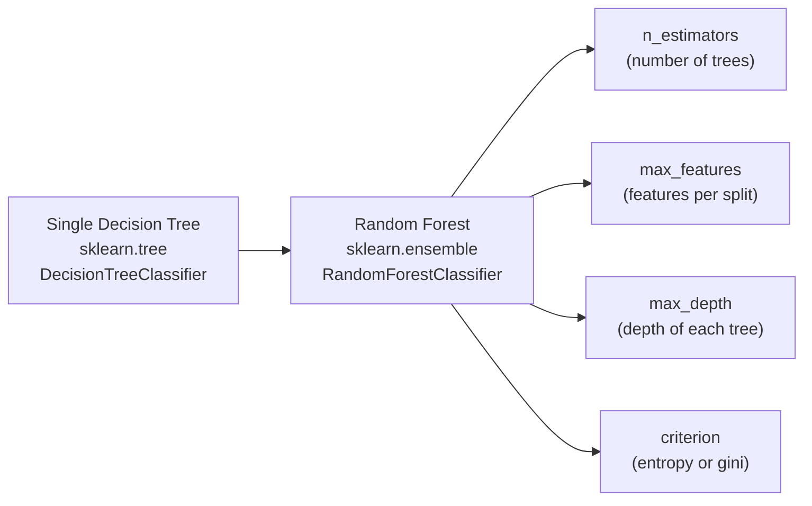

### Important Hyperparameters

| Hyperparameter | Meaning | Default (sklearn) | Explored Values |
|---|---|---|---|
| `n_estimators` | Number of trees in the forest | 100 | 50, 75, 100, 150 |
| `max_features` | Features considered at each node split | `sqrt(n_features)` | 5, 10, 15, 20, 25, 29 |
| `max_depth` | Max depth of each individual tree | None (full depth) | Fixed at 6 |
| `criterion` | Split quality measure | `gini` | `entropy`, `gini` |
| `random_state` | Seed for reproducibility | None | 52 |

### Experiment 1 — Optimal Number of Trees (`n_estimators`)

Fix `max_features=sqrt(n)` (default), vary `n_estimators ∈ {50, 75, 100, 150}`:

```python
from sklearn.ensemble import RandomForestClassifier
from sklearn.metrics import accuracy_score, precision_score, recall_score, f1_score, roc_auc_score

estimator_range = [50, 75, 100, 150]
metrics_rf = {
    'train_acc': [], 'test_acc': [],
    'train_precision': [], 'test_precision': [],
    'train_recall': [], 'test_recall': [],
    'train_f1': [], 'test_f1': [],
    'train_auc': [], 'test_auc': []
}

for n in estimator_range:
    clf = RandomForestClassifier(
        n_estimators=n,
        criterion='entropy',
        max_depth=6,
        random_state=52
    )
    clf.fit(X_train, y_train)

    y_train_pred = clf.predict(X_train)
    y_test_pred  = clf.predict(X_test)
    y_test_prob  = clf.predict_proba(X_test)[:, 1]  # needed for AUC

    metrics_rf['test_acc'].append(accuracy_score(y_test, y_test_pred))
    metrics_rf['test_recall'].append(recall_score(y_test, y_test_pred))
    metrics_rf['test_auc'].append(roc_auc_score(y_test, y_test_prob))
    # ... similarly for precision, f1
```

**Finding**: Recall and F1 are highest at `n_estimators = 150` → selected as optimal.

### `predict` vs `predict_proba`

| Method | Output | Used For |
|---|---|---|
| `clf.predict(X)` | Hard labels: `[0, 1, 1, 0, ...]` | Accuracy, Precision, Recall, F1 |
| `clf.predict_proba(X)[:, 1]` | Soft probabilities: `[0.12, 0.87, ...]` | ROC-AUC score |

### Experiment 2 — Optimal `max_features`

Fix `n_estimators=150`, vary `max_features ∈ {5, 10, 15, 20, 25, 29}`:

**Finding**:
- Accuracy is highest at `max_features=29` (all features) — but recall is very poor
- Recall and F1 are highest at `max_features=15`
- **Selected: `max_features=15`** — recall is the priority metric for churn prediction (missing a churning customer = costly false negative)

### Why Not Optimize Both Together? (Grid Search)

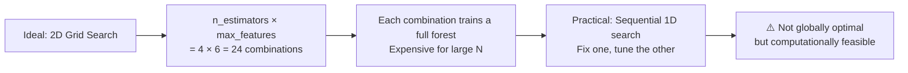

For 7,000 samples a 2D grid is feasible (~minutes). For millions of samples, sequential tuning is the practical approach.

### Final Model Comparison

| Config | Algorithm | Criterion | Test Accuracy | Notes |
|---|---|---|---|---|
| A | Decision Tree | Entropy | ~78% | Baseline |
| B | Decision Tree | Gini | ~78% | No improvement — criterion doesn't matter for single DT here |
| C | Random Forest | Entropy | ~79.88% | +~2% over single DT |
| D | Random Forest | Gini | ~80.09% | **Best** — small gain from Gini in RF |

> Changing criterion (entropy → Gini) made **no difference** for the single Decision Tree, but gave a **small uplift in Random Forest**. The ensemble averaging smooths out criterion-level differences but can still benefit from a better split quality measure.

### Performance Ceiling on This Dataset

The Telco Churn dataset is inherently challenging. Even with well-tuned Random Forest, accuracy plateaus around 80%. To push beyond:
- More feature engineering
- Try gradient boosting (XGBoost, LightGBM)
- Address class imbalance (SMOTE, class weights)
- Jointly optimize `max_depth` alongside `n_estimators` and `max_features`

---

## 11. Summary Comparison Table

| Concept | Key Takeaway |
|---|---|
| **Eager Learner** | Builds model upfront from all training data; fast prediction; captures global patterns |
| **Lazy Learner** | No upfront model; consults data at prediction time; slow prediction; captures local patterns |
| **Rote Learner** | Instance-based; exact match only; fails when no exact match exists |
| **KNN** | Instance-based; approximate match using K nearest neighbors; voting determines class |
| **K too small (K=1)** | Overfitting — sensitive to noise; decision boundary is jagged |
| **K too large** | Underfitting — irrelevant far-away points dilute the true neighborhood |
| **Optimal K** | Found by plotting metric vs K; pick the elbow / start of plateau |
| **KNN computation** | Always O(N·D) per prediction — all pairwise distances must be computed regardless of K |
| **Euclidean distance** | Standard metric; must scale features first to prevent magnitude bias |
| **Random Forest** | Ensemble of decision trees; key hyperparameters: `n_estimators`, `max_features`, `max_depth` |
| **n_estimators** | More trees = more stable but more compute; diminishing returns after optimal point |
| **max_features** | Subset of features per split — too many defeats the randomness purpose of RF |
| **Metric choice** | Use **recall** when false negatives are costly (churn, fraud, medical diagnosis) |
| **stratify=y** | Preserves original class distribution in train/test split — essential for imbalanced data |

---

*Notes compiled from class transcript — Durga Toshniwal (theory) + Ashish Kumar (hands-on)*
*GenAI Batch-2 Course*
