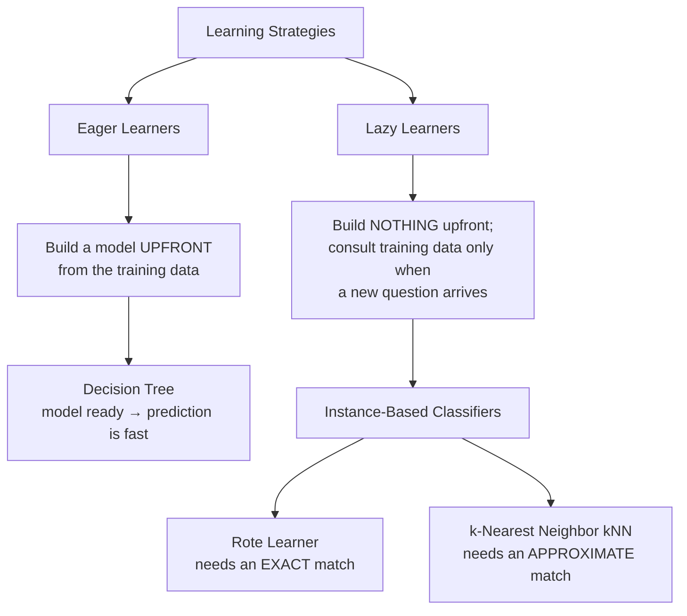
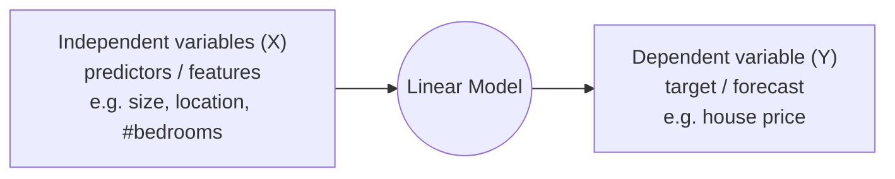
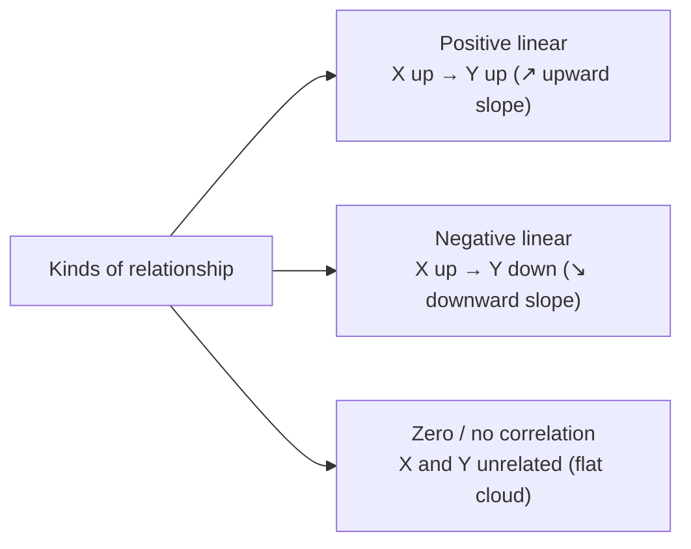
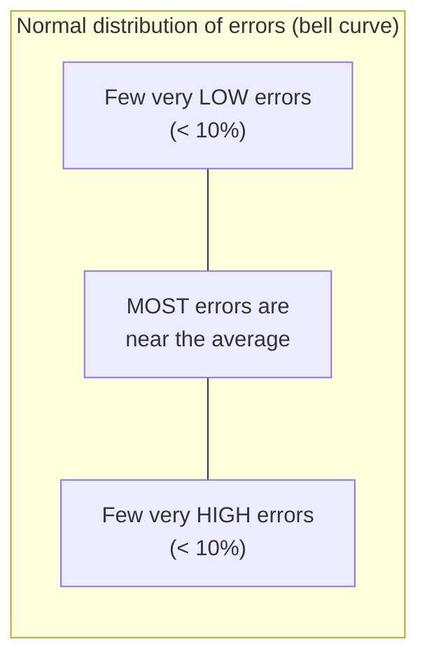
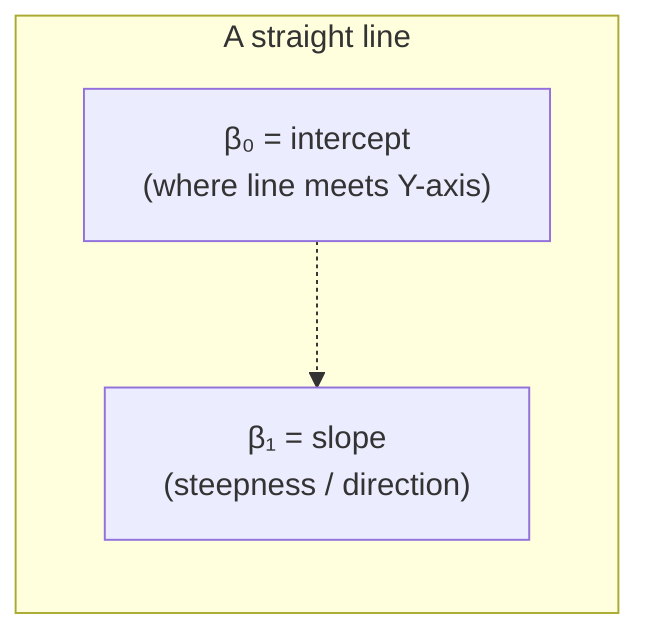
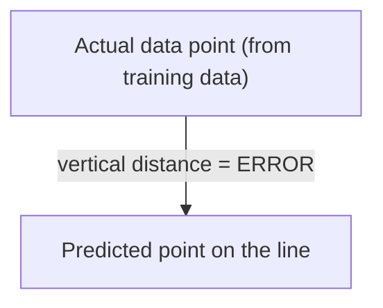
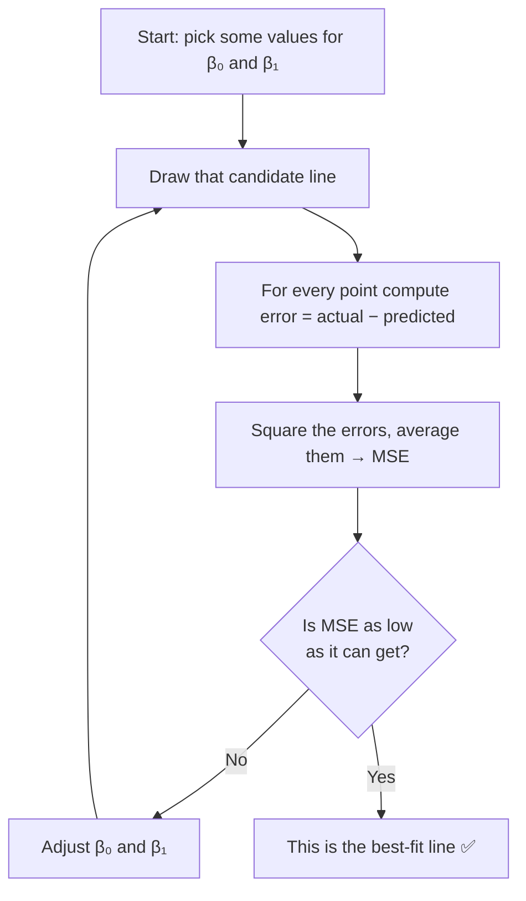
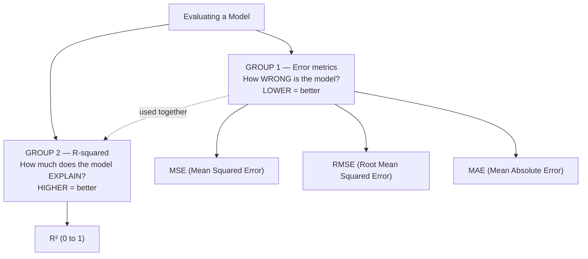
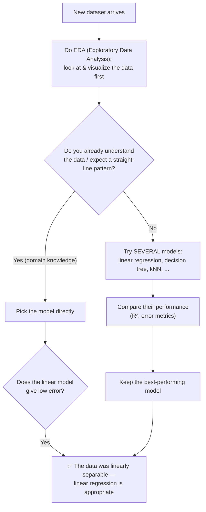
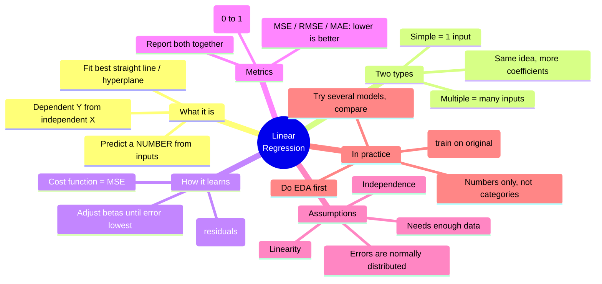

# Linear Regression — A Beginner's Guide (From Scratch)

*Instructor: Dr. Durga Toshniwal | Assumes no prior machine-learning knowledge.*

> **How to read this document:** Every new word is explained the first time it appears. If you read top to bottom, nothing will be assumed that wasn't already explained. Take your time with the diagrams — they summarize each section visually.

---

## 0. The Big Picture First

Machine learning is about teaching a computer to **learn patterns from examples** (called **training data**) so it can make good guesses about new situations it has never seen.

There are two big families of tasks:

| Task | What you predict | Example |
|---|---|---|
| **Classification** | A **category / label** (a name) | "Is this email spam or not spam?" |
| **Regression** | A **number** (a quantity) | "What will the temperature be tomorrow?" |

This document is about **regression** — specifically **linear regression**, the simplest and most popular way to predict a number.

Before we get to regression, the lecture recapped some *classification* methods. We'll cover those briefly first (Section 1), because they build useful intuition, then spend the rest of the document on regression.

---

## 1. Recap: How Do Classifiers Learn? (Background)

### Two learning styles: "Eager" vs "Lazy"

Imagine two students preparing for an exam:
- The **eager student** studies everything in advance and builds a neat set of notes (a "model"). On exam day, answering is fast because the work is already done.
- The **lazy student** doesn't prepare. When a question comes, they flip through the whole textbook to find a similar solved problem.

That's exactly the difference between eager and lazy learning algorithms.

**Key terms explained:**

- **Training data** = the solved examples we learn from. Each example (a "record" or "sample") has some input **attributes** (also called **features**) and a known answer (the **class label**).
- **Model** = the pattern the algorithm has learned; a reusable "formula" or "rule set" for making predictions.
- **Unseen record** = a new example we want to predict the answer for.

**Eager learner — Decision Tree:** As soon as training data arrives, it builds a tree of yes/no questions (the model). Prediction afterward is quick.

**Lazy learner — Instance-based:** Stores the training data and only does work when a new record appears.
- **Rote Learner:** Looks for an *identical* past example. Problem: with millions of records, an exact match almost never exists, so it's rarely used in practice. It's taught only to explain how the next method evolved.
- **k-Nearest Neighbor (kNN):** Instead of an exact match, it finds the **k closest** past examples (e.g. the 5 most similar) and lets them "vote" on the answer.
  - Each record is treated as a **point in space** (if there are 2 attributes, it's a point on a 2D graph; with D attributes, a point in D-dimensional space).
  - "Closest" is measured with a **distance formula**, usually **Euclidean distance** (the ordinary straight-line distance).
  - If neighbors disagree, use **majority voting** (the most common label among the k neighbors wins).
  - **k is a hyperparameter** — a setting *you* choose (not learned from data). Too small → sensitive to noise; too large → blurs real distinctions. It must be "just right."

### Naïve Bayes Classifier (probability-based)

This method uses **Bayes' theorem**, a rule about how the chance of one event changes once you know another event happened.

$$P(C \mid A) = \frac{P(A \mid C)\, P(C)}{P(A)}$$

Reading the symbols:
- $P(C)$ = the plain probability of class $C$ (the "prior" — what we believe before seeing evidence).
- $P(C \mid A)$ = probability of class $C$ **given that** $A$ already happened (the "|" means "given"). This is called a **conditional probability**.
- The idea: knowing $A$ happened *updates* our belief about $C$.

In classification, $C$ is a class and $A$ is the set of attributes $A_1, A_2, \dots, A_n$. Because the denominator $P(A)$ is the same for every class, we only need to compare the **numerator** across classes.

**The "naïve" trick — conditional independence:** We *assume* each attribute is independent of the others (a simplifying assumption that often works well enough). That turns a hard joint probability into a simple product:

$$P(A_1, A_2, \dots, A_n \mid C_j) = P(A_1 \mid C_j)\times P(A_2 \mid C_j)\times \dots \times P(A_n \mid C_j)$$

Compute this for every class; the class with the **highest probability** is the prediction.

### k-Fold Cross-Validation (how to test a model fairly)

**The problem:** How much data should be used for training vs. testing? And how do we know our test result wasn't just luck?

**The solution:** Split the data into **k equal parts ("folds")**. Train on some folds, test on the held-out fold, then rotate so every fold gets a turn as the test set. Average the results. Pick the setup that performs best. This gives a more reliable estimate than a single lucky/unlucky split.

---

## 2. Where Does the Word "Regression" Come From?

- It comes from the Latin word **regressus**, meaning **"returning / going back."**
- **Sir Francis Galton** (19th century) noticed: very tall parents tend to have tall children, but the children are usually **a bit shorter** than the parents (closer to average height). Likewise, very short parents have short children who are a bit taller than them.
- In other words, extreme values tend to **drift back toward the average** over generations. He named this **"regression toward the mean"** — and the statistical technique kept the name.

*("Mean" = the average.)*

---

## 3. What Is Linear Regression?

**In one sentence:** Linear regression finds the **best straight line** through your data so you can predict a number.

**The vocabulary:**
- **Dependent variable** (also **target**, or **Y**) = the number we want to predict. It "depends on" the inputs.
- **Independent variable(s)** (also **predictor(s)**, **feature(s)**, or **X**) = the inputs we already know and use to make the prediction.

- In **2 dimensions** (one input, one output) the model is a **straight line**.
- In **higher dimensions** (many inputs) it's a flat surface called a **hyperplane** — just the multi-dimensional version of a line. (You can't easily picture it, but the math is the same.)

**What is it good for?**
- **Forecasting a number** — tomorrow's temperature, a stock price, a currency value.
  - *Terminology note:* predicting a **number** is usually called **forecasting**; predicting a **category** is called **prediction**.
- Understanding **how two variables are related**.
- **Filling in missing values** in a dataset.
- It's **simple, easy to understand, works on noisy data, and is computationally cheap** (fast).

### Types of relationship between two variables

- **Positive:** as X increases, Y increases (e.g. more study hours → higher marks).
- **Negative:** as X increases, Y decreases (e.g. more exercise → lower weight).
- **Zero:** no consistent relationship.

The **slope** of the fitted line tells you which of these you have (positive slope, negative slope, or flat).

### The 3 assumptions linear regression relies on

For linear regression to work well, we assume:

1. **Linearity** — the relationship really is (roughly) a straight line / hyperplane. If the true pattern is a curve, a straight line won't fit well.
2. **Independence** — the observations don't depend on each other (one row doesn't influence another).
3. **Normal distribution of errors** — the mistakes the model makes (called **residuals** or **errors**) follow a **normal distribution** (the classic "bell curve"): most errors are small/average, and only a few are very large or very small.

> **Important caveat raised in class:** This "bell curve" behavior only reliably shows up when the dataset is **large enough**. With only 2–4 samples, errors may not look normal at all. So regression assumes your training data is big enough to represent reality.

---

## 4. Simple vs. Multiple Linear Regression

The difference is just **how many inputs** you use.

### Simple Linear Regression — ONE input

Equation:

$$\hat{Y} = \beta_0 + \beta_1 X$$

Reading it:
- $\hat{Y}$ ("Y-hat") = the **predicted** value of Y. *(The little hat "^" means "estimated/predicted," to distinguish it from the true value Y.)*
- $X$ = the single input.
- $\beta_0$ ("beta-zero") = the **intercept** — where the line crosses the vertical axis (the value of Y when X = 0).
- $\beta_1$ ("beta-one") = the **slope** — how steeply the line rises or falls (how much Y changes when X increases by 1).
- $\beta_0$ and $\beta_1$ together are the **regression coefficients** — the numbers the algorithm must figure out.

> **You may have seen this exact idea in school as $y = mx + c$.** It's identical:
> - $m$ (slope) $= \beta_1$
> - $c$ (intercept) $= \beta_0$
> - $y = \hat{Y}$

### Multiple Linear Regression — MANY inputs

In the real world you rarely predict from a single input. A house price depends on size, location, number of bedrooms, year built, and more. Each of those is a separate input $X_1, X_2, X_3, \dots$

Equation:

$$\hat{Y} = \beta_0 + \beta_1 X_1 + \beta_2 X_2 + \beta_3 X_3 + \dots + \beta_n X_n$$

- $X_1, X_2, \dots, X_n$ = the different attributes/features.
- $\beta_0, \beta_1, \dots, \beta_n$ = one coefficient per feature (plus the intercept $\beta_0$).

### Side-by-side

| | Simple Linear Regression | Multiple Linear Regression |
|---|---|---|
| Number of inputs | **One** ($X$) | **Many** ($X_1 \dots X_n$) |
| Equation | $\hat{Y} = \beta_0 + \beta_1 X$ | $\hat{Y} = \beta_0 + \beta_1 X_1 + \dots + \beta_n X_n$ |
| Coefficients to find | 2 | $n + 1$ |
| Shape | A line | A hyperplane |

> **The key insight (from a student's question in class):** The *foundation is exactly the same*. More inputs just means more coefficients to estimate. The goal never changes — find the coefficients that make predictions as close to reality as possible. In practice you never compute these by hand; a library (like Python's scikit-learn) does it for you. We work through the math only so you understand what's happening under the hood.

---

## 5. How Does It Find the "Best" Line? (Minimizing Error)

### What is "error"?

For any data point, the **error** (or **residual**) is the gap between the **actual** value from your data and the **predicted** value on the line.

- If a data point sits **exactly on the line**, its error is **zero** (perfect prediction).
- The further a point is from the line, the bigger its error.

The "best" line is the one where the **total error across all points is as small as possible.**

### The cost function: Mean Squared Error (MSE)

To measure total error with a single number, we use a **cost function** (a "badness score" — lower is better). The most common one is **Mean Squared Error (MSE)**:

$$\text{MSE} = \frac{1}{m}\sum_{i=1}^{m}\left(Y_i - \hat{Y}_i\right)^2$$

Reading it step by step:
1. For each of the $m$ training samples, take the actual value $Y_i$ minus the predicted value $\hat{Y}_i$ → that's the error for sample $i$.
2. **Square** each error (so negatives don't cancel positives, and big errors are penalized more).
3. **Add** them all up (that's the $\sum$ / "sigma" summation symbol).
4. **Divide by $m$** (the total number of samples) to get the **average** — hence "**mean** squared error."

$m$ = total number of training samples.

### Worked example A — how changing the coefficients changes the error

Suppose our data is: X = 1,2,3,4 and the true Y = 1,2,3,4.

| Case | $\beta_0$ | $\beta_1$ | Resulting equation | Predictions | Error (MSE) |
|---|---|---|---|---|---|
| 1 | 0 | 1 | $\hat{Y} = X$ | 1,2,3,4 (matches!) | **0** — perfect fit |
| 2 | 0 | 0.5 | $\hat{Y} = 0.5X$ | 0.5,1,1.5,2 (too low) | non-zero |
| 3 | 0 | 0 | $\hat{Y} = 0$ | 0,0,0,0 (flat line at zero) | large |

This shows: different coefficient choices give different lines and different errors. The algorithm searches for the choice with the **lowest** error (Case 1 here).

### Worked example B — actually computing the line

There are direct formulas for simple linear regression:

$$\beta_1 \;(\text{slope}, m) = \frac{\sum (X-\bar{X})(Y-\bar{Y})}{\sum (X-\bar{X})^2}, \qquad \beta_0 \;(\text{intercept}, c) = \bar{Y} - \beta_1\bar{X}$$

*(The bar, e.g. $\bar{X}$, means "the average of all X values.")*

**The lecture's example** used these 5 points: X = 1,2,3,4,5 and Y = 3,4,2,4,5.

Step 1 — averages:
- $\bar{X} = (1+2+3+4+5)/5 = 3$
- $\bar{Y} = (3+4+2+4+5)/5 = 3.6$

Step 2 — for each point compute $(X-\bar X)$, $(Y-\bar Y)$, their product, and $(X-\bar X)^2$:

| X | Y | $X-\bar X$ | $Y-\bar Y$ | product | $(X-\bar X)^2$ |
|---|---|---|---|---|---|
| 1 | 3 | −2 | −0.6 | 1.2 | 4 |
| 2 | 4 | −1 | 0.4 | −0.4 | 1 |
| 3 | 2 | 0 | −1.6 | 0 | 0 |
| 4 | 4 | 1 | 0.4 | 0.4 | 1 |
| 5 | 5 | 2 | 1.4 | 2.8 | 4 |

Step 3 — plug the sums into the formulas → **slope $\beta_1 = 0.4$** and **intercept $\beta_0 = 2.4$**.

**Final fitted line:** $\hat{Y} = 0.4X + 2.4$

Now you can predict: if X = 1, then $\hat Y = 0.4(1) + 2.4 = 2.8$.

---

## 6. How Do We Know If the Model Is Any Good? (Evaluation Metrics)

After fitting a line, we need to score it. There are **two groups** of metrics that complement each other:

### R² (R-squared, "coefficient of determination")

**Plain meaning:** Out of all the ups-and-downs (**variance**) in the thing you're predicting, **what fraction does your model successfully explain?**

*("Variance" = how spread out / how much variation there is in the Y values.)*

- R² always lies **between 0 and 1**.
  - **R² = 0** → the model explains **none** of the variation (useless).
  - **R² = 1** → the model explains **all** of the variation (perfect).
- **Example:** R² = 0.85 means the model captures **85%** of the variation in Y → a strong, good model.
- The lecture's small example gave R² = 0.3 → only 30% explained → not a good model.

**Formula:**

$$R^2 = 1 - \frac{SS_{res}}{SS_{tot}} = 1 - \frac{\sum (Y_i - \hat{Y}_i)^2}{\sum (Y_i - \bar{Y})^2}$$

- $SS_{res}$ = **residual sum of squares** = total squared error between actual and *predicted* values (how much the model still gets wrong).
- $SS_{tot}$ = **total sum of squares** = total squared difference between actual values and their *mean* (the total variation to begin with).
- If the model's errors are tiny, $SS_{res}$ is tiny, so $R^2$ is close to 1. 

> **Two useful facts from class:**
> - R² is **not only for regression** — it can also judge how good a *classification* model is.
> - Higher R² generally goes hand-in-hand with lower error (they point to the same conclusion, though they're not the same formula).

### RMSE (Root Mean Squared Error) and friends

$$\text{RMSE} = \sqrt{\frac{1}{n}\sum_{i=1}^{n}\left(\hat{Y}_i - Y_i\right)^2}$$

This is literally the **square root of the MSE**. Taking the square root brings the error back to the same units as Y (e.g. rupees, degrees), making it easier to interpret.

**When to use which error metric:**
- **MSE / RMSE** — square the errors, so they **exaggerate large mistakes**. Use when big errors are especially bad and you want to punish them.
- **MAE (Mean Absolute Error)** — just averages the size of the errors without squaring. Use when you simply want a plain measure of average error.

> **Practical tip from class:** If you already computed MSE and it's low, RMSE will automatically be low too (since RMSE ≈ √MSE). No need to compute both.

### How the two groups relate (a student's question)

- **Low error (MSE/RMSE) ↔ High R²** → good model.
- **High error ↔ Low R²** → bad model.
- Think of it as: **R² tells you how *good* the model is; error metrics tell you how *wrong* it is.** They're two sides of the same coin, and people report both.
- **R² vs. accuracy/precision/recall/F1:** those classification metrics form one group; R² is a different kind of measure (variance explained). They **complement** each other — use both to choose the best model.

---

## 7. Practical Advice: Choosing and Applying Regression (from the Q&A)

**Question: How do I know linear regression is the right choice for my data?**

**Key takeaways from the discussion:**

- **You usually can't tell just by looking.** Machine learning is often trial-and-error: try multiple models and compare. If a linear model gives low error, the data was **linearly separable** (a straight line/plane can separate or describe it well).

- **EDA (Exploratory Data Analysis)** = examining and visualizing your data before modeling, to understand its shape, relationships, and quirks. Always do this first.

- **PCA (Principal Component Analysis)** = a technique to **reduce the number of dimensions** (attributes) while keeping the overall structure of the data. Handy for **visualizing** data that has 10–15+ attributes (you can't plot 15 dimensions, but you can reduce to 2–3 and plot those).
  - **But:** run your actual **regression on the original full data**, not the PCA-reduced data. Reducing dimensions loses a little information, which **increases error**. Use PCA to *look* at the data, not to *train* on (when you can avoid it).

- **Clusters don't disqualify linear regression.** Even if the data forms several separate groups (**clusters**), the classes can still be **linearly separable** — a single straight line/plane may still divide them correctly.

- **Regression per cluster — a neat use case:** If some points have **missing values**, you can cluster the data first, then fit a separate regression line for each cluster, and use those lines to **estimate the missing values** far more accurately than a simple overall average would.

- **Non-linear data → use a different model.** If a straight line can't describe the data, use something like a **decision tree**, which builds a **non-linear decision boundary** out of many if/else rules (e.g. "if X₁ > 5 and X₂ ≤ 100 then..."). Combining many such rules carves out a jagged, non-linear boundary.

- **Categorical data limitation:** Plain linear regression works **only on numbers**. It **cannot** directly handle categories (like "red/green/blue" or "male/female") because it relies on numeric operations (slopes, intercepts, distances). Such data must be converted to numbers first (a separate preprocessing step).

---

## 8. One-Page Summary

**Cheat-sheet of every symbol used:**

| Symbol | Meaning |
|---|---|
| $Y$ | actual value of the target (dependent variable) |
| $\hat{Y}$ | predicted value ("Y-hat") |
| $X$ | input (independent variable / feature) |
| $\bar{X}, \bar{Y}$ | the average (mean) of the X or Y values |
| $\beta_0$ / $c$ | intercept (where the line meets the Y-axis) |
| $\beta_1$ / $m$ | slope (steepness & direction of the line) |
| $\sum$ | "sum of" (add up over all samples) |
| $m$ or $n$ | number of training samples |
| $P(C \mid A)$ | probability of C given A already happened |

**Coming next (per the lecture):** hands-on coding of Naïve Bayes + linear regression, then **logistic regression** next week. An ungraded self-practice assignment will be shared.
