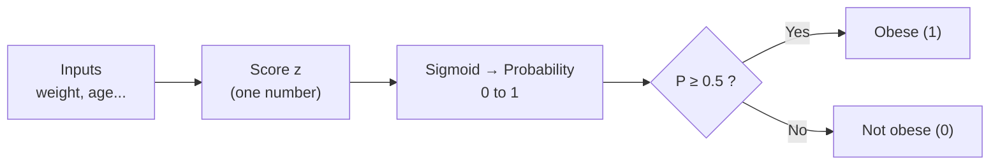
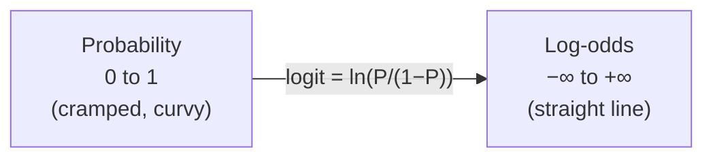
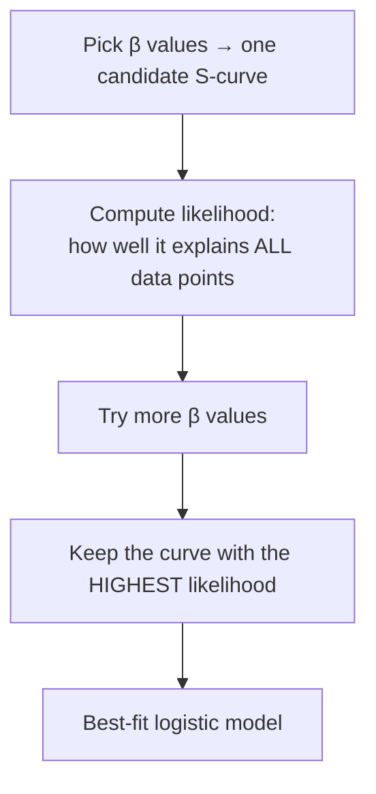

~~# Logistic Regression — Beginner-Friendly Complete Notes

> **Course:** GenAI / ML | **Instructor:** Durga Toshniwal
> **For:** Someone seeing logistic regression for the **first time**.
> Read top to bottom — each section builds on the previous one. No prior ML knowledge assumed.

---

## Table of Contents
0. [Glossary — Words You'll See](#0-glossary--words-youll-see)
1. [The Big Idea (in plain English)](#1-the-big-idea-in-plain-english)
2. [What Logistic Regression Is](#2-what-logistic-regression-is)
3. [The Sigmoid Function](#3-the-sigmoid-function)
4. [Odds, Log-Odds & the Logit](#4-odds-log-odds--the-logit)
5. [The Key Transformation](#5-the-key-transformation-probability--linear-scale)
6. [Linear vs. Logistic Regression](#6-linear-vs-logistic-regression)
7. [How the Model Learns (β coefficients)](#7-how-the-model-learns-the-β-coefficients)
8. [Fitting: Maximum Likelihood](#8-fitting-the-curve--maximum-likelihood)
9. [Decision Boundary / Threshold](#9-decision-boundary--threshold)
10. [A Full Worked Example (start to finish)](#10-a-full-worked-example-start-to-finish)
11. [Multinomial (Multi-class) Logistic Regression](#11-multinomial-multi-class-logistic-regression)
12. [Try It in Code (scikit-learn)](#12-try-it-in-code-scikit-learn)
13. [Q&A Highlights](#13-qa-highlights)
14. [Key Takeaways](#14-key-takeaways)

---

## 0. Glossary — Words You'll See

| Term | Plain meaning |
|---|---|
| **Feature (x)** | An input measurement, e.g. a mouse's *weight*. Also called attribute/variable. |
| **Class / label (y)** | The answer we want, e.g. *obese (1)* or *not obese (0)*. |
| **Binary classification** | Choosing between exactly **two** classes. |
| **Coefficient / weight (β)** | A number the model learns that says how important each feature is. |
| **Probability (P)** | A number from 0 to 1 saying how likely something is (0 = never, 1 = certain). |
| **Sigmoid** | An S-shaped formula that squashes any number into the 0–1 range. |
| **Odds** | Chance of "yes" divided by chance of "no". |
| **Logit / log-odds** | The natural log of the odds. |
| **Threshold** | The cut-off probability (often 0.5) that turns a probability into a Yes/No. |
| **Likelihood** | How well a chosen curve explains the data we actually saw. |

---

## 1. The Big Idea (in plain English)

Imagine you want to answer a **yes/no** question:
*"Given this mouse's weight, is it obese — yes or no?"*

Logistic regression does this in 3 steps:

1. **Combine the inputs** into a single score (weight, age, etc. → one number `z`).
2. **Squash that score into a probability** between 0 and 1 using the *sigmoid*.
3. **Compare to a threshold** (say 0.5): above it → "Yes / obese", below → "No / not obese".

That's it. Everything else in this doc explains *why* each step works.



---

## 2. What Logistic Regression Is

- **Careful:** the name says "regression," but it is actually a **classification** tool (it puts things into categories, it doesn't predict a number like price).
- It predicts the **probability** that an input belongs to a class.
- Best known for **binary** problems: yes/no, 0/1, spam/not-spam, obese/not-obese.
- Output is always a probability in **[0, 1]**; a **threshold** then picks the class.

---

## 3. The Sigmoid Function

The sigmoid (a.k.a. logistic function) takes *any* number and squashes it into 0–1:

$$\sigma(z) = \frac{1}{1 + e^{-z}}$$

*(`e` ≈ 2.718, a fixed math constant. Don't worry about memorizing it.)*

- **S-shaped**, symmetric around 0.
- Very negative `z` → output near **0**.
- `z = 0` → output exactly **0.5**.
- Very positive `z` → output near **1**.

```
σ(z)   "squash any number into 0..1"
 1.0 |                          . - - - - - - -
     |                    .
     |                .
 0.5 |- - - - - - - •  ← z = 0 gives 0.5
     |          .
     |      .
 0.0 |. .
     +----------------|-----------------------  z
    -∞                0                       +∞
```

**Why we need it:** a raw score `z` can be any number (−∞ to +∞), but a probability must stay between 0 and 1. The sigmoid does that conversion.

> ⚠️ The sigmoid is **nonlinear** and **stuck in [0,1]**. That's fine for output, but awkward for math. Sections 4–5 show the clever fix.

---

## 4. Odds, Log-Odds & the Logit

**Odds** = chance it happens ÷ chance it doesn't:

$$\text{odds} = \frac{P}{1 - P}$$

- Example: if `P = 0.75`, then `odds = 0.75 / 0.25 = 3`.
- Read as: "**3 times more likely** to happen than not."
- Odds can be bigger than 1 — that's normal, because it's a **ratio**, not a probability.

**Logit (log-odds)** = the natural log of the odds:

$$\text{logit}(P) = \ln\left(\frac{P}{1 - P}\right)$$

This is the piece logistic regression is named after and built on.

---

## 5. The Key Transformation (Probability → Linear Scale)

This is the "aha" of the whole topic. The logit **stretches** the cramped 0–1 probability range out into the full number line (−∞ to +∞):

| Probability P | Odds P/(1−P) | Log-odds ln(odds) |
|:---:|:---:|:---:|
| 0    | 0    | **−∞** |
| 0.25 | 0.33 | ≈ −1.1 |
| 0.5  | 1    | **0** (the middle) |
| 0.731| 2.72 | ≈ **1** |
| 0.95 | 19   | ≈ **2** |
| 1    | ∞    | **+∞** |

After this stretch, the model can be written as a simple **straight-line (linear) equation**:

$$\ln\left(\frac{P}{1-P}\right) = \beta_0 + \beta_1 x_1 + \dots + \beta_n x_n$$



**Why bother?** Straight-line (linear) math is simple and works over the full number line. Probabilities don't — they're trapped in 0–1. The logit lets us do easy linear math and still get a valid probability at the end (via the sigmoid). The sigmoid and the logit are **inverses** of each other — two views of the same relationship.

---

## 6. Linear vs. Logistic Regression

| Aspect | Linear Regression | Logistic Regression |
|---|---|---|
| **Answers** | "How much?" (a number) | "Which class?" (a category) |
| **Output range** | −∞ to +∞ | 0 to 1 |
| **Target example** | height, price, temperature | 0/1, yes/no, spam/not-spam |
| **Model shape** | straight line `y = mx + c` | S-curve (sigmoid) |
| **Error measure** | Mean Squared Error (MSE) | Log loss (see §7) |
| **How it fits** | minimize **residuals** | maximize **likelihood** |

**Why not just draw a straight line for yes/no data?**
Because it gives nonsense at the edges. If you fit a line to weight-vs-obese data and extend it backward, it predicts a mouse with **negative weight** — impossible. Yes/no data isn't a straight line, so we use the S-curve.

```
Weight vs. Obesity (a straight line can't fit this)

Obese  1 |            o   o o   ●outlier
         |         o
         |     _.-'      ← the S-curve (sigmoid) fits both groups
         | _.-'
Not    0 |o o o  ●outlier
Obese    +-------------------------  Weight →
```

---

## 7. How the Model Learns the β Coefficients

Where do `β₀, β₁, …` come from? The computer **learns** them from training data:

1. Start with random guesses for the β's.
2. Make predictions and measure how wrong they are using **log loss** (a.k.a. cross-entropy):

$$\text{Log loss} = -\big[\, y \cdot \ln(P) + (1-y)\cdot \ln(1-P) \,\big]$$

   - If the true answer `y = 1` and the model said `P` near 1 → tiny loss (good).
   - If `y = 1` but the model said `P` near 0 → huge loss (bad).

3. Nudge the β's a little in the direction that reduces the loss. This step is called **gradient descent**.
4. Repeat thousands of times until the loss stops shrinking.

You don't do this by hand — libraries (§12) do it for you. Just know: **learning = adjusting β to make log loss as small as possible.**

---

## 8. Fitting the Curve — Maximum Likelihood

Another way to describe §7's goal:

- Linear regression fits by **minimizing residuals** (vertical gaps to a line). That doesn't work for yes/no data.
- Logistic regression instead uses **maximum likelihood**: choose the S-curve that makes the data we actually observed **most probable**.
- Practically: try many candidate S-curves (each is a different set of β's), score how well each explains all points, and keep the best one.
- **Outliers are not thrown away** — they're included; the winning curve just fits the *majority* of points best.



*(Maximizing likelihood and minimizing log loss are the same thing, just described differently.)*

---

## 9. Decision Boundary / Threshold

- The model outputs a **probability**, not a class. You choose a **threshold** to decide.
- Default: **0.5** → `P ≥ 0.5` = Class 1, otherwise Class 0.
- The threshold is a **choice**, driven by your problem:
  - **Domain knowledge:** e.g. "any mouse 0–40 g should be *not obese*" → set the threshold at whatever probability matches 40 g.
  - **Trial and error:** try a few thresholds and see which gives the best results.
- Lower the threshold to catch more positives (fewer misses, more false alarms); raise it to be stricter.

---

## 10. A Full Worked Example (start to finish)

**Problem:** Predict if a mouse is obese from its weight (grams).
Suppose training gave us: `β₀ = −6`, `β₁ = 0.15`.

**A mouse weighs 50 g. Is it obese?**

**Step 1 — Compute the score z:**
`z = β₀ + β₁ · weight = −6 + 0.15 × 50 = −6 + 7.5 = 1.5`

**Step 2 — Squash with the sigmoid to get a probability:**
`P = 1 / (1 + e^(−1.5)) = 1 / (1 + 0.223) ≈ 0.82`

**Step 3 — Apply the threshold (0.5):**
`0.82 ≥ 0.5` → **Obese (Class 1)**, with ~82% confidence.

**Now a mouse weighs 30 g:**
- `z = −6 + 0.15 × 30 = −1.5`
- `P = 1 / (1 + e^(1.5)) ≈ 0.18`
- `0.18 < 0.5` → **Not obese (Class 0)**, ~82% confidence it's *not* obese.

That's the entire pipeline: **inputs → z → sigmoid → probability → threshold → class.**

---

## 11. Multinomial (Multi-class) Logistic Regression

What if there are **more than two** classes? Use the multinomial version.

| Type | Number of classes | Example |
|---|---|---|
| **Binary** | 2 | spam / not-spam |
| **Multinomial** | 3+ | proficiency: advanced / intermediate / novice |

Instead of the sigmoid, it uses **softmax**, which gives a probability to *each* class (and they all add up to 1):

$$\text{softmax}(z_i) = \frac{e^{z_i}}{\sum_{j=1}^{K} e^{z_j}}$$

For class `Cᵢ` among classes `C₁ … C_K`:

$$P(C_i) = \frac{e^{z_{C_i}}}{e^{z_{C_1}} + e^{z_{C_2}} + \dots + e^{z_{C_K}}}$$

You pick the class with the **highest** probability. *(Softmax detail comes in a later session.)*

---

## 12. Try It in Code (scikit-learn)

```python
from sklearn.linear_model import LogisticRegression
import numpy as np

# Training data: mouse weights (grams) and labels (1 = obese, 0 = not)
X = np.array([[20], [25], [30], [45], [50], [60]])   # feature: weight
y = np.array([0,    0,    0,    1,    1,    1])       # label

# 1. Create and train the model (it learns β automatically via gradient descent)
model = LogisticRegression()
model.fit(X, y)

# 2. Predict the CLASS for a new 50 g mouse
print(model.predict([[50]]))          # -> [1]  (obese)

# 3. Predict the PROBABILITY instead of the hard class
print(model.predict_proba([[50]]))    # -> [[0.18, 0.82]]  (P(not obese), P(obese))

# 4. Peek at the learned coefficients
print(model.intercept_, model.coef_)  # β0 and β1
```

- `.fit()` = the learning (§7). `.predict()` = §10 with threshold 0.5. `.predict_proba()` = the raw probability.
- For 3+ classes, `LogisticRegression` automatically uses the multinomial/softmax approach.

---

## 13. Q&A Highlights

| Asked by | Question | Answer |
|---|---|---|
| Muni | Odds = 3 is bigger than 1 — valid? | Yes. Odds is a **ratio** P/(1−P), not a probability. |
| Vinit | What about outliers / borderline points? | Not ignored — included in likelihood; the curve fits the majority best. |
| Aditya / Ankit | Binary only? | Traditionally yes, but multinomial handles multi-class. |
| Ankit | How is the 0.5 threshold chosen? | It's a **decision boundary** — app/domain driven, or trial and error. |
| Ankit | Maximize one class or both? | **Both** — likelihood of *all* points fitting the S-curve. |
| Ankit | What changes the S-curve's shape? | The **β coefficients** (like the slope in a straight line). |
| Deepak | Why map [0,1] → (−∞, +∞)? | So simple **linear math** can be used; probabilities alone are too constrained. |

---

## 14. Key Takeaways

1. **It's classification**, not real "regression" — it predicts a **category** via a **probability**.
2. **Pipeline:** inputs → score `z` → sigmoid → probability → threshold → class.
3. **Sigmoid** squashes any number into 0–1; **logit** stretches 0–1 back to the full number line so linear math works.
4. **Learning = adjusting β** to minimize **log loss** (a.k.a. maximizing likelihood), done via gradient descent.
5. **Threshold** (default 0.5) is a *choice* based on your problem.
6. **Softmax** extends everything to 3+ classes.
7. Understand the *why*; memorizing formulas is optional. Try the code in §12 to make it click.

> **Next session:** hands-on coding of both binary and multinomial logistic regression.~~
