# ML Masterclass — Session Notes

> Instructor: Mayukh Ghosh · Format: 2-hour interactive masterclass
> Focus: connecting ML concepts to business context, from linear regression → logistic regression → model evaluation → the DL/NLP/LLM roadmap.

The theme of the whole session: **don't just run code and stare at outputs — understand the concepts and how they connect, so you can anticipate the next 3–4 outputs before you even produce them.** Running code is easy; connecting concepts is what gives a model longevity in production.

> **Note on diagrams:** This file uses [Mermaid](https://mermaid.js.org/) diagrams. They render automatically in GitHub, GitLab, VS Code (with a Mermaid extension), Obsidian, and most modern Markdown viewers.

---

## Table of Contents
1. [Why Linear Regression Still Matters](#1-why-linear-regression-still-matters)
2. [The Linear Regression Equation & the Error Term](#2-the-linear-regression-equation--the-error-term)
3. [R-Square](#3-r-square)
4. [Best Fit Line & OLS](#4-best-fit-line--ols)
5. [The Core Goal: Minimize Error, Don't Chase Accuracy](#5-the-core-goal-minimize-error-dont-chase-accuracy)
6. [Logistic Regression — Why Linear Fails for Categorical Targets](#6-logistic-regression--why-linear-fails-for-categorical-targets)
7. [Odds, Probability & Log-Odds](#7-odds-probability--log-odds)
8. [Deriving the Logistic Equation](#8-deriving-the-logistic-equation)
9. [Precision, Recall & F1 — Choosing What Matters](#9-precision-recall--f1--choosing-what-matters)
10. [Confusion Matrix, ROC & AUC](#10-confusion-matrix-roc--auc)
11. [The Null Model](#11-the-null-model)
12. [Choosing the Right Cutoff & Youden's Index](#12-choosing-the-right-cutoff--youdens-index)
13. [Error Analysis: Borderline vs Extreme Misclassification](#13-error-analysis-borderline-vs-extreme-misclassification)
14. [Boosting vs Random Forest](#14-boosting-vs-random-forest)
15. [Explainability vs Accuracy — Horses for Courses](#15-explainability-vs-accuracy--horses-for-courses)
16. [Practical Tip: Buffer Dummies](#16-practical-tip-buffer-dummies)
17. [The Learning Roadmap: ML → DL → NLP → LLMs](#17-the-learning-roadmap-ml--dl--nlp--llms)

---

## 1. Why Linear Regression Still Matters

- In real business problems, linear regression is **rarely used directly** — the space is dominated by classification models. It shows up mostly in manufacturing/supply-chain, occasionally banking; very little in retail.
- But it is the **foundation** everything else is built on.

> **Analogy:** You're building a 10-storey building. Linear regression is the **ground floor / basement**. If the foundation is weak, no matter how many floors you stack (decision trees, random forest, boosting, neural nets), the whole thing eventually collapses.

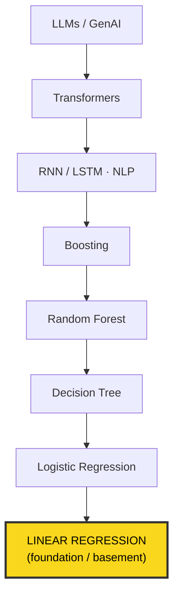

---

## 2. The Linear Regression Equation & the Error Term

The school-days straight line `y = mx + c` **is** a linear regression equation. In econometric form:

```
Y = m·X + c + E
      │    │   │
      │    │   └── E : error / residual term
      │    └────── c : intercept (β₀)  — value of Y when X = 0
      └─────────── m : slope (β₁)      — how X drives Y
```

**Worked example — monthly spend on food vs income:**

- `c` (intercept): the minimum subsistence spend on food even when income = 0 (you still eat; funded from savings/borrowing).
- `m = 0.2`: roughly 20% of income goes to food.

**Why the error term `E` is unavoidable:** a strict 1-to-1 mathematical line never holds with real people. Ten people on the same ₹50,000 income will *not* all spend exactly ₹10,000 on food. `E` balances `Y` against `mX + c` and captures two things:

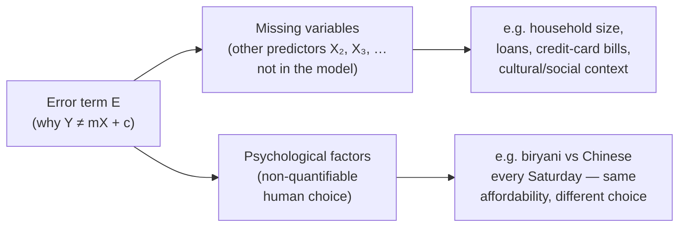

Full multivariate form:

```
Y = β₀ + β₁X₁ + β₂X₂ + β₃X₃ + … + E
```

The aim: get the group of X's to **explain Y** as much as possible.

---

## 3. R-Square

R² measures **to what extent the X's (as a group) explain the variation in Y.** Range: 0 to 1 (0–100%). Higher = better. (It is *not* "the square of errors.")

**Business example — sales grew ₹100M → ₹150M (change = 50):**

If the predictors (cost of advertising, marketing, R&D) together explain up to 140 (predicted), but actual is 150:

```
Actual change     = 50  (100 → 150)
Explained change  = 40  (100 → 140)   → prediction
Unexplained (gap) = 10  → this is the ERROR (E)

R² = 40 / 50 = 0.80  = 80%
```

> Figuratively: **R² + (error share) ≈ 1.** The higher R², the lower the error.

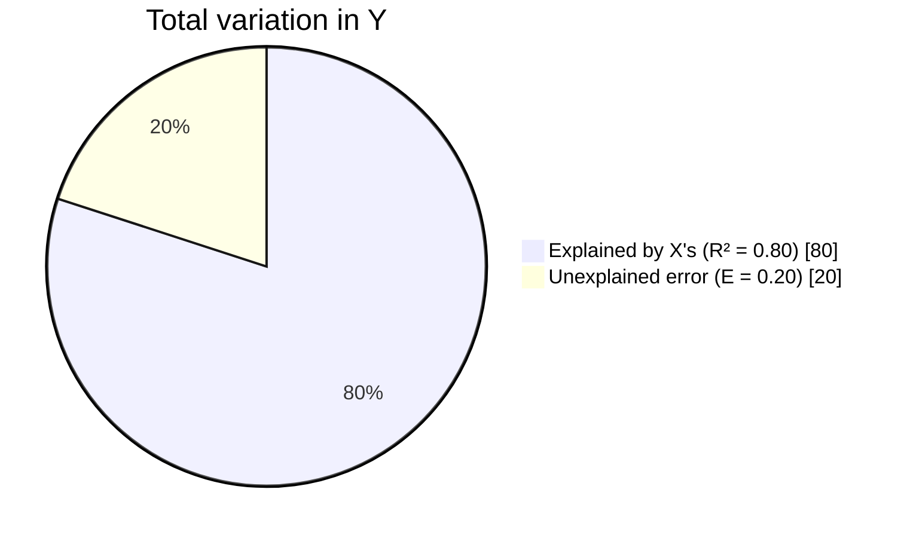

This is the regression cousin of the **Gini / entropy** you used to build decision trees, and the **accuracy** metric — all are measuring model "health," just from different angles.

---

## 4. Best Fit Line & OLS

Through any scatter of points you can draw **infinitely many** lines. The **best fit line** is the one closest to most points *in aggregate* — i.e. the one that minimizes the vertical distances between the points and the line.

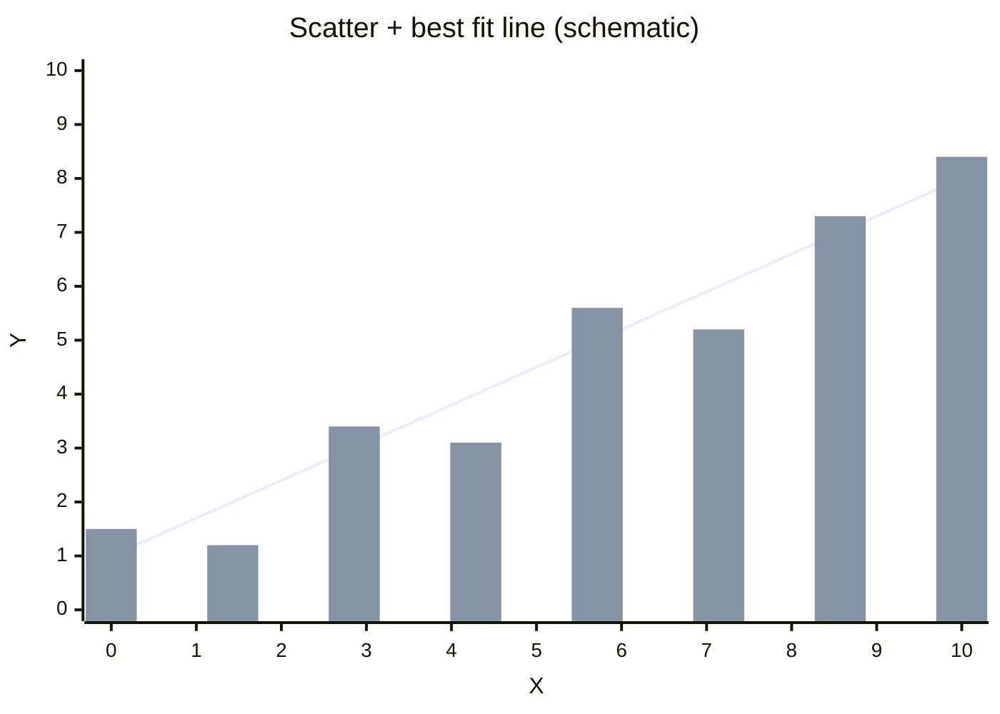

The line is the best fit; the bars stand in for the data points scattered around it — the **vertical gap** between each point and the line is a **residual**.

Because vertical distances can be **positive or negative** (and would cancel out), we **square** them so they don't cancel. The line with the **lowest sum of squared distances** is the best fit line.

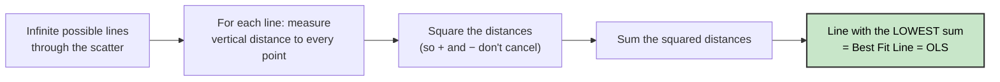

> This is **OLS — Ordinary Least Squares**, the method used to build linear regression. It generalizes to many X's plotted against one Y (we just can't *visualize* beyond 2–3D, but the machine can).

**Applies when:** the **target variable is continuous** — sales, profit, revenue, etc.

---

## 5. The Core Goal: Minimize Error, Don't Chase Accuracy

Every model — linear, logistic, decision tree, random forest, boosting, KNN, Naive Bayes, SVM, neural nets — shares **one goal: reduce error.** As a by-product, accuracy/precision/recall/R² improve.

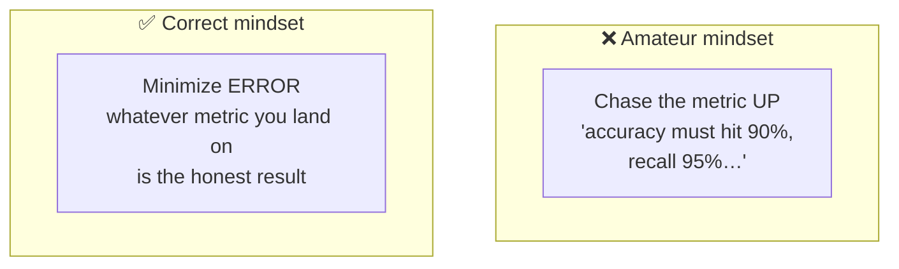

**Why the direction matters (they're not equivalent):**

- Metrics can keep climbing without errors genuinely being "down for good."
- Pushing accuracy on one train/test split doesn't guarantee the result **generalizes** to test data or the next data cycle.
- Endlessly re-shuffling train/test splits / random states gives you *variability*, not a *universal, acceptable* outcome. 50 people with 50 different splits would just argue over whose model is best. There's no end to that process.

This connects to **gradient descent** — the universal rule for any ML/DL model: find the sweet spot where **error is minimum.**

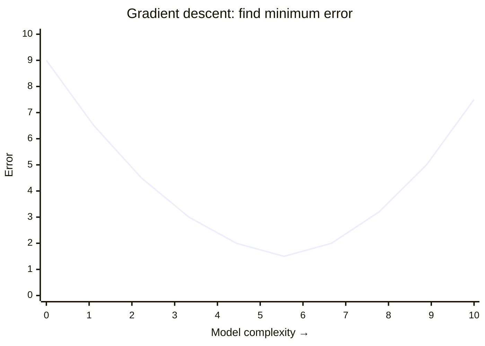

The curve bottoms out at **minimum error** (the target); going further right = **overfitting** (error climbs on unseen data).

Checking overfitting = comparing errors (RMSE / MAPE) between **train and test** — you want them close.

---

## 6. Logistic Regression — Why Linear Fails for Categorical Targets

**Supervised learning splits into:**

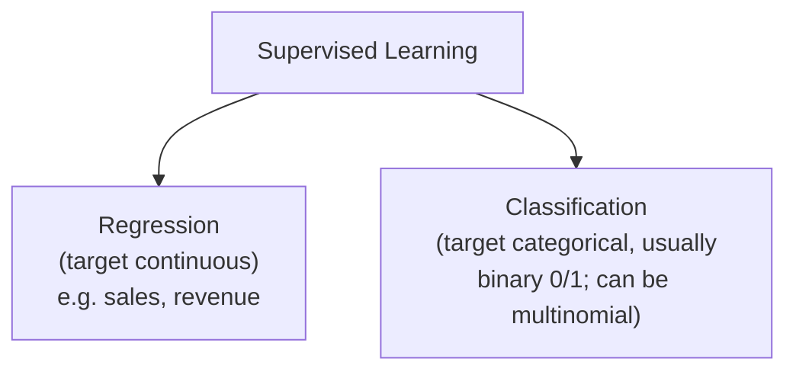

**The classic interview question:** if `Y = mX + c + E` exists, why do we need a separate logistic function the moment Y becomes categorical?

**Force-fit demo — "probability of subscribing to Netflix" vs age**, using `P = β₀ + β₁·Age` with β₀ = −1.5, β₁ = 0.06:

| Age | −1.5 + 0.06·Age | "Probability" | Valid? |
|----:|:----------------|:--------------|:-------|
| 25 | −1.5 + 1.5 | **0.0** | Says a 25-yr-old can *never* subscribe — unrealistic |
| 35 | −1.5 + 2.1 | 0.3 (30%) | OK |
| 45 | −1.5 + 2.7 | **1.2** | Impossible — probability > 1 |

Only a narrow "sweet range" (~30–40) behaves; outside it the equation breaks.

**Root cause — apples vs oranges:**

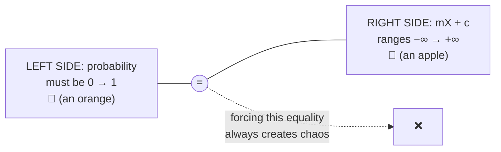

**Two ways to fix a mismatch:** change the left side to comply with the right, or change the right side to comply with the left. Logistic regression **transforms the right side** (via exponential + log) so both sides share the same range.

---

## 7. Odds, Probability & Log-Odds

These are **not** the same thing.

```
                success            success
 Probability = ─────────      Odds = ─────────
                 total              failure

 Range: 0 → 1                Range: 0 → ∞  (can exceed 1)
```

**Cricket example** — India wins 6 of 10 matches vs an opponent:

```
 Probability = 6/10 = 0.60
 Odds        = 6/4  = 1.5
```

If "success" is what you care about (and want to predict), you'd want **odds > 1.**

**Log-odds symmetry** — this is what logistic is built on:

```
 odds(having diabetes)     = 6/4   → log(6/4)  = +x
 odds(NOT having diabetes) = 4/6   → log(4/6)  = −x
```

Taking the log makes the two directions **equal in magnitude, opposite in sign** — and, crucially, gives a value that can range over (−∞, +∞).

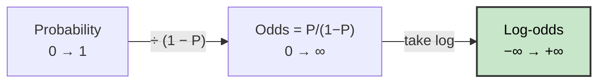

---

## 8. Deriving the Logistic Equation

Goal: keep the right side, but wrap the probability so both sides span (−∞, +∞).

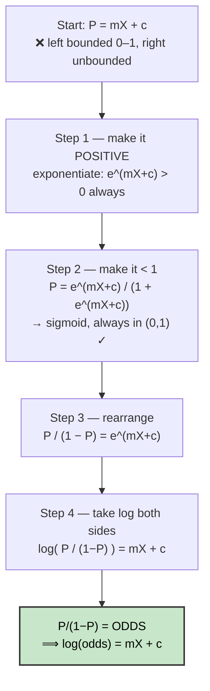

**The sigmoid / logistic function** produced in Step 2:

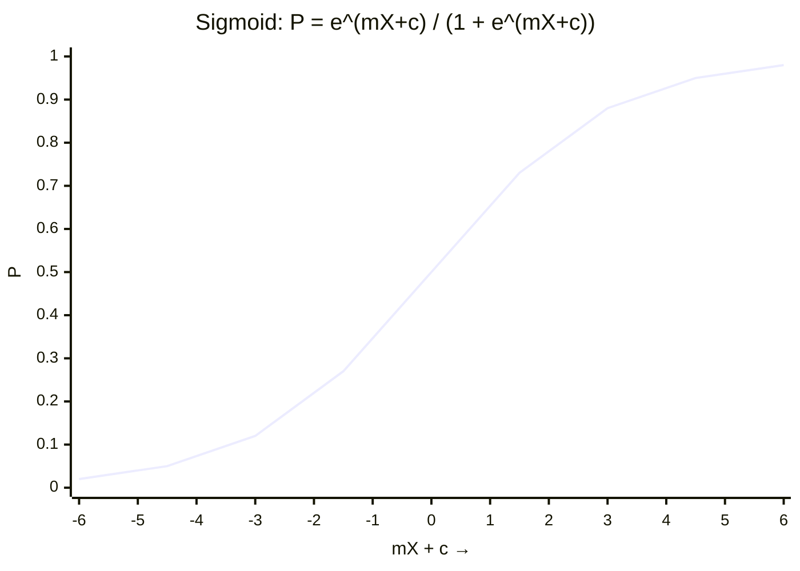

Always bounded between 0 and 1 — an S-curve.

**Side-by-side:**

```
 Linear:    Y          = mX + c + E
 Logistic:  log(odds)  = mX + c
            └── the "Y" is now the log-odds ──┘
```

Now the left side (log-odds) also ranges over (−∞, +∞) → the apples-vs-oranges mismatch is gone.

> This derivation is *the* first and most important thing to understand about logistic regression. **Gradient Boosting (GBM) is a direct descendant** — it's built on odds and probability, so study logistic *before* GBM.

---

## 9. Precision, Recall & F1 — Choosing What Matters

**Before opening a notebook, understand the business problem and decide: is recall or precision more important?** You generally can't maximize both.

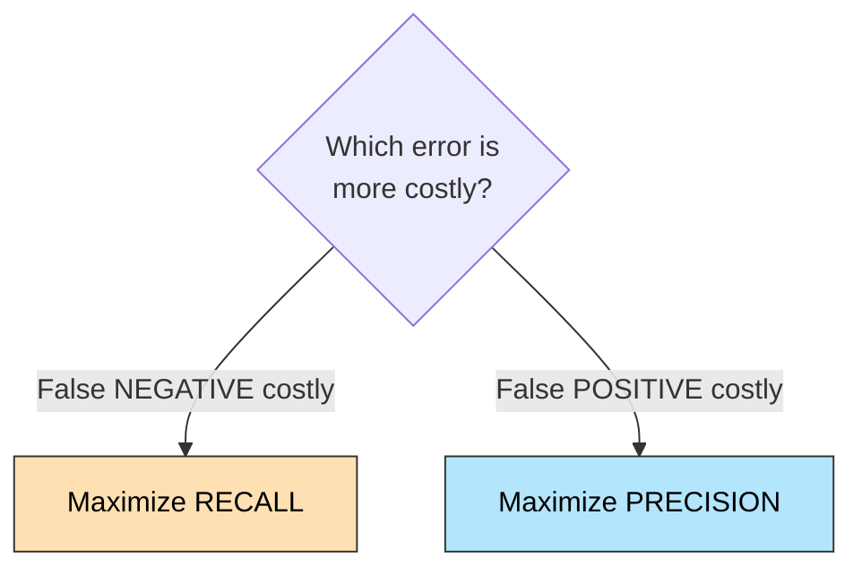

**Cancer example:**

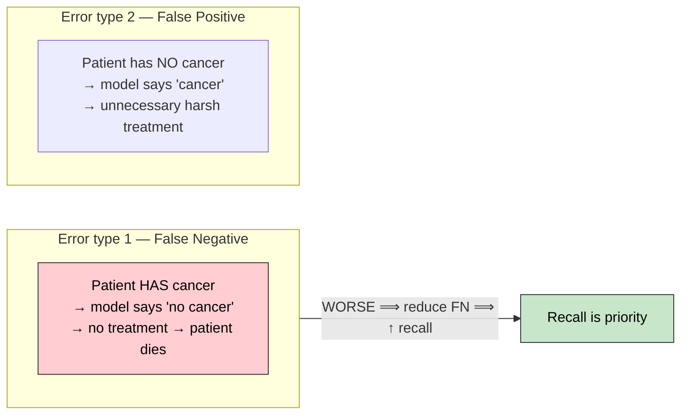

**F1 score** = harmonic mean of precision and recall.

> Industry reality check: relying **solely on F1** effectively means you're *unsure* whether precision or recall matters, so you split the difference. It may pass a model in the short run, but if the data shifts slightly in production (after you've already spent on cloud/Databricks/Snowflake), precision & recall drift, and the model fails — and you answer to management. **Understand the business problem first; everything else waits.**

---

## 10. Confusion Matrix, ROC & AUC

**Confusion matrix (example, 80 test observations):**

|  | **Pred 0** | **Pred 1** |
|---|:---:|:---:|
| **Actual 0** | TN = 33 | FP |
| **Actual 1** | FN | TP = 33 |

`Accuracy = (TN + TP) / total = 66 / 80 ≈ 82.5%`

**ROC curve** (Receiver Operating Characteristic): plots **TPR vs FPR**. You want to be in the top-left — **high TPR for low FPR.**

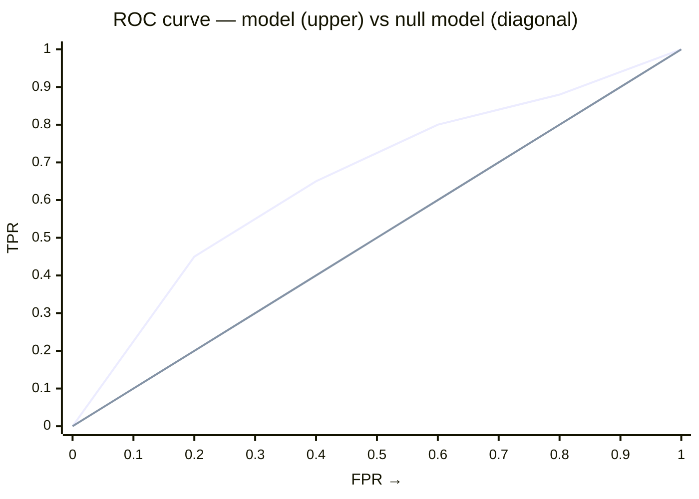

Upper curve = your model (farther from the diagonal → higher AUC). The straight diagonal = the **null model** (random).

**AUC** = Area Under the Curve.
- **AUC = 0.5** → null model (random, the 45° line) — this is the practical floor; it won't go below 0.5.
- Higher AUC → better model.

**Connecting the two — the overlap of the class distributions:**

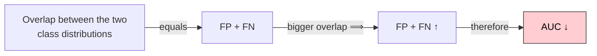

In reality you're always in the "some overlap" middle case (perfect separation is only theoretical).

> The skill: from a **confusion matrix you can anticipate the ROC**, from the ROC the AUC, and connect all the way back to EDA and the raw data.

---

## 11. The Null Model

```
   Y = c        ← the X's have NO effect on Y
```

The **null model** is when independent variables do nothing; Y is just a constant. On the ROC it's the **45° diagonal (red line)** with **AUC = 0.5.** The blue line is your real model where the X's are working — the farther the blue line sits from the red diagonal, the better the model and the higher the AUC.

---

## 12. Choosing the Right Cutoff & Youden's Index

Logistic outputs **predicted probabilities**, which must be converted back to 0/1 using a **cutoff (threshold)**:

```
 predicted prob < cutoff  → class 0
 predicted prob ≥ cutoff  → class 1
```

The **default cutoff is 0.5** — but 0.5 is rarely optimal, **especially for imbalanced data.** If ~90% of predicted probabilities sit below 0.5, using 0.5 leaves you too few 1's, the confusion matrix becomes a mess, and precision/recall go for a toss.

> **Choosing the right cutoff is arguably the most important step in logistic (and any classification model).**

**Method + Youden's Index:**

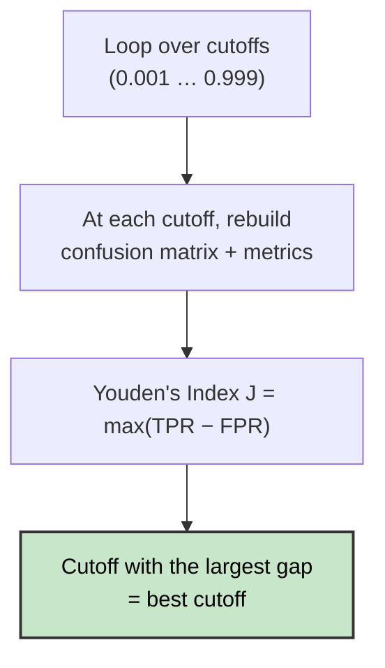

`Youden's J = max ( TPR − FPR )` over all thresholds.

**Worked result** (from the admissions dataset): sorting by TPR−FPR descending and taking the top 5:

| Rank | Cutoff | TPR − FPR |
|-----:|:------:|:---------:|
| 1 | **0.62** | 0.7256 |
| 2 | ~0.85 | ~0.68 |
| 3 | ~0.86 | ~0.67 |
| 4 | ~0.38 | ~0.67 |
| 5 | ~0.85 | ~0.67 |

Switching the cutoff from 0.5 → **~0.62** raised correct predictions from **66 → 68** out of 80.

**Why look at the top 5 when you only need #1?** The *spread* is diagnostic. Here the thresholds range from **0.38 to 0.86** (half the whole 0–1 zone) yet the TPR−FPR gap barely changes (only ~5–6%). That tells you:

> There are **few predicted probabilities in the 0.38–0.86 middle band** — the probabilities cluster near 0 or near 1. Changing the cutoff anywhere in that band barely moves TP/FP. For 80 rows you could eyeball it, but for 8 lakh rows you *must* infer the distribution from outputs like this. And it confirms 0.5 is definitely wrong for this data.

---

## 13. Error Analysis: Borderline vs Extreme Misclassification

> No matter how good the numbers look, **always analyze your errors.** ~90% of data scientists skip this because they're seduced by good numbers — and pay for it later.

Out of the misclassified rows, there are **two kinds**:

| Actual | Pred. prob. | Type | Fixable by changing cutoff? |
|:---:|:---:|:---|:---:|
| 0 | 0.90 | **Extreme** misclassification | ❌ No |
| 1 | 0.10 | **Extreme** misclassification | ❌ No |
| 0 | 0.55 | **Borderline** misclassification | ✅ Yes |
| 1 | 0.40 | **Borderline** misclassification | ✅ Yes |

- **Borderline:** predicted probability sits near the cutoff — a small cutoff tweak corrects them. (Controllable, so *less* worrying.)
- **Extreme:** actual 0 but predicted 0.9 (or actual 1 but predicted 0.1) — **no cutoff change can fix these.** These are the ones to worry about.

**Why extreme errors matter — the "Shah Rukh Khan / Sachin Tendulkar" example:**

Building a loan-propensity model over all bank customers. Most rows are ordinary people; a few are celebrities whose transaction patterns (feature values) look nothing like everyone else's — their *daily* transaction may exceed our *annual* CTC. Keeping both groups in **one** model finds a middle ground that fits **neither** group well. If enough such extreme points exist, your data is **heterogeneous, not homogeneous.**

**The correct move:**

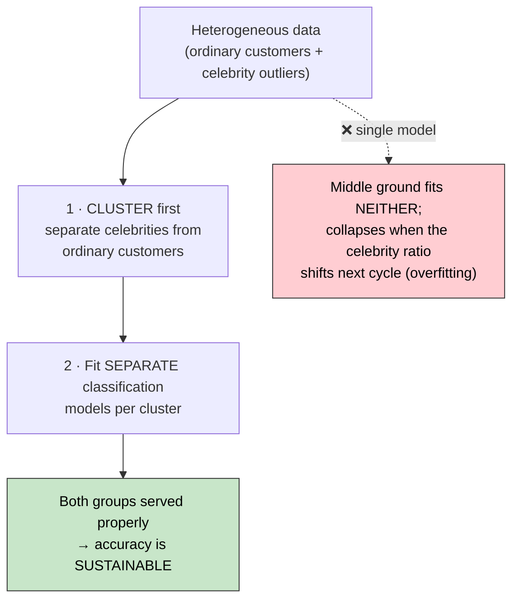

> Error analysis lets you connect backward: confusion matrix → ROC → cutoff → EDA → outlier treatment → raw data quality. That full chain is what lets you defend the model when the board of directors grills you.

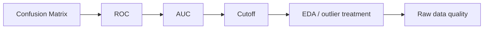

---

## 14. Boosting vs Random Forest

Both build many decision trees, but differently:

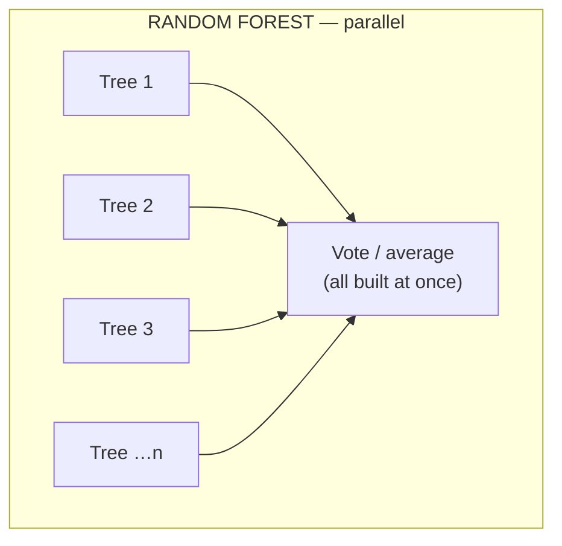

```mermaid
flowchart LR
    subgraph BO["BOOSTING — sequential"]
        b1["Tree 1<br/>note errors"] -->|"weight errors"| b2["Tree 2<br/>fixes T1 errors"]
        b2 --> b3["Tree 3<br/>fixes T2 errors"]
        b3 --> bn["… 50–100 trees"]
    end
```

| | Random Forest | Boosting (XGBoost, GBM) |
|---|---|---|
| Trees built | Simultaneously (parallel) | Sequentially |
| Overfitting | Handles well | Handled |
| Underfitting | A bit of a gamble | Systematically addressed |
| Errors | Whatever remains at the end | Reduced tree-by-tree via weighting |
| Typical accuracy | Good | Higher (very powerful) |

**Boosting** re-weights the rows a tree got wrong so the *next* tree focuses on them — systematically reducing both under- and over-fitting. That's why it hits higher precision/recall/F1. **GBM is a direct result of logistic regression** (built on odds/probability), and boosting is the **bridge between classical ML and deep learning.**

---

## 15. Explainability vs Accuracy — Horses for Courses

- **Logistic regression:** highly **explainable**, statistically rigorous (many assumptions), but often **lower accuracy**.
- **Boosting / neural nets:** higher accuracy, but **less explainable** ("black box").

```mermaid
quadrantChart
    title Explainability vs Accuracy
    x-axis "Low Accuracy" --> "High Accuracy"
    y-axis "Low Explainability" --> "High Explainability"
    quadrant-1 "High acc · High explain (ideal)"
    quadrant-2 "Low acc · High explain"
    quadrant-3 "Low acc · Low explain"
    quadrant-4 "High acc · Low explain"
    "Logistic Regression": [0.35, 0.9]
    "Decision Tree": [0.5, 0.75]
    "Random Forest": [0.7, 0.4]
    "Boosting (XGBoost/GBM)": [0.85, 0.3]
    "Neural Networks": [0.9, 0.15]
```

> "Nothing can replace logistic" — but people have moved to boosting because when selling a POC to a stakeholder, you can't show low accuracy; they care about ROI, not statistical nuance.

**When explainability is mandatory:** banks under RBI direction may **not** use anything unexplainable — no neural networks, sometimes not even boosting. There, **explainable AI > predictive accuracy.**

> **Horses for courses.** You must know 4–5 models (minimum for a classification problem: **logistic, decision tree, random forest, boosting**; Naive Bayes / SVM optional) — not to use all of them everywhere, but so you *have the option* to pick the right one. Choosing the best model is a hard exercise on its own, and it is **not** just about accuracy — especially with imbalanced data.

---

## 16. Practical Tip: Buffer Dummies

**Problem:** production model is live; the business adds a few new features / new categories. Do you rebuild from scratch?

```mermaid
flowchart TB
    Q{"How much changed?"}
    Q -->|"A few (2–5) vars,<br/>similar composition"| BUF["Use BUFFER DUMMIES<br/>(no rebuild)"]
    Q -->|"Large change in vars<br/>AND their composition"| RE["Rebuild the model<br/>(no choice)"]
    style BUF fill:#c8e6c9,stroke:#333,color:#000
    style RE fill:#ffe0b2,stroke:#333,color:#000
```

**Buffer dummies** = placeholder columns reserved during one-hot encoding for categories you *expect* to appear later.

**Example — one-hot encoding cities:** you have Delhi, Mumbai, Kolkata, Chennai, but expect Bangalore/Hyderabad/Pune to enter soon. Encode now with reserved buffer columns:

| City | Delhi | Mumbai | Kolkata | Chennai | buffer_1 | buffer_2 |
|---|:---:|:---:|:---:|:---:|:---:|:---:|
| Delhi | 1 | 0 | 0 | 0 | 0 | 0 |
| Mumbai | 0 | 1 | 0 | 0 | 0 | 0 |
| … | | | | | ↑ | ↑ |

The CI/CD data-engineering pipeline slots new cities (Bangalore, …) into `buffer_1` / `buffer_2` as they arrive.

```mermaid
flowchart LR
    NEW["New category arrives<br/>(e.g. Bangalore)"] --> PIPE["CI/CD data-eng pipeline"]
    PIPE --> SLOT["Insert into reserved<br/>buffer_1 / buffer_2"]
    SLOT --> MODEL["Live model undisturbed<br/>✓ no retrain needed"]
    style MODEL fill:#c8e6c9,stroke:#333,color:#000
```

Works for a handful of variables — you can't reserve buffers for 20; beyond ~5 you must retrain.

---

## 17. The Learning Roadmap: ML → DL → NLP → LLMs

**Don't jump to LLMs.** Follow the sequence — otherwise you'll know how to *run* models but understand nothing.

```mermaid
flowchart TB
    ML["ML<br/>(logistic, trees, boosting)"] --> DL["Deep Learning basics (ANN)"]
    DL --> PRE["Three critical prerequisites"]
    PRE --> RNN["RNN"]
    PRE --> LSTM["LSTM<br/>(Long Short-Term Memory)"]
    PRE --> EMB["Embeddings in NLP<br/>(Word2Vec = word → vector)"]
    RNN --> ED["Encoder – Decoder"]
    LSTM --> ED
    EMB --> ED
    ED --> TR["Transformers<br/>(built on encoder–decoder)"]
    TR --> SA["Self-Attention<br/>📄 'Attention Is All You Need'<br/>(Google Brain, 2017)"]
    SA --> LLM["LLMs / GenAI<br/>(RAG, LangChain pipelines, …)"]
    style SA fill:#f9d71c,stroke:#333,stroke-width:2px,color:#000
    style LLM fill:#c8e6c9,stroke:#333,stroke-width:2px,color:#000
```

- **Boosting** is the bridge between classical ML and deep learning — master it and connect it back to logistic + decision trees, and forward to ANN/CNN/RNN.
- If you don't understand **RNN, LSTM, embeddings → you won't understand encoder/decoder → you won't understand transformers/self-attention → you won't understand how LLMs are built.** The fancy terms (RAG, LangChain) sit on top of this backbone.

---

## Key Takeaways

1. **Understand the business problem first** — decide precision vs recall *before* touching code.
2. **Minimize error**, don't chase accuracy; watch generalization (train vs test).
3. **Logistic** exists because linear can't handle a bounded [0,1] target — the log-odds transform fixes the range mismatch.
4. **0.5 is rarely the right cutoff** — use Youden's Index (max TPR − FPR).
5. **Always analyze errors** — extreme misclassifications may signal heterogeneous data that needs clustering + separate models.
6. **Know multiple models** so you can pick the right one — explainability vs accuracy is a real trade-off (esp. in regulated domains like banking).
7. **Connect concepts** end-to-end (EDA → confusion matrix → ROC/AUC → cutoff → data) — that's what separates a modeler from someone who just runs code.
8. **Follow the learning sequence** to LLMs; don't skip the DL/NLP fundamentals.
