# Supervised Learning — Naive Bayes & K-Fold Cross-Validation

Study notes from the lecture (Prof. Durga Toshniwal). Covers every topic discussed, each with a Mermaid diagram.

---

## 0. Where this lecture sits

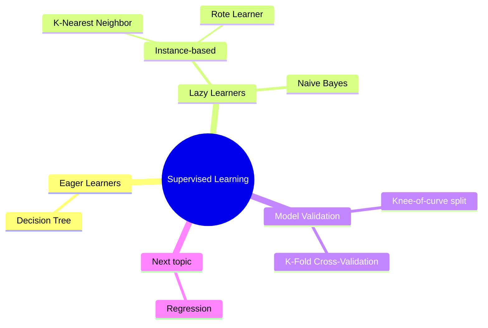

---

## 1. Recap — Instance-Based Classifiers

An instance-based classifier builds **no model**. It just stores all training records and, when an unseen sample arrives, searches the stored data for a match.

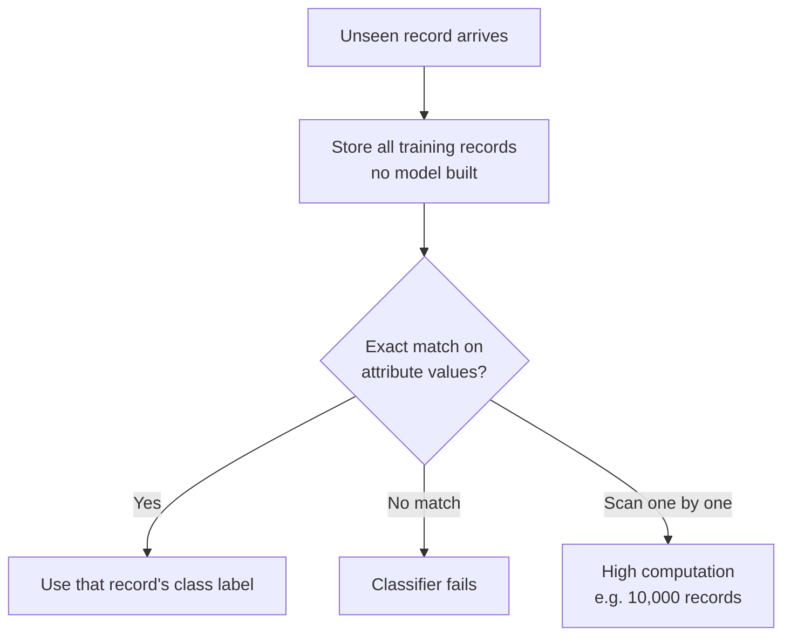

**Limitations**
- Needs an **exact match** → often none exists → classifier fails.
- Must scan every training record → very expensive on large data.

**Fix:** allow an **approximate match** → leads to **K-Nearest Neighbor (KNN)**.

---

## 2. K-Nearest Neighbor (KNN)

Each training sample is a point in a **D-dimensional space** (D = number of attributes). For an unseen record, find the **K closest points** using a distance metric (e.g. Euclidean), then take a **majority vote** of their class labels.

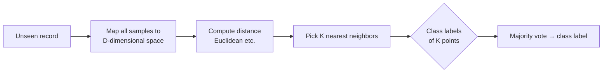

### Choosing K (bias–variance tradeoff)

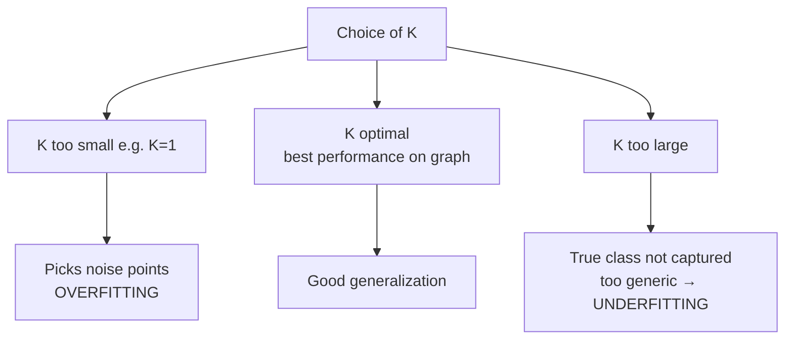

Plot **performance vs K** and pick the K where performance is best.

---

## 3. Eager vs Lazy Learners

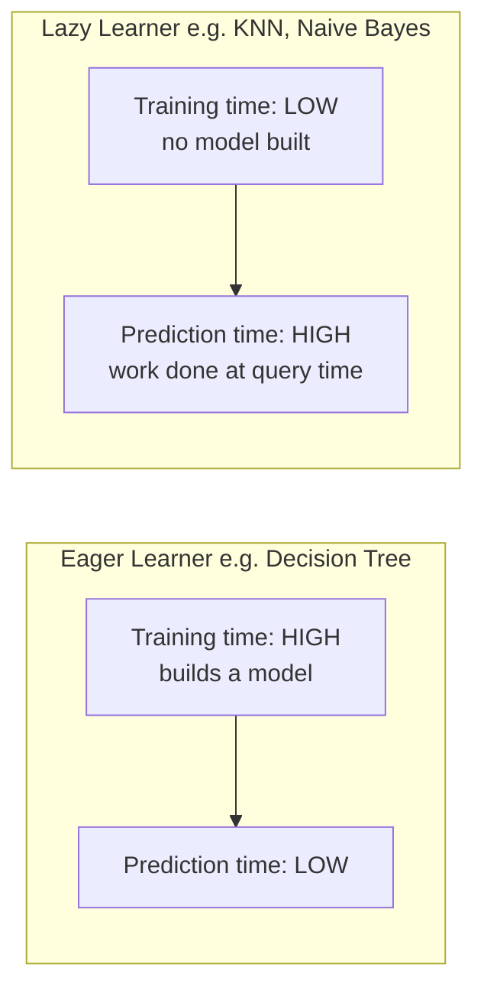

Choice depends on the application (fast training vs fast prediction).

---

## 4. Why we need probabilistic classifiers

Sometimes the **same attribute values map to different class labels** — the relationship is **non-deterministic**.

**Example:** a person on a strict diet + frequent workout — do they risk heart disease?
Not guaranteed "no" — hidden factors (smoking, heredity, stress, sudden events) may not be in the data.

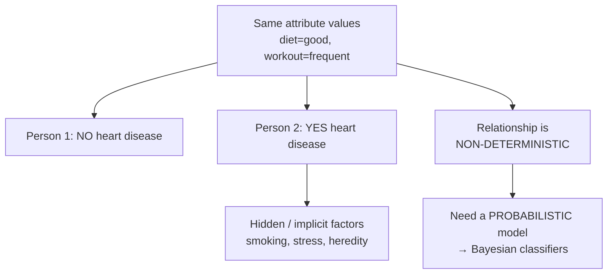

---

## 5. Bayes' Theorem

Relates **conditional probability** and **marginal (prior) probability**.

$$P(C \mid A) = \frac{P(A \mid C)\, P(C)}{P(A)}$$

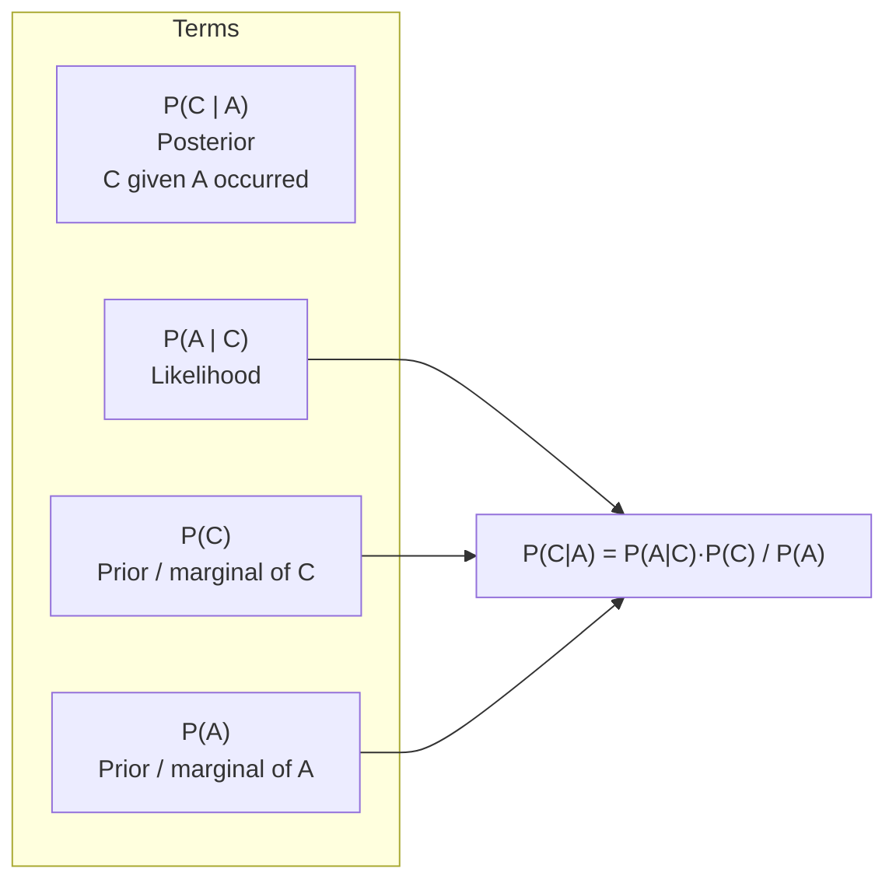

**Key idea:** `P(C)` (independent) ≠ `P(C | A)` (after observing A).
> Observations change our beliefs — e.g. trust in a teammate after seeing past performance; reliance on an airline after seeing disruptions. Independent events (coin toss, draw-with-replacement) are the exception where they stay equal.

### Worked example — Meningitis & stiff neck

Given: `P(stiff neck | meningitis) = 0.5`, `P(meningitis) = 1/50000`, `P(stiff neck) = 1/20`.

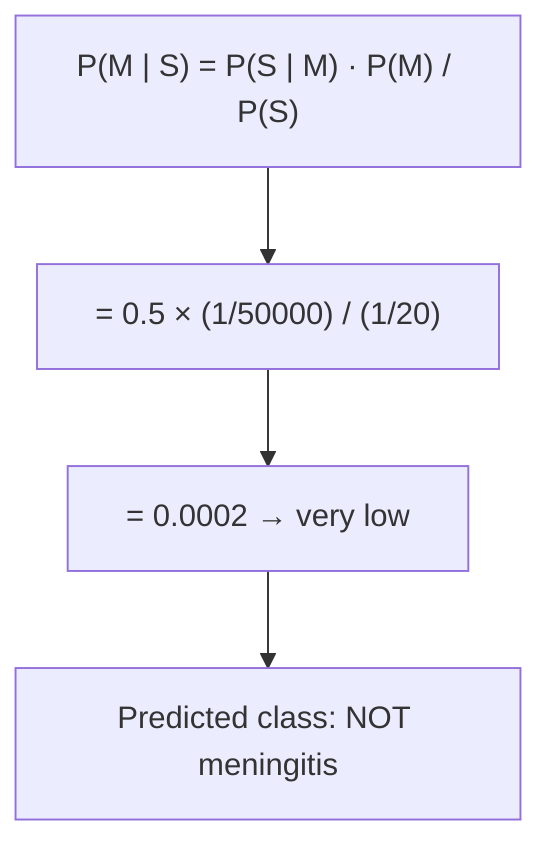

**Use in ML:** for multiple classes, compute `P(C₁|A), P(C₂|A), …` and pick the **highest** as the predicted label.

---

## 6. Naive Bayes Classifier

Goal: `P(C | A₁, A₂, …, Aₙ)`. Directly estimating `P(A₁…Aₙ | C)` is hard, so Naive Bayes assumes **conditional independence** of attributes given the class.

$$P(A_1,\dots,A_n \mid C_j) = \prod_{i=1}^{n} P(A_i \mid C_j)$$

```mermaid
flowchart TD
    A["P(C | A1,A2,...,An)"] --> B["∝ P(A1,...,An | C) · P(C)"]
    B --> C[Naive assumption:<br/>attributes conditionally<br/>independent given C]
    C --> D["= P(A1|C)·P(A2|C)·...·P(An|C) · P(C)"]
    D --> E[Denominator P(A1..An)<br/>ignored — same for all classes]
    E --> F[Pick class C with<br/>highest product]
```

---

## 7. Naive Bayes — Worked Example (Cheating dataset)

10 training samples, class label = **Cheat (Yes/No)**. Priors: `P(No)=7/10`, `P(Yes)=3/10`.
Continuous **income** is **discretized**: `≥80K` vs `<80K` (70, 60, 75 all fall in `<80K`).

**Query:** `Refund=No, Marital=Single, Income=70K` → predict class.

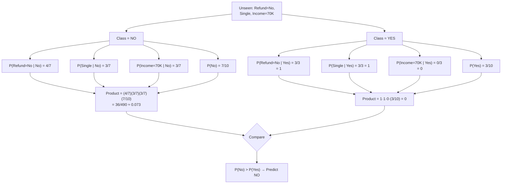

**Key point (attribute independence):** each attribute is counted **independently** — we don't require rows to match on all three attributes at once, only per-attribute given the class.

---

## 8. Properties of Naive Bayes

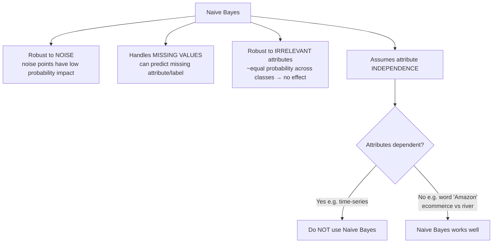

**"Amazon" example:** context decides class — "purchased on Amazon" → e-commerce; "Amazon River is long" → river/rainforest.
**Time-series counter-example:** value at Tₙ depends on previous values → not independent → don't use Naive Bayes.

---

## 9. Naive Bayes vs Decision Tree — when to use which

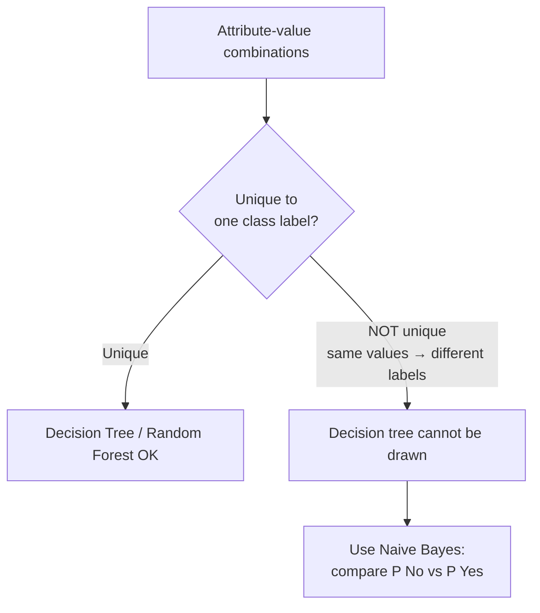

Decision trees fail when identical attribute values carry different labels; probabilities resolve it.

---

## 10. K-Fold Cross-Validation

Split training data into **K equal folds**. In each of K iterations, one fold = **test**, the rest = **train**. Average the K performances → final performance (removes data bias).

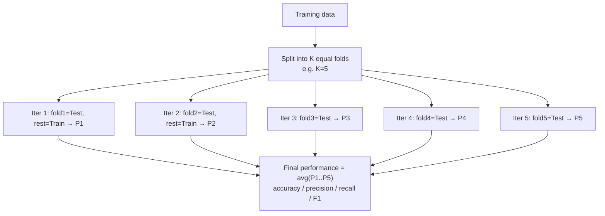

### Why average?
Any single fold may be biased (e.g. a majority class in one fold gives 95%, a hard fold gives 80%). Averaging gives an **unbiased** estimate.

### Choosing the number of folds K

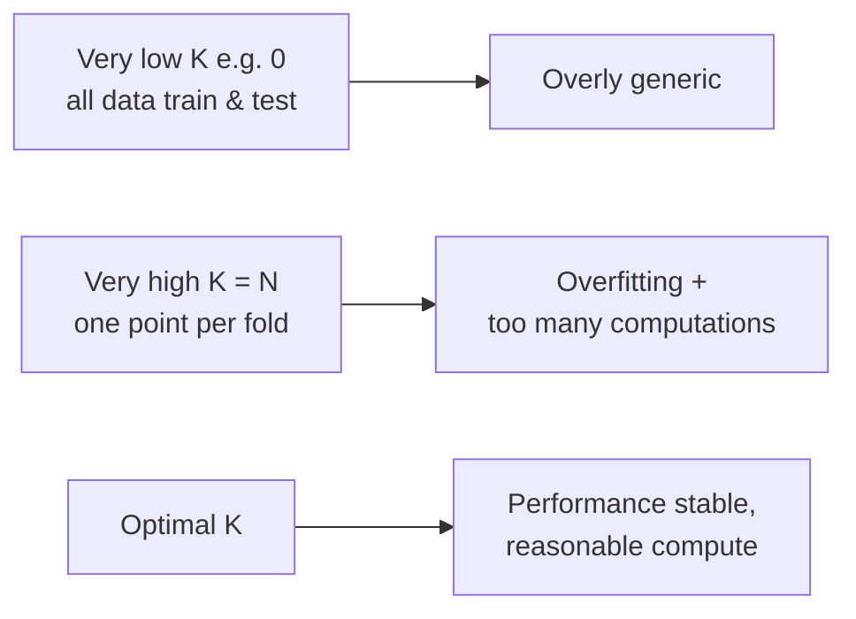

Plot **performance vs K**, pick where the curve **flattens** (adding folds beyond adds compute, not accuracy). K-fold and the "training-split ratio / knee-of-curve" method both ultimately decide the **train-test ratio** — the two most popular approaches.

### Two methods to split train/test

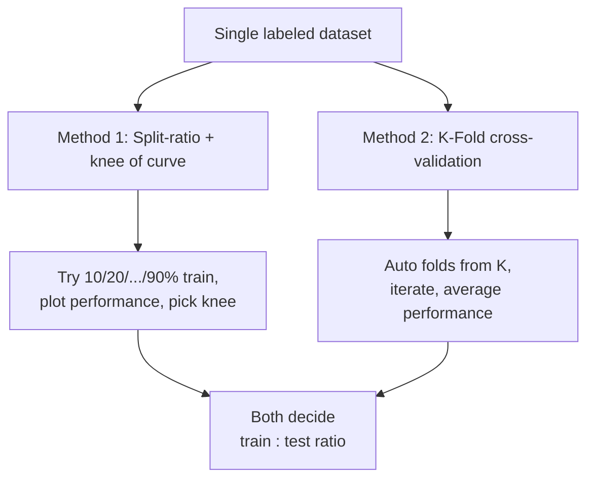

---

## Quick reference

| Concept | One-liner |
|---|---|
| Lazy learner | No model; work done at prediction time (KNN, Naive Bayes) |
| Eager learner | Builds model up front (Decision Tree) |
| Bayes theorem | `P(C\|A) = P(A\|C)P(C)/P(A)` |
| Prior / marginal | `P(C)` independent of other events |
| Posterior | `P(C\|A)` after observing A |
| Naive assumption | Attributes conditionally independent given class |
| Ignore denominator | `P(A₁…Aₙ)` constant across classes |
| Use Naive Bayes when | Noise, missing values, non-unique value→label, independent attributes |
| Avoid Naive Bayes when | Attributes dependent (e.g. time series) |
| K-fold CV | K folds, rotate test fold, average performance |
