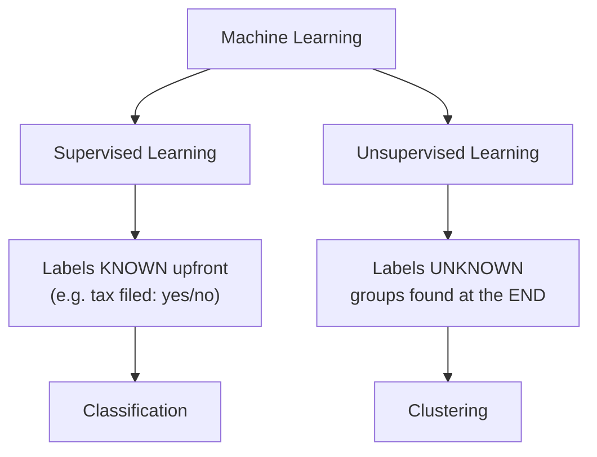
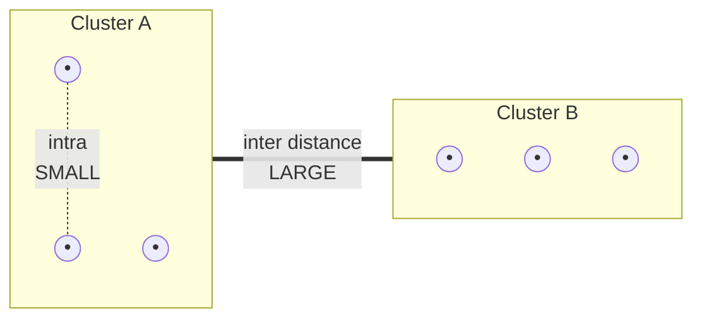
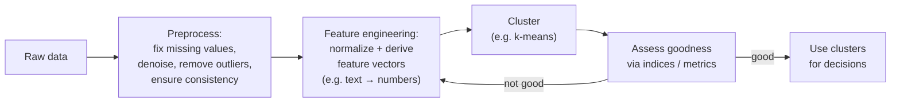
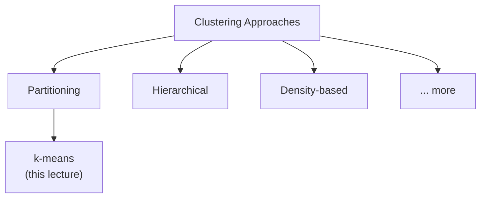
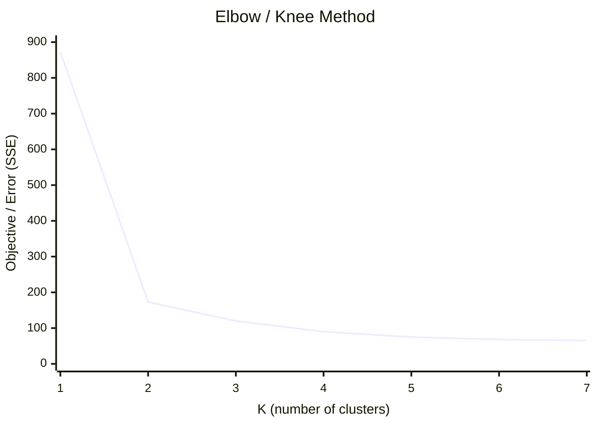
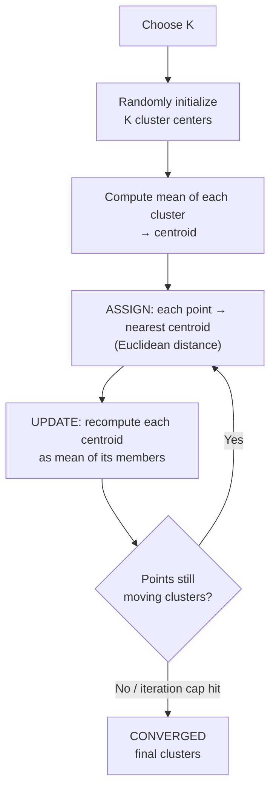

# Unsupervised Learning & Clustering — Complete Notes

> Lecture by Prof. Durga Toshniwal. Written assuming **zero prior knowledge**. Read top to bottom.

---

## 1. The Big Picture: Supervised vs Unsupervised Learning

Machine learning tasks fall into two broad camps based on **whether we already know the answer (labels)**.

### Supervised Learning
- We **already know the class labels / groups** in the data before we start.
- Example: A dataset of people where each row is already tagged *"filed income tax: yes / no."* We know upfront that the two groups exist.
- Example task: **Classification** — learn to put new data into these known groups.

### Unsupervised Learning
- We have **no idea about class labels or group information**. There is no "answer key."
- We discover structure/groups **at the end** of the process, not the beginning.
- The main unsupervised task in this course: **Clustering**.



> **Word origin (grammar trivia from lecture):** In plain English both "classify" and "cluster" just mean *"to group."* The technical difference is only **supervised (labels known) vs unsupervised (labels unknown)**.

---

## 2. What is Clustering?

**Clustering = grouping data points so that:**
- Points **within the same group (cluster)** are **similar** to each other.
- Points in **different clusters** are **dissimilar** from each other.

Similarity is judged by some **notion of similarity** (defined later — usually a distance).

### The two governing objectives

| Term | Meaning | What we want |
|------|---------|--------------|
| **Intra-cluster distance** | Distance *between points inside the same cluster* | **Minimize** (clusters should be compact/tight) |
| **Inter-cluster distance** | Distance *between different clusters* | **Maximize** (clusters should be far apart / well-separated) |

Plain English:
- **Minimize intra-cluster** → points in one cluster huddle close together (compact, crowded).
- **Maximize inter-cluster** → different clusters sit far apart, so their points are very dissimilar.



> ⚠️ In the lecture the professor briefly mixed up the terms ("maximize intra... sorry, inter"). The correct statement is above: **minimize intra, maximize inter.**

Cluster boundaries drawn in diagrams are **only for illustration** — the data itself has no real boundary lines.

---

## 3. Clustering is Subjective & Ambiguous

A key conceptual point: **there is often no single "correct" number of clusters.**

- Given a scatter of points, different people reasonably answer "2 clusters," "4," "6," "7," "10"…
- All can be *valid* — it depends on **why** you are clustering and **what** you'll do with the result.
- A small blob might be counted as 1 cluster by one person and split into 2 by another (that's how "6" becomes "7").

**Conclusion:** The notion of a cluster is inherently **ambiguous and subjective**, unless you have **prior/domain knowledge about the data** telling you what grouping you actually need.

### The Simpsons / cartoon-characters example
You can group the same set of cartoon characters by many different attributes:
- gender, age, dress color, profession, mood/expression, family vs. school-employees, etc.

Each choice gives **completely different clusters**. So:
- If your goal is **"how many males vs females,"** but you accidentally cluster on **age**, you get the **wrong** answer.
- In this toy example the mistake is obvious. **In real, unfamiliar datasets it is NOT obvious** — you may have no domain expertise, cluster on the wrong attribute, get garbage clusters, **and never even realize they're wrong.**

> **Practical warning:** Choosing the **wrong notion of similarity** (wrong attribute) silently corrupts the entire analysis. Be very deliberate about what similarity you cluster on.

---

## 4. Similarity, Dissimilarity & Distance (a.k.a. "Proximity")

- **Similarity** can be thought of as **closeness** → measured as a **distance** between points.
  - Very similar points → **small** distance.
  - Very dissimilar points → **large** distance.
- The umbrella term for similarity/dissimilarity/distance is **proximity** (used synonymously with "similarity" in this course).

### 4.1 Euclidean Distance
The most common distance. It compares two data points **attribute-by-attribute** (feature-by-feature).

Setup: two points **P** and **Q**, each with **k attributes**. `Pₖ` = value of the k-th attribute of P; `Qₖ` = k-th attribute of Q.

**Formula (Euclidean distance):**

```
d(P, Q) = sqrt( Σ (Pₖ − Qₖ)²  )      for k = 1 … number of attributes
```

Steps in words:
1. For each attribute, take the **difference** `(Pₖ − Qₖ)`.
2. **Square** each difference.
3. **Add** them all up.
4. Take the **square root** of the total.

If P and Q are identical, distance = 0 (curves fully overlap).

### 4.2 Minkowski Distance (generalization of Euclidean)
Instead of squaring and square-rooting, raise to a general power **r**:

```
d(P, Q) = ( Σ |Pₖ − Qₖ|^r )^(1/r)
```

- When **r = 2** → this **becomes exactly the Euclidean distance**.
- (Other r values give other distances, e.g. r = 1 is Manhattan distance.)

> (The lecture pronounced it "Minskowitzky" — the correct name is **Minkowski**.)

### End-to-end data pipeline (asked in class)
Clustering is only one step. The full flow:



### 4.3 Why Standardization / Normalization Matters ⭐ (very important)
Euclidean distance just squares raw differences — it does **not** account for **different scales/units** of attributes.

**Worked example** — three attributes:

| Attribute | Unit | Range | Point P | Point Q | Raw difference |
|-----------|------|-------|---------|---------|----------------|
| Weight | kg | 1–1000 | 50 | 1000 | 950 |
| Length | m | 10–100 | 10 | 20 | 10 |
| Speed | km/h | ~50 | 50 | 51 | 1 |

Euclidean distance² = 950² + 10² + 1² → **weight (950²) completely dominates**, purely because its numbers are bigger. Length and speed contribute almost nothing, even if they're proportionally just as different.

**The fix: standardize / normalize** all attributes onto a **common scale** (e.g. 0–1) so they're comparable and no single attribute dominates unfairly.

Ways to normalize (covered in data-preprocessing):
- **Min-max normalization** → rescales to a fixed range like 0–1 (e.g. divide by the max, more precisely `(x − min)/(max − min)`).
- **Z-score normalization** → rescales using mean and standard deviation.
- (Several other methods exist.)

> Rule of thumb: **divide each attribute's difference by its scale** so a "950 out of 1000" and a "10 out of 100" are treated fairly relative to their own ranges.

---

## 5. What Makes a *Good* Clustering Method?

A good method finds the **natural groupings** — the genuinely **crowded/dense regions** of the data — and does **not** invent artificial splits.

- ✅ Correct: identify the real dense blobs as clusters.
- ❌ Wrong: split one big natural cluster into several sub-clusters "just for the sake of it," or cut across natural groups.

### Desired properties/requirements of a good clustering algorithm
1. **Correct notion of similarity** — cluster on the attribute that matches your goal.
2. **Minimize intra-cluster, maximize inter-cluster** distance (the core objective).
3. **Handle noise & outliers** — outliers shouldn't distort clusters (they must be trimmed / handled).
4. **Order-insensitive** — reordering the input points must NOT change the clusters (e.g. 100 points shuffled → same result).
5. **Scalable** — must still work as the number of points grows huge; shouldn't fail on large data.
6. **Discover arbitrary shapes** — should find true clusters of any shape, not be biased toward only spherical/oval/circular clusters.
7. **Handle dynamic data** — cope with new points arriving over time.
8. **Handle different attribute types** — not restricted to one data type.
9. **Interpretable** — results should be understandable (important for explainable AI).

> ⭐ **Reality check (stated later in the lecture):** **No single algorithm has all of these properties.** Getting even 2–3 of them together is hard. You pick the best available tool for your situation.

---

## 6. How Data is Organized for Clustering

Two standard structures:

### 6.1 Data Matrix ("object × attribute")
- Shape: **n × p**
  - **n rows** = data points/objects.
  - **p columns** = attributes/features.
- Each row is one data item; each column is one feature. Standard table of raw data.

### 6.2 Dissimilarity Matrix ("object × object")
- Shape: **n × n** (points on both rows and columns).
- Each cell = the **distance between point i and point j**.
- Properties:
  - **Diagonal = 0** (distance of a point to itself is 0).
  - **Symmetric**: distance(2→1) = distance(1→2). By symmetry, you only need to **fill in one half** (upper or lower triangle); the other half is identical.

---

## 7. Categories of Clustering Approaches

Many families of algorithms exist, each with many algorithms inside:
- **Partitioning** (e.g. **k-means** — focus of this lecture)
- **Hierarchical**
- **Density-based**
- …and more.



### Partitioning approach (the focus)
Divide n points into **k subsets/partitions** such that points within each partition are very similar. The evaluation minimizes intra-cluster distances ("errors").

**Rules of partitioning:**
- **k = number of clusters**, **n = number of data points**, usually **k ≪ n**.
- Worst case: k = n (one point per cluster).
- **Every cluster must have ≥ 1 point** (no empty clusters).
- **Every point belongs to exactly ONE cluster — "not less, not more":**
  - *Not less* → no point can be left out; all points must be placed in some cluster.
  - *Not more* → no point can be in multiple clusters simultaneously.
- Clusters are refined **iteratively** (points reassigned) until they **stabilize**.

> If you're clustering only a subset of the data, that's fine — but **every point in that chosen subset must still be assigned to a cluster**.

---

## 8. Choosing the Number of Clusters K — The Elbow ("Knee") Method

k-means needs **K as an input**, but often we don't know the right K. Method to find it:

1. **Objective function** = a value we minimize (or maximize). For clustering it's usually the **error** (how spread out / non-compact the clusters are).
2. Run clustering for many values of K, record the objective (error) each time.
3. **Plot: objective function (Y) vs. K (X).**
4. Find the **"knee"/"elbow"** of the curve — the point where error stops dropping meaningfully.

**Illustrative numbers from the lecture:**
- K = 1 → all points in one cluster → error = **873** (huge).
- K = 2 → error = **173.1** (~⅛ of before — massive improvement; matches the natural 2 clusters).
- K = 3 → error drops a bit more, but now one real cluster gets **artificially split** into two.
- Beyond ~6 → curve **plateaus**: adding clusters barely reduces error but greatly increases cluster count.

**Decision:** Pick the K at the **knee** — the smallest K where error is already "optimally low." Adding more clusters past the knee gives **tiny error gains for a big rise in complexity**, so it's not worth it. (In this example, K ≈ 2.)



> The sharp bend at **K = 2** is the "knee" — error drops steeply up to it, then flattens (plateaus). That bend is the chosen K.

---

## 9. K-MEANS ALGORITHM (Step by Step) ⭐ Core of the lecture

**Name meaning:**
- **K** = the number of clusters you decide to form.
- **Means** = each cluster's center = the **mean (average) of all points in that cluster**, called the **centroid** (cluster center).

### The algorithm

1. **Choose K** (number of clusters).
2. **Initialize:** pick **K initial cluster centers**, typically by **random assignment** — either randomly place K centers, or randomly assign points to K clusters.
3. **Compute means:** for each cluster, compute the **mean of all its points** → that mean becomes the cluster's **centroid**.
   - Mean is computed **per attribute**: average attribute A over all points in the cluster, average attribute B, etc. The resulting point (avg A, avg B, …) is the centroid.
4. **Assignment step:** for **every point**, compute its **distance to every centroid** (Euclidean for numeric data), and **assign the point to its nearest centroid**.
   - A point may **move** to a different cluster than before if another centroid is now closer. (Typically only **boundary points** move; interior points stay.)
5. **Update step:** recompute each cluster's centroid as the **new mean** of its (possibly changed) members. Centroids shift to new locations (`K1_old → K1_new`, etc.).
6. **Repeat** steps 4–5 (reassign → recompute means) **iteratively**.
7. **Stop (convergence):** when there is **no substantial movement of points** across clusters between iterations. The clusters are then declared **converged / final**.

> The very first centroids come from **random initialization**; every later centroid is a **real mean** of assigned points.



### Stopping via a max-iteration cap
Real data can have **millions of points** → possibly thousands/lakhs of iterations → too expensive.
- Common practical stop: **cap the number of iterations** (e.g. 1000). After that many iterations, stop **regardless** of the objective value.
- **Trade-off:** capping means you accept an **"optimally good"** answer, **not necessarily the best** — some points may not be as tight to their cluster as they could be. You trade quality for compute savings.
- How to pick a good cap: try several cap values, see how good the clusters are, then decide. Often data scientists **just pick a number based on available compute/runtime.** There is **no foolproof rule.**

---

## 10. The Objective Function = Error = SSE (Sum of Squared Errors)

**Objective function IS the error** — they're the same thing in k-means.

### What the error measures
For each cluster: the distance of every point in that cluster **from its own centroid**.
- Compact cluster → points sit close to the centroid → **small error**. (The centroid should sit roughly in the middle of its points.)
- Spread-out cluster → points far from centroid → **large error**.

### Total error
- Compute error for each cluster: `E1`, `E2`, `E3`, …
- **Total objective = E1 + E2 + E3 + … + E_K** (sum over all clusters).
- We **minimize** this total → all clusters become as compact as possible.

### Sum of Squared Errors (SSE) — the most popular objective

```
SSE = Σ (over clusters i = 1..K)  Σ (over points x in cluster Cᵢ)  distance(x, mᵢ)²
```

where **mᵢ = centroid of cluster Cᵢ**, and **x = a point in Cᵢ**.

In words: for each cluster, take the distance of each point to its centroid, **square it, add them up**; then **sum across all clusters**.

> The objective could instead be **mean absolute error** or others — but **SSE (difference → square → add) is by far the most popular.**

---

## 11. Computational Complexity of K-Means

```
O(n · K · I · d)
```

| Symbol | Meaning |
|--------|---------|
| **n** | number of data points |
| **K** | number of clusters |
| **I** | number of iterations |
| **d** | number of attributes/dimensions |

Since **K, I, and d are effectively fixed** for a given run, complexity is **linear in n → O(n)**.

⭐ **This is k-means' biggest strength:** despite looking complex (repeated distance calculations + iterations), it's **O(n)** — the **lowest complexity** and **far less compute-intensive** than most other clustering methods.

---

## 12. Problems / Limitations of K-Means ⚠️

k-means has many flaws (though it's still hugely popular):

### 12.1 You must know K in advance
- K is an **input**. On new data you often **don't know the right K**.
- Requires running the **elbow method** across many K values → extra work. A wrong K makes **everything** go wrong.

### 12.2 Sensitive to noise & outliers ⭐
- Because partitioning **forces every point into a cluster**, outliers can't be ignored.
- The **centroid is a mean**, and **means are dragged by extreme values**.
- A few far-away noise points **pull the centroid away** from where it should be → clusters get distorted.
- **k-means is NOT robust to noise.** → **Handle noise/outliers in preprocessing** (denoise, remove outliers) *before* clustering.

### 12.3 Sensitive to initial centroid choice ⭐ (a subtle, dangerous one)
- Initial centroids are chosen **randomly** → results can **vary run to run**.
- If the initial centroids are only **slightly off** → it will still **converge** correctly (iterations fix it).
- If the initial centroids are **grossly wrong** → it may **NEVER converge** to the correct clusters, **even after all iterations**.
  - Symptom: two real clusters get **merged**, and one big cluster gets **split** — wrong, even when **K is correct**.
- **Fix:** **restart** with different random seeds and repeat; use **visualization** to guide better initial placement.

> ⭐ **The scary insight:** Even when the **error (objective) keeps going down**, the **final clusters can still be wrong** — because within a badly-seeded configuration, only boundary points shuffle around; points **cannot drift far enough** to fix a grossly wrong start. **Low error ≠ correct clusters.** And on unfamiliar data **you may never know they're wrong.**
>
> There is **no scientific/standard way** to pick the perfect initial seeds — the process is **iterative and empirical** (try, look at results, adjust) — much like modern generative/agentic AI workflows. **Visualization is the best practical aid.**

### 12.4 Order sensitivity
- May be sensitive to the **order** points are presented (a good method shouldn't be).

### 12.5 Needs normalized data
- Un-normalized data → wrong clusters (weight-dominates-length problem). **Normalize/scale first.** (True for most clustering methods, not just k-means.)

### 12.6 Only for STATIC data (not dynamic/streaming) ⭐
- Everything above assumes a **fixed dataset**.
- If **new points keep arriving** (dynamic/streaming data), plain k-means **breaks**: centroids keep changing endlessly, clusters **never stabilize**.
- **In their basic form, NO clustering algorithm handles dynamic data well.**

**Work-around for dynamic data — bucketing / snapshots:**
1. Group incoming data by time into **buckets/snapshots** (e.g. take 4 time-samples as one "static" snapshot).
2. Run k-means on each snapshot → get centroids (e.g. `K1=P1, K2=P2, K3=P3`).
3. For the **next snapshot**, see whether the centroids **drift** (`P1→P1'`, etc.) or stay.
4. Bucketing variants:
   - **Disjoint buckets** — no overlap between consecutive buckets.
   - **Sliding window** — consecutive buckets **share some points** plus add new ones.

**Trade-off of bucketing:** You **lose fine-grained history** — older detailed points become obsolete; newer points get emphasis.
- But centroids are a **summary (mean)** of past points, so the previous snapshot's info is partially retained in its centroids — just not the full detail.
- **Analogy (weather):**
  - **Prediction** (what's the weather *today/tomorrow*?) → use **recent** data (~last 5 years). Old data is misleading because conditions changed.
  - **Long-term trend analysis** (temperature trend over decades) → use **all** the data (50–100 years).
  - So *recency vs. full-history* depends on whether you're doing **prediction** or **trend/forecast** analysis.

---

## 13. Why Use K-Means Despite All the Flaws? ⭐

Even with so many limitations, k-means is **one of the most popular clustering methods** because:

1. **Lowest complexity — O(n).** Far less compute-intensive than other methods (which you'll see later).
2. **Very intuitive & interpretable.** Easy to understand: "clusters have centroids; assign points to the nearest centroid; minimize distances." Interpretability matters a lot in modern AI.

**Bottom line:** **No clustering method is foolproof.** None has all the "good clustering" properties (having even 2–3 is hard). So you use the best available tool. As the professor put it: **"Better to have something rather than nothing."**

> Note: k-means clusters ARE used for real **decision-making**, not just recommendations/segmentation. It's a general-purpose method; it just happens to have known flaws we must manage.

---

## 14. Quick Revision Cheat-Sheet

| Concept | One-liner |
|---------|-----------|
| Supervised | Labels known upfront (classification) |
| Unsupervised | No labels; discover groups (clustering) |
| Clustering goal | Similar points together, dissimilar apart |
| Intra-cluster distance | Within a cluster → **minimize** |
| Inter-cluster distance | Between clusters → **maximize** |
| Proximity | Umbrella term for similarity/distance |
| Euclidean distance | √(Σ (Pₖ−Qₖ)²) |
| Minkowski distance | (Σ|Pₖ−Qₖ|^r)^(1/r); r=2 → Euclidean |
| Normalization | Put attributes on same scale so none dominates |
| Data matrix | n × p (objects × attributes) |
| Dissimilarity matrix | n × n, symmetric, diagonal = 0 |
| Partitioning rule | Every point in exactly 1 cluster; no empty clusters |
| Centroid | Mean (per-attribute average) of a cluster's points |
| K-means loop | assign to nearest centroid → recompute means → repeat till stable |
| Elbow/knee method | Plot error vs K; pick K at the bend |
| Objective = error = SSE | Σ over clusters Σ over points dist(x, centroid)² |
| Complexity | O(n·K·I·d) ≈ O(n) |
| Stop condition | No substantial point movement, or hit iteration cap |
| Main flaws | Need K; sensitive to noise & to init seeds; static-only; needs normalization |
| Main strengths | Fast O(n); simple & interpretable |
| Golden warning | Low error ≠ correct clusters; bad seeds/K can silently ruin results — **visualize your data** |

---

## 15. Terms the lecture mispronounced (so you search correctly)
- "Minskowitzky / Minskowitzki" → **Minkowski distance**
- "NE / knee of the curve" → **knee / elbow** of the curve (elbow method)
- "camings / kaymines / keynes / cayments" → **k-means**
- "IELT / IATS cluster" → **i-th cluster**
