# Data Similarity, Distance Measures & Evaluation Metrics
> ML lecture notes — data types, similarity measures, confusion matrix, and model evaluation.

---

## Table of Contents
1. [Types of Data Attributes](#1-types-of-data-attributes)
2. [Properties of a Valid Metric](#2-properties-of-a-valid-distance-metric)
3. [Distance Measures for Numeric Data](#3-distance-measures-for-numeric-data)
4. [Distance Matrix](#4-distance-matrix)
5. [Binary Vector Similarity](#5-binary-vector-similarity)
6. [Cosine Similarity](#6-cosine-similarity)
7. [Confusion Matrix](#7-confusion-matrix)
8. [Precision](#81-precision)
9. [Recall](#82-recall)
10. [Precision–Recall Trade-off](#83-precisionrecall-trade-off)
11. [F1 Score](#84-f1-score)
12. [Accuracy](#85-accuracy)
13. [Sensitivity & Specificity](#86-sensitivity--specificity)
14. [FPR & FNR](#87-fpr--fnr)
15. [ROC Curve & AUC](#9-roc-curve--auc)
16. [Cheat Sheet & Decision Guide](#10-complete-cheat-sheet)

---

## 1. Types of Data Attributes

### Taxonomy of Attribute Types

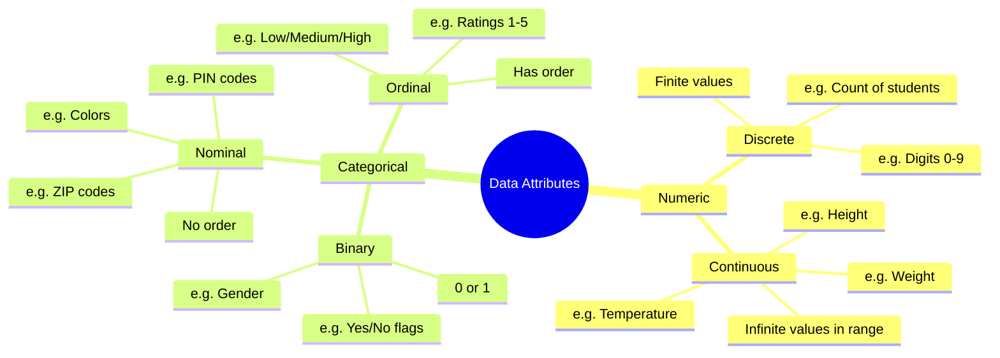

### Summary Table

| Type | Behaves like a number? | Examples |
|------|----------------------|---------|
| **Numeric** | Yes | Temperature, Height, Weight |
| **Categorical** | No (even if stored as number) | Gender (0/1), ZIP codes, PIN codes |
| **Discrete** | Finite set of values | Digits 0–9, number of students |
| **Continuous** | Infinite values in a range | Weight (70.1, 70.11, 70.111…) |

> **Key insight:** PIN codes look like numbers but represent *locations*. Adding two PIN codes is meaningless — they are categorical, not numeric.

---

## 2. Properties of a Valid Distance Metric

All four properties must hold for `D(P, Q)` to be a valid metric.

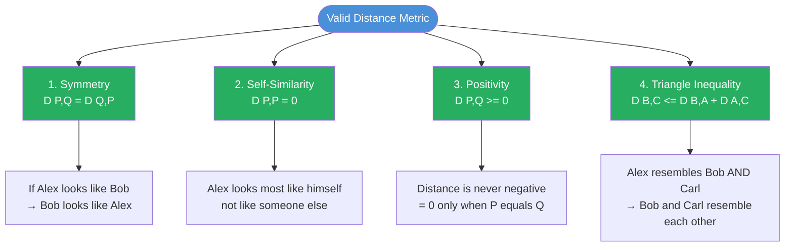

---

## 3. Distance Measures for Numeric Data

### Minkowski Family

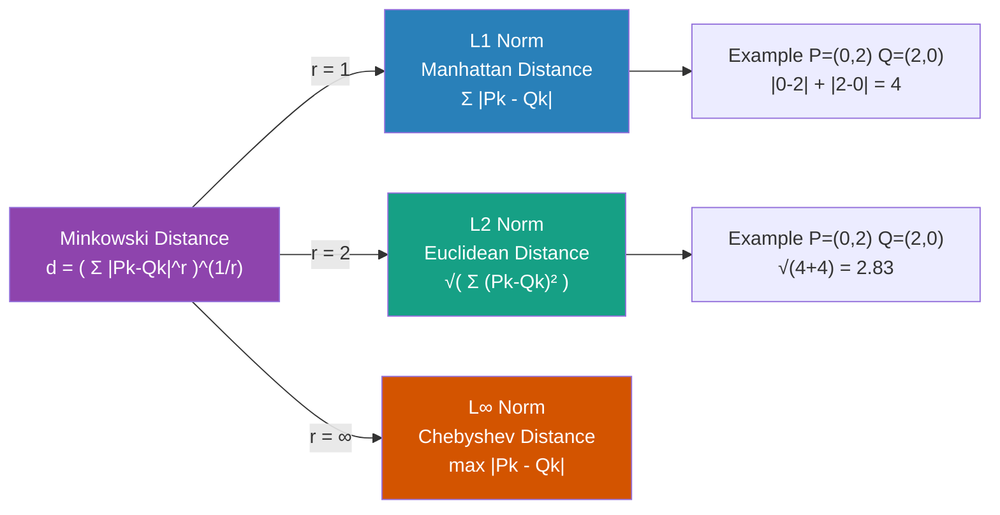

### Manhattan vs Euclidean — Concept

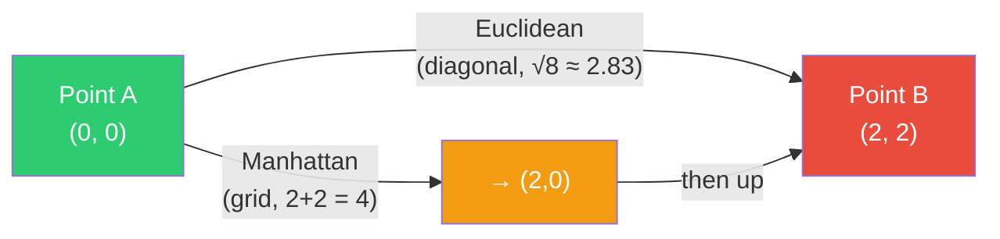

> Euclidean = straight line (shortest).  Manhattan = city-block path (horizontal + vertical only).

---

## 4. Distance Matrix

### How it is built

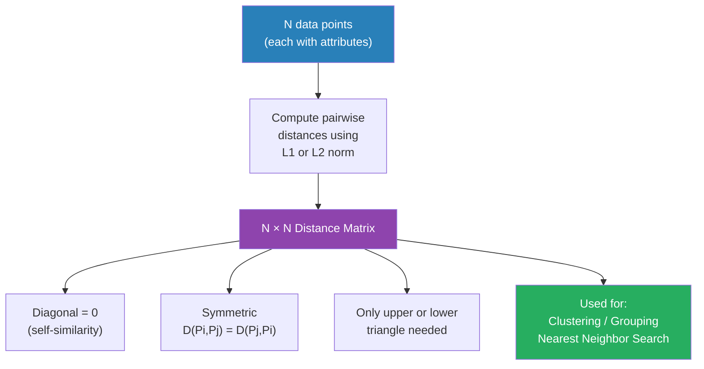

### Worked Example — 4 points in 2D

| Point | X | Y |
|-------|---|---|
| P1 | 0 | 2 |
| P2 | 2 | 0 |
| P3 | 3 | 1 |
| P4 | 5 | 1 |

#### Euclidean (L2) Distance Matrix

|    | P1 | P2 | P3 | P4 |
|----|----|----|----|----|
| **P1** | 0 | 2.83 | 3.16 | 5.10 |
| **P2** | 2.83 | 0 | **1.41** | 3.00 |
| **P3** | 3.16 | 1.41 | 0 | 2.00 |
| **P4** | 5.10 | 3.00 | 2.00 | 0 |

> **Closest pair: P2 and P3** (d = √2 ≈ 1.414)

---

## 5. Binary Vector Similarity

### When to use SMC vs Jaccard

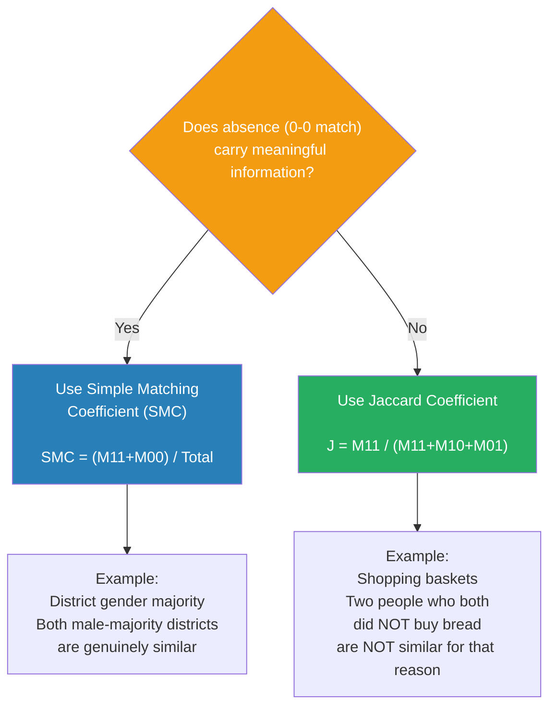

### Match Type Breakdown

```mermaid
quadrantChart
    title Binary Vector Match Types
    x-axis "Vector Q value" 0 --> 1
    y-axis "Vector P value" 0 --> 1
    quadrant-1 M11 - Both present (counts in SMC and Jaccard)
    quadrant-2 M10 - P present Q absent (mismatch)
    quadrant-3 M00 - Both absent (counts in SMC only)
    quadrant-4 M01 - P absent Q present (mismatch)
```

### Worked Example

```
P: 1  0  0  1  0  0  0  0  0  0
Q: 0  0  1  1  0  0  0  0  0  0
         ↑  ↑
        M01 M11  ← only 1 shared purchase
```

| Count | Value |
|-------|-------|
| M₁₁ | 1 |
| M₀₀ | 5 |
| M₁₀ | 2 |
| M₀₁ | 2 |

| Metric | Calculation | Score | Why it differs |
|--------|------------|-------|----------------|
| **SMC** | (1+5)/(1+5+2+2) | **60%** | 5 "neither bought" matches inflate result |
| **Jaccard** | 1/(1+2+2) | **20%** | Only real shared purchases counted |

---

## 6. Cosine Similarity

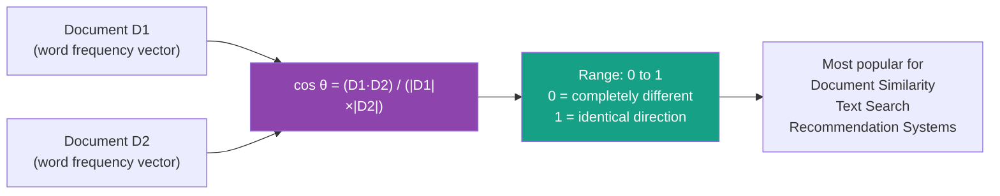

### Worked Example

|    | team | coach | play | ball | score |
|----|------|-------|------|------|-------|
| D1 | 3 | 2 | 2 | 5 | 1 |
| D2 | 1 | 0 | 2 | 3 | 2 |

```
D1·D2 = (3×1)+(2×0)+(2×2)+(5×3)+(1×2) = 24
|D1|  = √(9+4+4+25+1) = √43 ≈ 6.56
|D2|  = √(1+0+4+9+4)  = √18 ≈ 4.24

cos(θ) = 24 / (6.56 × 4.24) ≈ 0.86  → High similarity
```

---

## 7. Confusion Matrix

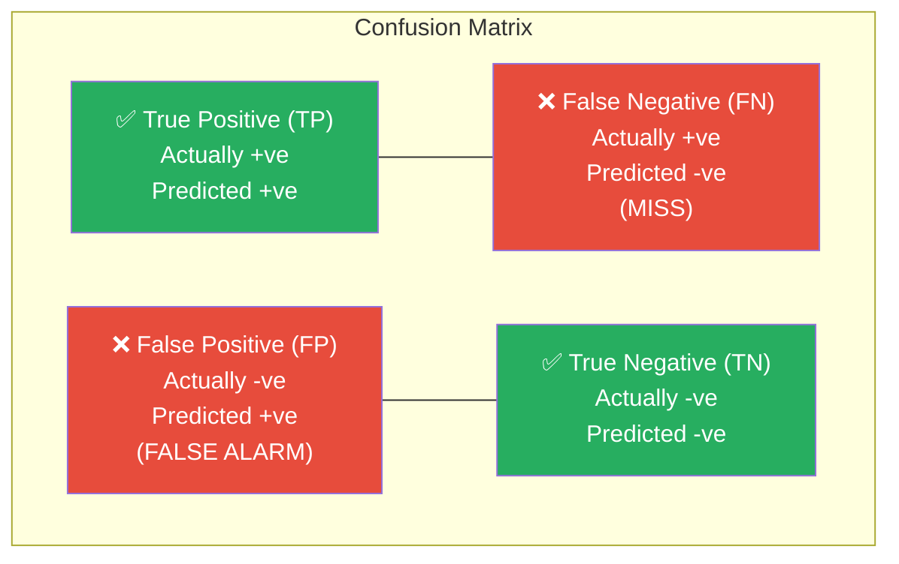

### COVID Test Example

| | Predicted: Positive | Predicted: Negative |
|-|---------------------|---------------------|
| **Actual: Positive (sick)** | TP ✅ Correctly flagged | FN ❌ Sick walks free — dangerous |
| **Actual: Negative (healthy)** | FP ❌ Healthy quarantined | TN ✅ Correctly cleared |

---

## 8.1 Precision

```
Precision = TP / (TP + FP)
```

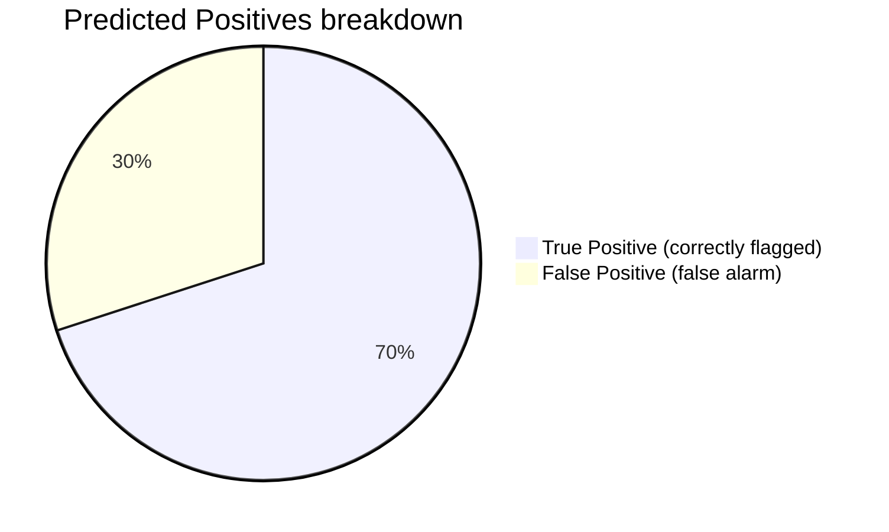

> Precision = 70 / (70+30) = **70%** — 30% of positive predictions were wrong.

- High precision = **low FP** = model rarely raises false alarms
- Model is **conservative**

**Real-world stakes:**

| Scenario | FP means | Impact |
|----------|---------|--------|
| Spam filter | Legit email blocked | User misses important email |
| Legal conviction | Innocent jailed | Severe injustice |
| Medical test | Healthy person treated | Unnecessary trauma/cost |

---

## 8.2 Recall

```
Recall = TP / (TP + FN)
```

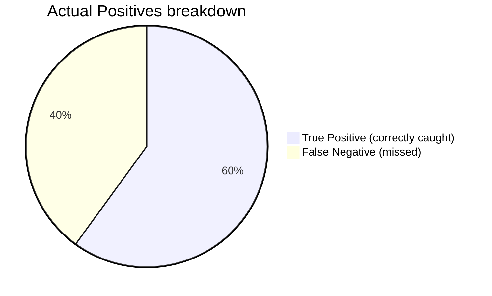

> Recall = 60 / (60+40) = **60%** — 40% of real positives were missed.

- High recall = **low FN** = model misses very few real positives
- Model is **lenient**

**Real-world stakes:**

| Scenario | FN means | Impact |
|----------|---------|--------|
| COVID/Cancer test | Sick person declared healthy | Spreads disease / untreated cancer |
| Fraud detection | Real fraud approved | Financial loss |
| Factory fault | Real fault undetected | Breakdown, safety incident |

---

## 8.3 Precision–Recall Trade-off

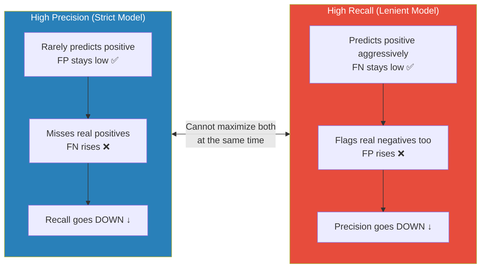

---

## 8.4 F1 Score

```
F1 = (2 × Precision × Recall) / (Precision + Recall)
```

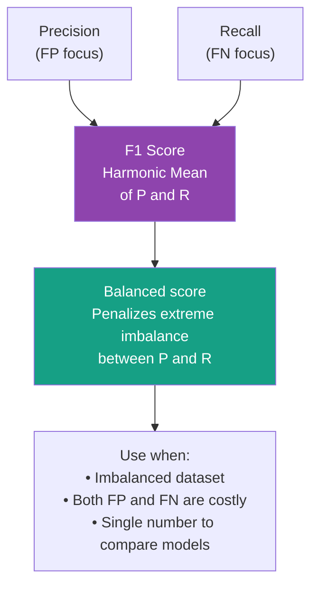

**Why harmonic mean, not arithmetic?**

| P | R | Arithmetic mean | F1 (Harmonic) | Verdict |
|---|---|----------------|---------------|---------|
| 1.0 | 0.01 | 0.505 ← misleading | **0.02** ← honest | Model is nearly useless |
| 0.8 | 0.8 | 0.80 | **0.80** | Genuinely good |

---

## 8.5 Accuracy

```
Accuracy = (TP + TN) / (TP + TN + FP + FN)
```

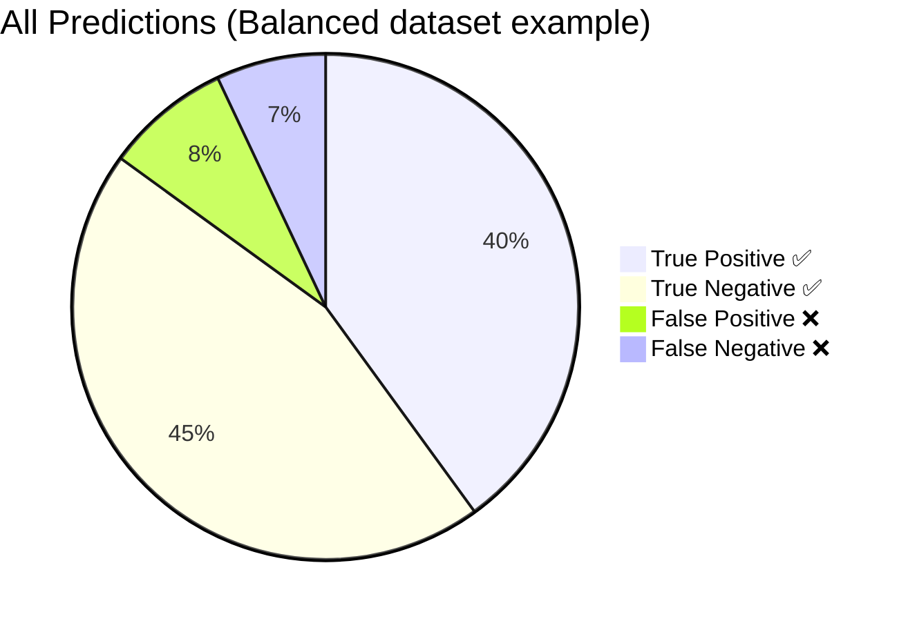

> Accuracy = (40+45)/(40+45+8+7) = 85/100 = **85%**

**The classic pitfall:**

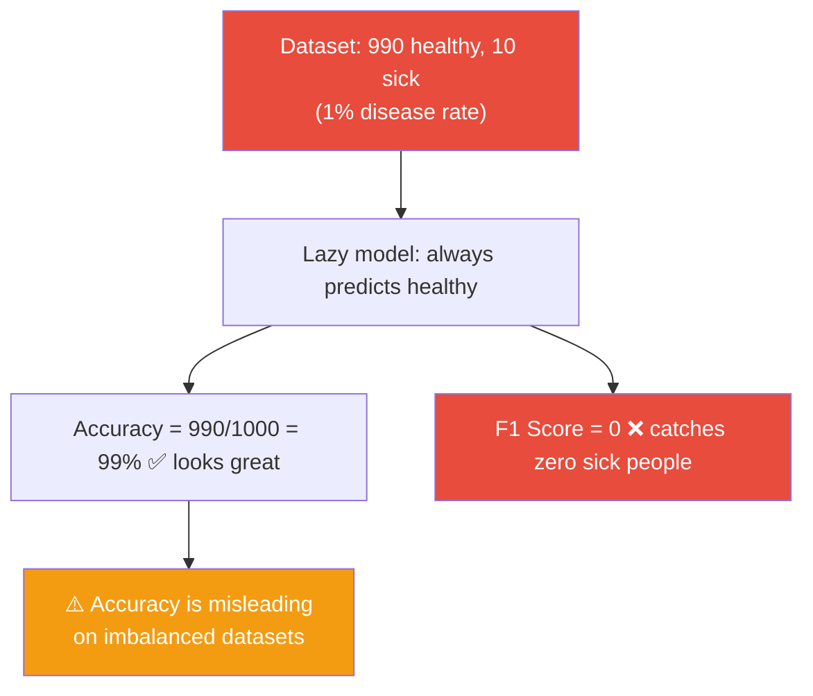

---

## 8.6 Sensitivity & Specificity

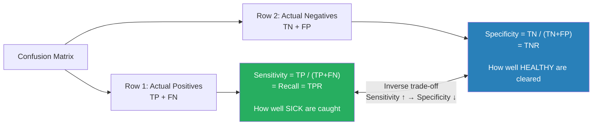

**Medical framing:**

| Metric | Question | Example |
|--------|---------|---------|
| Sensitivity | "Of 100 sick people, how many did the test correctly flag?" | COVID RT-PCR |
| Specificity | "Of 100 healthy people, how many did the test correctly clear?" | COVID RT-PCR |

---

## 8.7 FPR & FNR

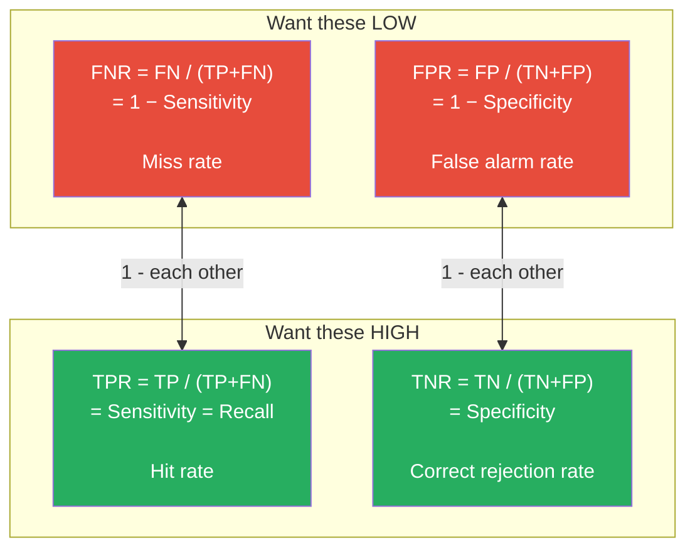

---

## 9. ROC Curve & AUC

### What the ROC curve is


### Classifier Quality on ROC

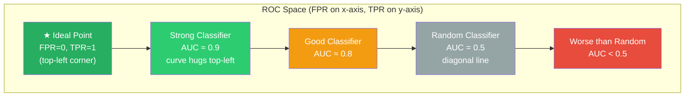

### AUC & Class Overlap

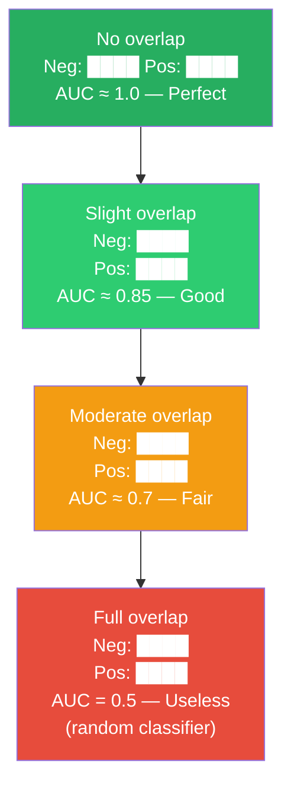

### AUC Quality Table

| AUC | Quality |
|-----|---------|
| 1.0 | Perfect (theoretical) |
| 0.9 – 1.0 | Excellent |
| 0.8 – 0.9 | Good |
| 0.7 – 0.8 | Fair |
| 0.5 | Useless — random |

---

## 10. Complete Cheat Sheet

| Metric | Formula | High value means | Use when |
|--------|---------|-----------------|----------|
| **Precision** | TP / (TP+FP) | Few false alarms | FP is costly |
| **Recall** | TP / (TP+FN) | Few real positives missed | FN is costly |
| **F1 Score** | 2PR / (P+R) | Good P–R balance | Imbalanced data |
| **Accuracy** | (TP+TN) / Total | Overall correctness | Balanced data |
| **Sensitivity** | TP / (TP+FN) | Catches sick people well | Medical +ve diagnosis |
| **Specificity** | TN / (TN+FP) | Clears healthy people well | Medical −ve clearance |
| **FPR** | FP / (TN+FP) | *(want LOW)* | ROC x-axis |
| **FNR** | FN / (TP+FN) | *(want LOW)* | Safety systems |
| **AUC-ROC** | Area under ROC | Better class separation | Comparing classifiers |

---

## 11. Metric Selection — Decision Flowchart

```mermaid
flowchart TD
    START["What kind of evaluation\ndo you need?"] --> Q1{"Dataset\nbalanced?"}

    Q1 -->|Yes| ACC["✅ Use ACCURACY\n(TP+TN)/Total"]
    Q1 -->|No / Skewed| Q2{"Which error is\nmore costly?"}

    Q2 -->|False Positives| PREC["✅ Maximize PRECISION\nTP/(TP+FP)\n\nSpam filter\nLegal conviction\nUnnecessary surgery"]
    Q2 -->|False Negatives| REC["✅ Maximize RECALL\nTP/(TP+FN)\n\nDisease detection\nFraud detection\nSafety systems"]
    Q2 -->|Both equally costly| F1["✅ Use F1 SCORE\n2PR/(P+R)\n\nRecommendation systems\nCancer screening"]

    F1 --> TUNE{"Need to tune\ndecision threshold?"}
    REC --> TUNE
    PREC --> TUNE
    TUNE -->|Yes| ROC["✅ Plot ROC Curve\nOptimize AUC\nPick threshold\nfrom TPR vs FPR tradeoff"]
    TUNE -->|No| DONE["Report chosen metric"]

    style START fill:#2980B9,color:#fff
    style ACC fill:#27AE60,color:#fff
    style PREC fill:#8E44AD,color:#fff
    style REC fill:#D35400,color:#fff
    style F1 fill:#16A085,color:#fff
    style ROC fill:#C0392B,color:#fff
```

---

## 12. Real-World Application Matrix

| Domain | Positive Class | FP consequence | FN consequence | Best Metric |
|--------|---------------|----------------|----------------|------------|
| Email spam | Spam | Legit email blocked | Spam in inbox | Precision |
| COVID test | Infected | Healthy quarantined | Infected walks free | Recall + F1 |
| Cancer screening | Malignant | Unnecessary biopsy | Cancer missed | Recall |
| Fraud detection | Fraud | Transaction declined | Fraud approved | Recall |
| Legal conviction | Guilty | Innocent jailed | Guilty goes free | Precision |
| Factory fault | Equipment fault | Unnecessary shutdown | Fault undetected | Recall |
| Recommendation | Relevant item | Irrelevant shown | Relevant missed | F1 Score |

---

## 13. Key Identities

```
Sensitivity  =  Recall  =  TPR  =  1 − FNR
Specificity  =  TNR          =  1 − FPR

Precision ↑  →  Recall ↓            (strict vs lenient — inverse)
Sensitivity ↑  →  Specificity ↓     (same trade-off, clinical vocabulary)

F1 Score  =  harmonic mean of Precision and Recall
AUC-ROC   =  integral of TPR vs FPR across all thresholds
```

---

*Next: Classification algorithms — Decision Trees, Naive Bayes, SVM — and hyperparameter tuning to shift these metrics in the desired direction.*
