# ML Lecture Notes — Similarity, Distance & Evaluation Metrics
### Complete Study Guide with Diagrams and Worked Examples

---

## Table of Contents
1. [Types of Data](#1-types-of-data)
2. [What is Similarity?](#2-what-is-similarity)
3. [Properties of a Distance Metric](#3-properties-of-a-distance-metric)
4. [Euclidean Distance](#4-euclidean-distance)
5. [Minkowski Distance Family](#5-minkowski-distance-family)
6. [Distance Matrix](#6-distance-matrix)
7. [Binary Vectors — SMC & Jaccard](#7-binary-vector-similarity)
8. [Cosine Similarity](#8-cosine-similarity)
9. [Confusion Matrix](#9-confusion-matrix)
10. [Precision](#10-precision)
11. [Recall](#11-recall)
12. [Precision vs Recall — The Trade-off](#12-precisionrecall-trade-off)
13. [F1 Score](#13-f1-score)
14. [Accuracy](#14-accuracy)
15. [Sensitivity & Specificity](#15-sensitivity--specificity)
16. [FPR & FNR](#16-fpr--fnr)
17. [ROC Curve & AUC](#17-roc-curve--auc)
18. [Quick Reference Cheat Sheet](#18-quick-reference-cheat-sheet)

---

## 1. Types of Data

Before we measure similarity between data points, we must understand **what kind of data** we are dealing with — because different data types require different similarity measures.

### 1.1 Big Picture

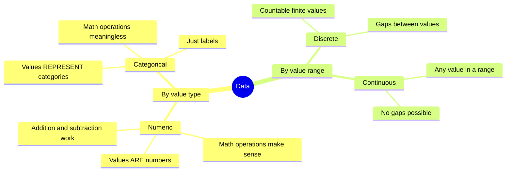

---

### 1.2 Numeric Data

**Numeric data** is data where the value itself is a meaningful number — you can add it, subtract it, compare it, and the result makes sense.

**Examples:**
- Temperature: 30°C is hotter than 20°C by 10°C — meaningful
- Height: 6 feet is taller than 5 feet by 1 foot — meaningful
- Weight: 80 kg is 10 kg heavier than 70 kg — meaningful

---

### 1.3 Categorical Data

**Categorical data** represents categories or labels. Even if stored as numbers, the numbers do **not** behave like numbers.

**Examples:**

| Attribute | Value | Why it is categorical |
|-----------|-------|----------------------|
| Gender | 0 = Male, 1 = Female | 0 + 1 = 1 has no meaning |
| PIN code | 400001 | 400001 + 110001 is meaningless |
| ZIP code | 10001 | Arithmetic on it makes no sense |
| Voltage range | 0 = (0-5V), 1 = (5-10V) | Just labels for ranges |

> **Real example from lecture:** If voltage ≤ 5V → label it 0. If voltage > 5V → label it 1.
> The 0 and 1 here are just category labels, not real numbers.

---

### 1.4 Discrete vs Continuous

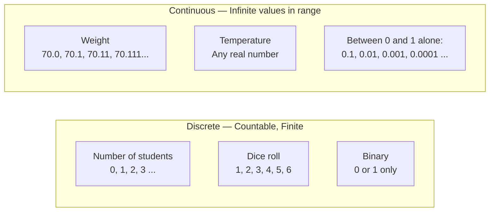

> **Key insight:** Between 0 and 1, there are infinitely many continuous values. You can always find a number between any two numbers. That is what makes it continuous.

---

## 2. What is Similarity?

**Similarity** (also called *proximity*) measures **how alike** two data objects are.

Think of it this way:

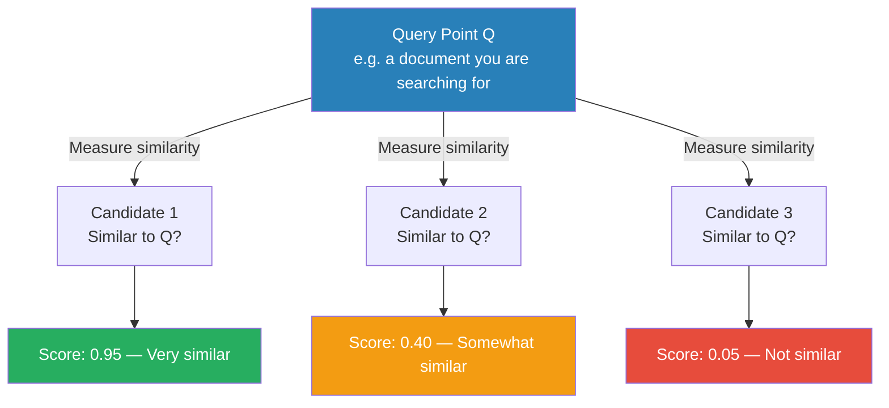

### Why do we need it?

**Grouping / Clustering:**
- You have 10,000 documents. Reading each one is impossible.
- Instead: compute similarity between all pairs → group similar ones together → now you have 50 groups, much easier to navigate.

**Recommendation Systems:**
- Find users similar to you → recommend what they liked.

**Search Engines:**
- Given a query, find the most similar documents in the database.

---

## 3. Properties of a Distance Metric

Not every function can be used as a distance measure. For a function `D(P, Q)` to qualify as a **valid metric**, it must satisfy **all four** properties:

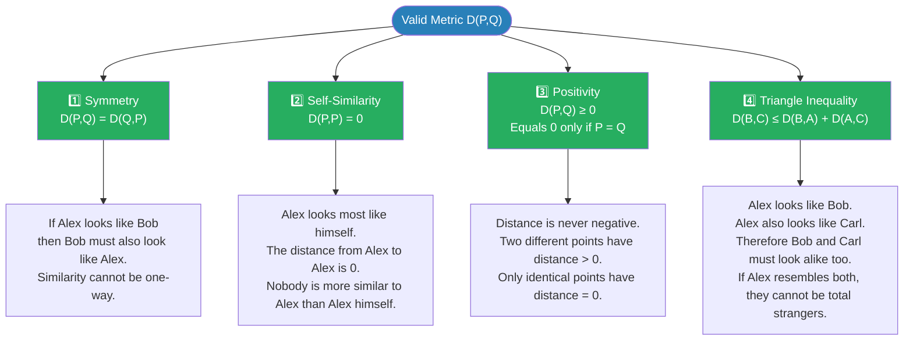

### Triangle Inequality — Visual

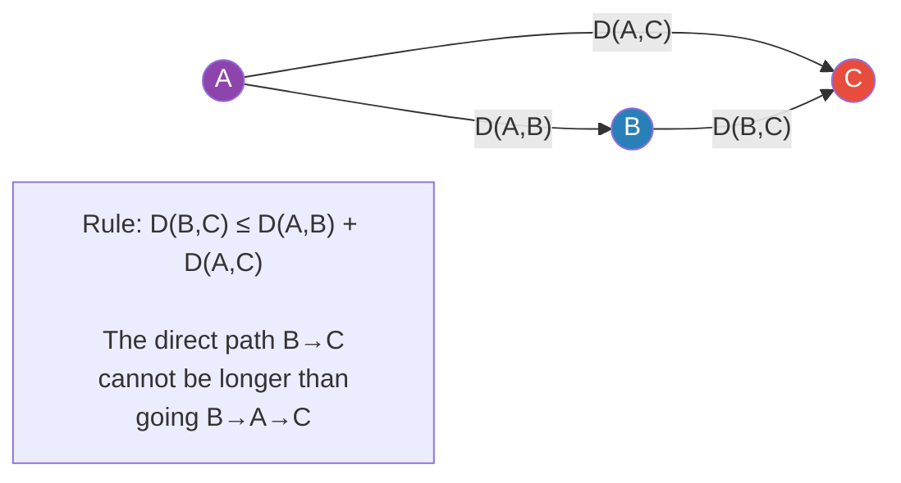

> Think of it like roads. The direct road from B to C cannot be longer than taking a detour through A.

---

## 4. Euclidean Distance

### What is it?

**Euclidean distance** is the **straight-line** distance between two points — exactly what a ruler would measure.

It was proposed by the ancient Greek mathematician **Euclid**.

### Formula

```
d(P, Q) = √[ (P₁−Q₁)² + (P₂−Q₂)² + ... + (Pₙ−Qₙ)² ]
         = √[ Σ (Pₖ − Qₖ)² ]  for k = 1 to n
```

**In plain English:**
1. For each attribute (dimension), find the difference between P and Q
2. Square each difference (removes negatives, amplifies big differences)
3. Add all the squared differences
4. Take the square root

### 2D Example — Step by Step

Points: P = (0, 2) and Q = (2, 0)

```
Step 1: Difference in X → 0 − 2 = −2
Step 2: Difference in Y → 2 − 0 = +2
Step 3: Square both    → (−2)² = 4,  (+2)² = 4
Step 4: Add            → 4 + 4 = 8
Step 5: Square root    → √8 = 2√2 ≈ 2.83
```

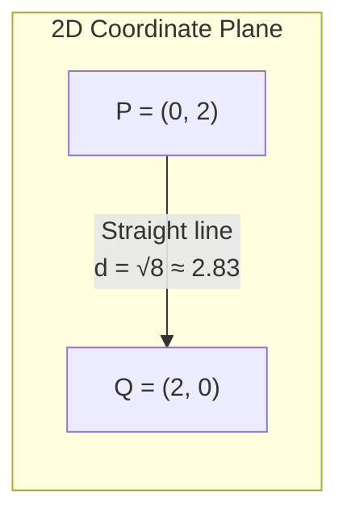

### 3D Example

Points: P = (1, 2, 3) and Q = (4, 6, 3)

```
d = √[ (1−4)² + (2−6)² + (3−3)² ]
  = √[ (−3)² + (−4)² + (0)² ]
  = √[ 9 + 16 + 0 ]
  = √25
  = 5
```

---

## 5. Minkowski Distance Family

Euclidean distance is actually a **special case** of a more general formula called the **Minkowski Distance**.

### General Formula

```
d(P, Q) = ( Σ |Pₖ − Qₖ|^r )^(1/r)
```

The **r** value controls which distance measure you get:

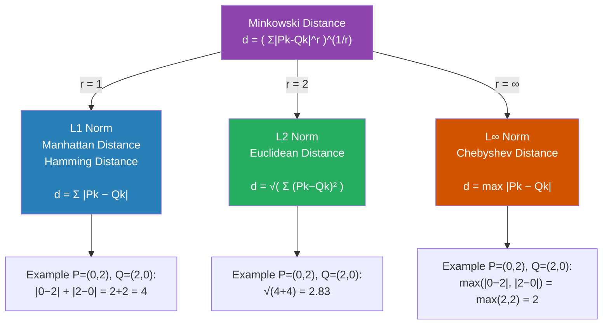

---

### Manhattan Distance (L1) — Deep Explanation

Imagine you are in a city where you can only move along a grid of streets — no diagonal cuts allowed.

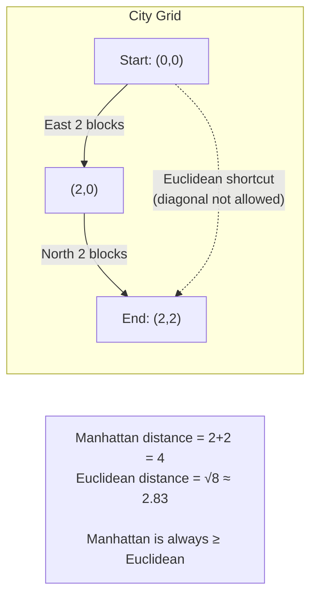

**Why it is called Manhattan distance:**
Manhattan (New York) has a strict grid layout. To get from point A to B, you walk along blocks — never diagonally. The total blocks walked = Manhattan distance.

**Why it is called Hamming distance:**
For binary strings, the Hamming distance counts the number of positions where the two strings differ.

```
P = 1 0 1 1 0
Q = 1 1 1 0 0
      ↑   ↑
   position 2 and 4 differ → Hamming distance = 2
```

---

### Same Example, All Three Norms

Points: P = (0, 2), Q = (2, 0)

| Norm | Formula applied | Result |
|------|----------------|--------|
| L1 (Manhattan) | \|0−2\| + \|2−0\| = 2+2 | **4** |
| L2 (Euclidean) | √((0−2)² + (2−0)²) = √8 | **2.83** |
| L∞ (Chebyshev) | max(\|0−2\|, \|2−0\|) = max(2,2) | **2** |

> L∞ is always the smallest, L1 is always the largest, L2 is in between.

---

## 6. Distance Matrix

### What is it?

When you have **N data points**, you want to know the distance between every pair. The result is stored in an **N × N matrix** called the **Distance Matrix**.

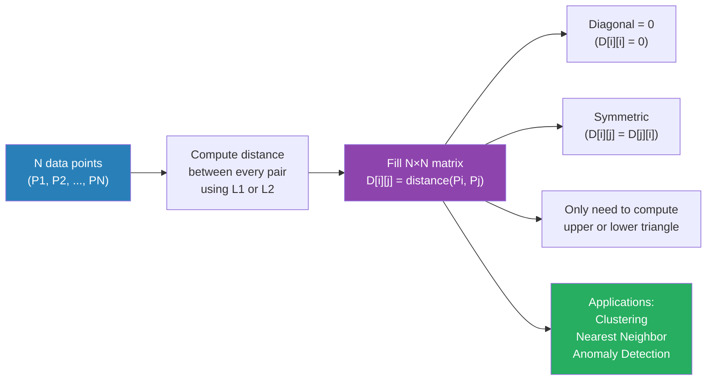

### Worked Example — Step by Step

Given 4 points:

| Point | X | Y |
|-------|---|---|
| P1 | 0 | 2 |
| P2 | 2 | 0 |
| P3 | 3 | 1 |
| P4 | 5 | 1 |

**Computing Euclidean distances one by one:**

```
d(P1, P2) = √[(0−2)² + (2−0)²] = √[4+4]   = √8   ≈ 2.83
d(P1, P3) = √[(0−3)² + (2−1)²] = √[9+1]   = √10  ≈ 3.16
d(P1, P4) = √[(0−5)² + (2−1)²] = √[25+1]  = √26  ≈ 5.10
d(P2, P3) = √[(2−3)² + (0−1)²] = √[1+1]   = √2   ≈ 1.41  ← SMALLEST
d(P2, P4) = √[(2−5)² + (0−1)²] = √[9+1]   = √10  ≈ 3.16
d(P3, P4) = √[(3−5)² + (1−1)²] = √[4+0]   = √4   = 2.00
```

**Final Euclidean Distance Matrix:**

|    | P1 | P2 | P3 | P4 |
|----|-----|-----|-----|-----|
| **P1** | 0 | 2.83 | 3.16 | 5.10 |
| **P2** | 2.83 | 0 | **1.41** | 3.16 |
| **P3** | 3.16 | 1.41 | 0 | 2.00 |
| **P4** | 5.10 | 3.16 | 2.00 | 0 |

> **Conclusion:** P2 and P3 are the closest pair (distance ≈ 1.41). They would be grouped together first in a clustering algorithm.

**Manhattan Distance Matrix (for same points):**

|    | P1 | P2 | P3 | P4 |
|----|----|----|----|-----|
| **P1** | 0 | 4 | 4 | 6 |
| **P2** | 4 | 0 | **2** | 4 |
| **P3** | 4 | 2 | 0 | 2 |
| **P4** | 6 | 4 | 2 | 0 |

```
d(P1,P2) Manhattan = |0−2| + |2−0| = 2+2 = 4
d(P2,P3) Manhattan = |2−3| + |0−1| = 1+1 = 2  ← SMALLEST here too
```

---

## 7. Binary Vector Similarity

### What is a Binary Vector?

A binary vector is a sequence of 0s and 1s where each position represents whether an attribute is **present (1)** or **absent (0)**.

**Real example:** A shop with 10 items. Customer P's purchase history:

```
Item:    1  2  3  4  5  6  7  8  9  10
P:       1  0  0  1  0  0  1  0  0  0
                                        → P bought items 1, 4, 7
```

### The Core Problem with Binary Similarity

If a shop has 100 items and a customer buys only 5:
- 5 positions are 1
- 95 positions are 0

Now compare two customers P and Q who bought **completely different** items (no overlap):

```
Item:    1  2  3  4  5  6  7 ... 100
P:       1  1  1  1  1  0  0 ... 0     ← bought items 1-5
Q:       0  0  0  0  0  1  1 ... 0     ← bought items 6-10
```

Both P and Q have 90+ zeros in common (the items neither bought).
If we naively count 0-0 as "match", the similarity looks extremely high — but they have **nothing in common** in terms of actual purchases!

This is the fundamental problem that leads to two different measures:

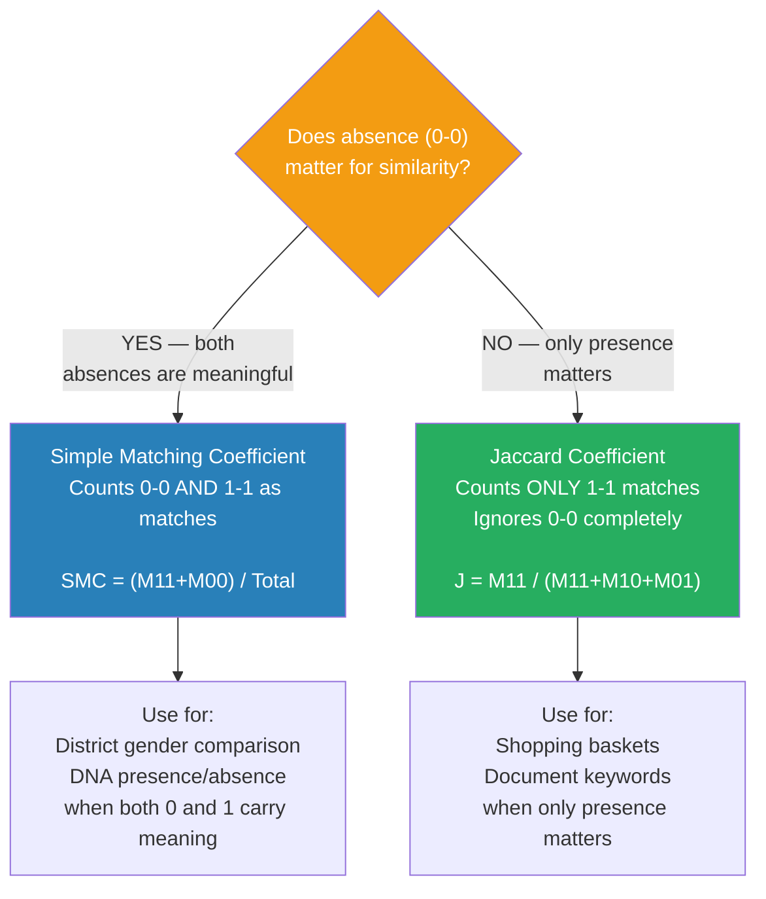

### Match Types Explained

For two binary vectors P and Q of length n, every position falls into one of four categories:

| Symbol | P value | Q value | Name | Meaning |
|--------|---------|---------|------|---------|
| **M₁₁** | 1 | 1 | Both present | Both bought the item |
| **M₀₀** | 0 | 0 | Both absent | Neither bought the item |
| **M₁₀** | 1 | 0 | Only P | P bought it, Q did not |
| **M₀₁** | 0 | 1 | Only Q | Q bought it, P did not |

Note: M₁₁ + M₀₀ + M₁₀ + M₀₁ = n (total attributes)

---

### Simple Matching Coefficient (SMC)

```
SMC = (M₁₁ + M₀₀) / (M₁₁ + M₀₀ + M₁₀ + M₀₁)
    = (matches) / (total positions)
```

**Use when:** Both 0-0 and 1-1 matches are equally meaningful.

**Example:** Comparing districts P and Q on majority gender (0=male majority, 1=female majority)

```
District: 1  2  3  4  5  6  7  8  9  10
P:        1  0  1  0  0  1  0  0  1  0
Q:        1  0  0  0  0  1  0  0  0  1
```

Here, a 0-0 match (both districts have male majority) IS meaningful — they truly share a characteristic.

---

### Jaccard Coefficient

```
J = M₁₁ / (M₁₁ + M₁₀ + M₀₁)
```

**Use when:** Absence (0) is not a shared property — it just means "not applicable".

**Shopping example:** If neither P nor Q bought a motorcycle helmet, that tells us nothing about how similar their shopping preferences are. We only care about what they **did** buy.

---

### Full Worked Example — SMC vs Jaccard

```
P: 1  0  0  1  0  0  0  0  0  0
Q: 0  0  1  1  0  0  0  0  0  0
```

Go position by position:

| Position | P | Q | Match Type |
|----------|---|---|-----------|
| 1 | 1 | 0 | M₁₀ |
| 2 | 0 | 0 | M₀₀ ✓ |
| 3 | 0 | 1 | M₀₁ |
| 4 | 1 | 1 | M₁₁ ✓ |
| 5 | 0 | 0 | M₀₀ ✓ |
| 6 | 0 | 0 | M₀₀ ✓ |
| 7 | 0 | 0 | M₀₀ ✓ |
| 8 | 0 | 0 | M₀₀ ✓ |
| 9 | 0 | 0 | M₀₀ ✓ |
| 10 | 0 | 0 | M₀₀ ✓ |

**Counts:**
- M₁₁ = 1 (position 4: both bought item 4)
- M₀₀ = 7 (positions 2,5,6,7,8,9,10: neither bought)
- M₁₀ = 1 (position 1: only P bought)
- M₀₁ = 1 (position 3: only Q bought)

**SMC calculation:**
```
SMC = (1 + 7) / (1 + 7 + 1 + 1) = 8/10 = 0.80 = 80%
```

**Jaccard calculation:**
```
J = 1 / (1 + 1 + 1) = 1/3 = 0.33 = 33%
```

**Which is right for shopping?**
- SMC says 80% similar — because 7 items were not bought by either
- Jaccard says 33% — based only on what they actually purchased
- **Jaccard is correct** for this use case. The 7 "not bought" items are irrelevant.

---

## 8. Cosine Similarity

### The Core Idea

Instead of measuring the **distance** between two vectors, cosine similarity measures the **angle** between them.

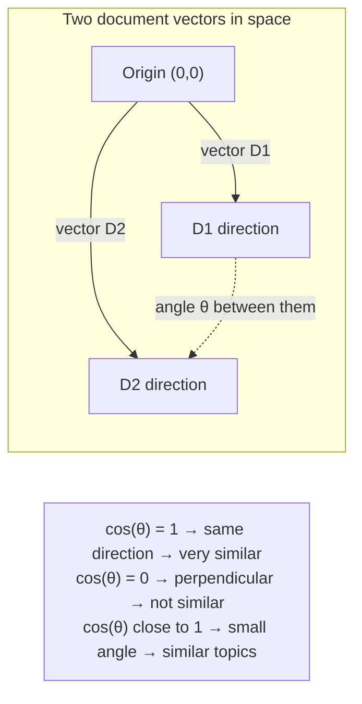

**Why not just use Euclidean distance for documents?**

Imagine two documents about sports:
- D1 is a short article: mentions "ball" 3 times
- D2 is a long article: mentions "ball" 30 times

They are about the same topic, but Euclidean distance would say they are very far apart (due to scale). Cosine similarity ignores length — it only cares about **direction** (topic distribution).

### Formula

```
cos(θ) = (D1 · D2) / (|D1| × |D2|)

where:
  D1 · D2 = dot product = Σ (D1ₖ × D2ₖ)
  |D1|    = magnitude = √(Σ D1ₖ²)
  |D2|    = magnitude = √(Σ D2ₖ²)
```

### Step-by-Step Worked Example

Two documents represented by word frequencies:

|    | team | coach | play | ball | score |
|----|------|-------|------|------|-------|
| **D1** | 3 | 2 | 2 | 5 | 1 |
| **D2** | 1 | 0 | 2 | 3 | 2 |

**Step 1: Dot product (multiply matching positions, then sum)**

```
D1 · D2 = (3×1) + (2×0) + (2×2) + (5×3) + (1×2)
        = 3     +  0    +  4    + 15    +  2
        = 24
```

**Step 2: Magnitude of D1**

```
|D1| = √(3² + 2² + 2² + 5² + 1²)
     = √(9 + 4 + 4 + 25 + 1)
     = √43
     ≈ 6.56
```

**Step 3: Magnitude of D2**

```
|D2| = √(1² + 0² + 2² + 3² + 2²)
     = √(1 + 0 + 4 + 9 + 4)
     = √18
     ≈ 4.24
```

**Step 4: Cosine similarity**

```
cos(θ) = 24 / (6.56 × 4.24) = 24 / 27.82 ≈ 0.86
```

**Interpretation:** 0.86 is close to 1 → D1 and D2 are very similar in topic. Both heavily use words like "ball", "team", "play" → both are likely sports documents.

---

## 9. Confusion Matrix

### What Problem Does it Solve?

When a model classifies data into **Positive** or **Negative**, there are 4 possible outcomes. The confusion matrix tracks all four.

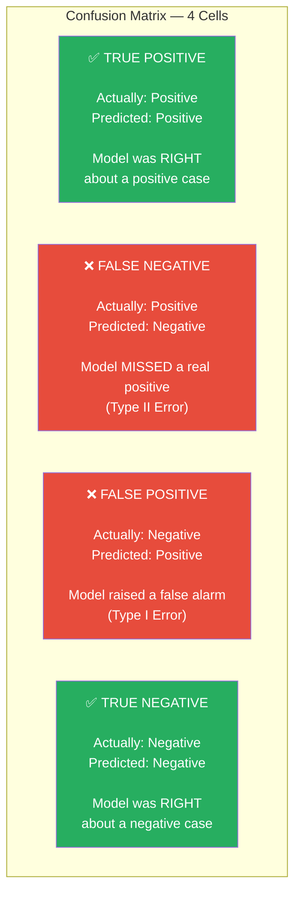

### COVID Test — Concrete Numbers

Say we tested 200 people. 50 are actually infected, 150 are healthy.

|  | Predicted: Infected | Predicted: Healthy | Row Total |
|--|---------------------|--------------------|-----------|
| **Actually: Infected (50)** | TP = 45 | FN = 5 | 50 |
| **Actually: Healthy (150)** | FP = 10 | TN = 140 | 150 |
| **Column Total** | 55 | 145 | 200 |

Reading this table:
- **TP = 45**: 45 infected people were correctly identified as infected ✅
- **FN = 5**: 5 infected people were wrongly declared healthy ❌ (they went home and could spread virus)
- **FP = 10**: 10 healthy people were wrongly declared infected ❌ (they were quarantined for no reason)
- **TN = 140**: 140 healthy people were correctly cleared ✅

---

## 10. Precision

### Definition

**Precision** answers: *"Of all the cases the model predicted as positive, what fraction were actually positive?"*

```
Precision = TP / (TP + FP)
          = True Positives / All Predicted Positives
```

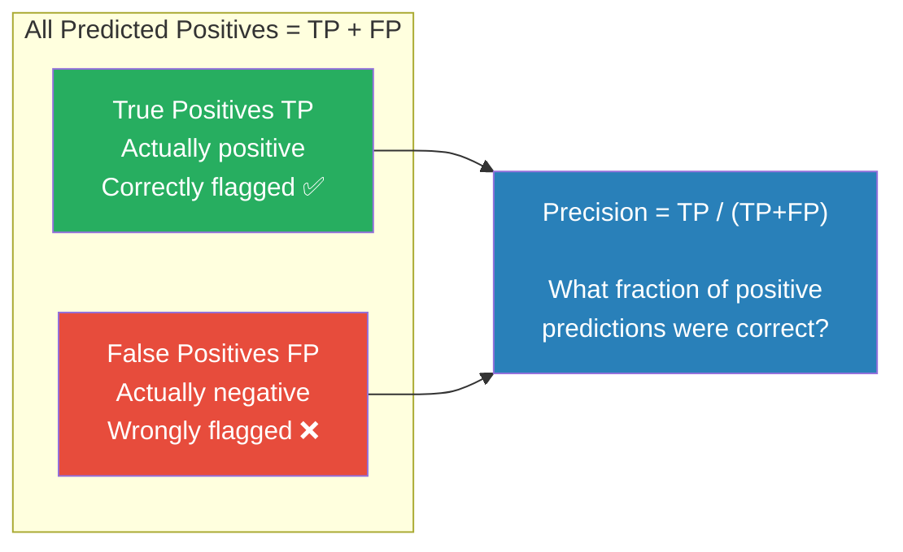

### Using our COVID numbers

```
Precision = TP / (TP + FP) = 45 / (45 + 10) = 45/55 ≈ 0.818 = 81.8%
```

This means: of the 55 people the model flagged as infected, 81.8% were actually infected.

### When precision is critical

**Spam Filter:**
- FP = a legitimate email classified as spam
- Consequence: user never sees an important email (job offer, bank notification)
- A model with **high FP rate = low precision** is dangerous here
- We want **high precision** to ensure spam folder contains only actual spam

**High Precision → Low FP rate → model is conservative/strict about calling things positive**

---

## 11. Recall

### Definition

**Recall** answers: *"Of all the cases that were actually positive, what fraction did the model catch?"*

```
Recall = TP / (TP + FN)
       = True Positives / All Actual Positives
```

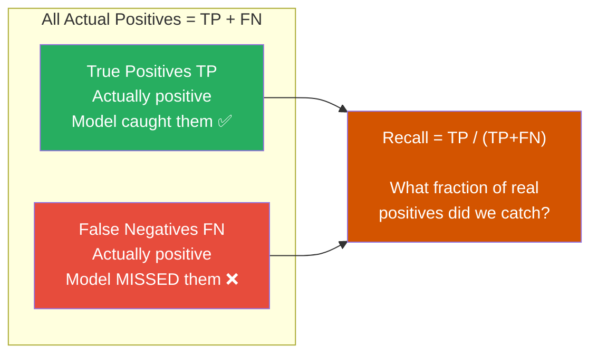

### Using our COVID numbers

```
Recall = TP / (TP + FN) = 45 / (45 + 5) = 45/50 = 0.90 = 90%
```

This means: of the 50 truly infected people, the model correctly caught 90% of them.

### When recall is critical

**COVID / Cancer detection:**
- FN = a sick person declared healthy
- Consequence: they receive no treatment, they infect others
- We want **high recall** — we must catch as many real cases as possible, even at the cost of some false alarms

**High Recall → Low FN rate → model is lenient/aggressive about calling things positive**

---

## 12. Precision/Recall Trade-off

### Why They Cannot Both Be High

This is one of the most important concepts in ML evaluation.

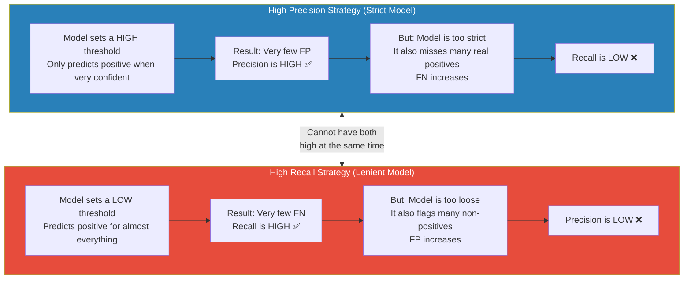

### Real-World Illustration

**Scenario:** COVID testing machine. You can set the sensitivity dial.

```
Dial turned to MAX SENSITIVITY (high recall):
  → Declares almost everyone as infected
  → Catches all 50 infected people (FN=0, Recall=100%)
  → But also flags 100 healthy people as infected (FP=100, Precision=33%)

Dial turned to MAX SPECIFICITY (high precision):
  → Only declares someone infected if absolutely certain
  → FP = 0, Precision = 100%
  → But misses 30 infected people (FN=30, Recall=40%)

Balanced setting:
  → Some FP and some FN, but both at acceptable levels
  → Precision ≈ 80%, Recall ≈ 90%
```

> **Key insight from lecture:** If you want precision high, the model becomes conservative.
> If you want recall high, the model becomes lenient.
> A model cannot be conservative and lenient at the same time.

---

## 13. F1 Score

### Why We Need It

Since precision and recall pull in opposite directions, we need a **single metric** that captures both. That is the F1 Score.

### Formula

```
F1 = 2 × (Precision × Recall) / (Precision + Recall)
   = 2 / (1/Precision + 1/Recall)
```

This is the **harmonic mean** of Precision and Recall.

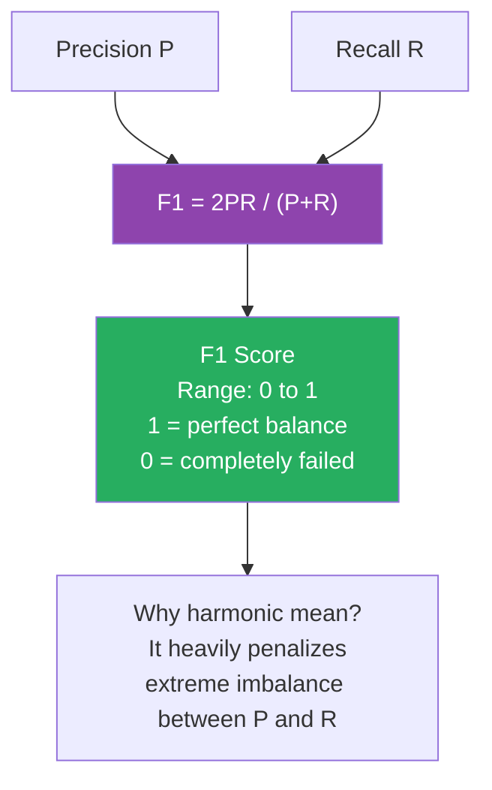

### Why Harmonic Mean (not arithmetic)?

| Precision | Recall | Arithmetic Average | F1 (Harmonic) | Verdict |
|-----------|--------|-------------------|---------------|---------|
| 1.0 | 0.01 | **0.505** (looks good!) | **0.020** (honest) | Model is nearly useless |
| 0.9 | 0.8 | 0.85 | **0.847** | Genuinely good |
| 0.5 | 0.5 | 0.50 | **0.500** | Moderate |

> Harmonic mean punishes extreme values. If either Precision or Recall is very low, F1 will be low too — no matter how high the other is.

### Using our COVID numbers

```
Precision = 0.818
Recall    = 0.90

F1 = 2 × (0.818 × 0.90) / (0.818 + 0.90)
   = 2 × 0.736 / 1.718
   = 1.472 / 1.718
   ≈ 0.857
```

F1 = 0.857 → good balanced performance.

### When to Use F1

- **Imbalanced dataset** (one class is much rarer than the other)
- When **both FP and FN have significant costs**
- When you need **one number** to compare two models

---

## 14. Accuracy

### Definition

```
Accuracy = (TP + TN) / (TP + TN + FP + FN)
         = Correct predictions / All predictions
```

Accuracy is the simplest metric — what percentage of **all** predictions were correct.

### Using our COVID numbers

```
Accuracy = (45 + 140) / (45 + 140 + 10 + 5)
         = 185 / 200
         = 0.925 = 92.5%
```

The model is correct 92.5% of the time.

### The Critical Pitfall — Class Imbalance

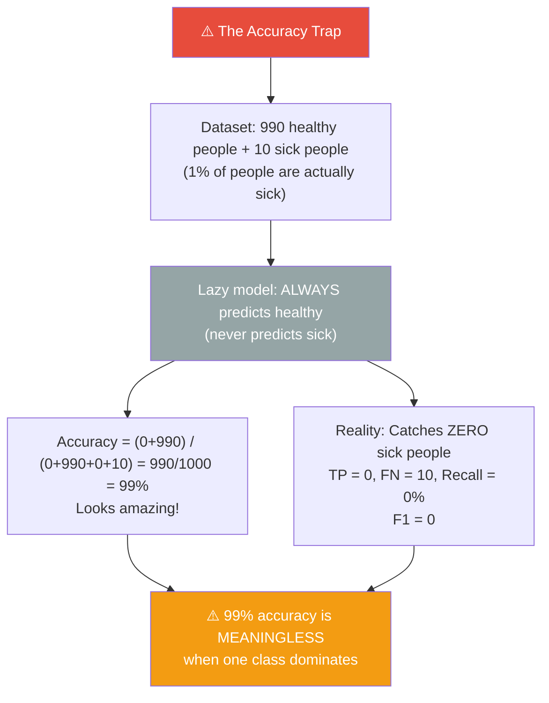

### Accuracy vs F1 — When to Use Which

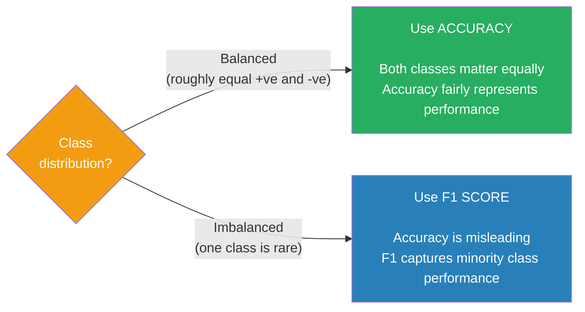

---

## 15. Sensitivity & Specificity

These are the clinical/medical vocabulary equivalents of recall and precision-for-negatives.

### Sensitivity (= Recall = TPR)

```
Sensitivity = TP / (TP + FN)
```

**"Of all sick people, what fraction did the test correctly identify as sick?"**

- Same formula as Recall
- High sensitivity → low FN → model rarely misses real positives

### Specificity (= TNR)

```
Specificity = TN / (TN + FP)
```

**"Of all healthy people, what fraction did the test correctly identify as healthy?"**

- Different from precision — focuses on the **negative class**
- High specificity → low FP → model rarely misses real negatives

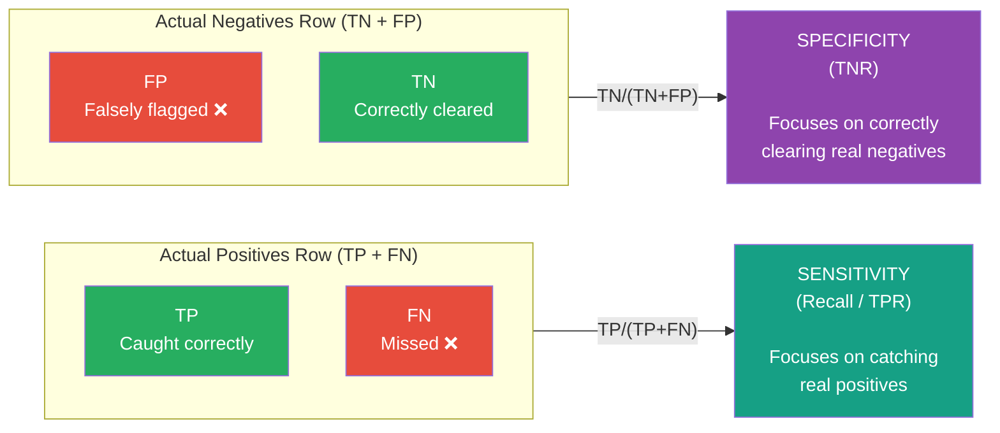

### Using our COVID numbers

```
Sensitivity = TP / (TP+FN) = 45/(45+5)   = 45/50  = 0.90 = 90%
Specificity = TN / (TN+FP) = 140/(140+10) = 140/150 = 0.93 = 93%
```

**Interpretation:**
- The test correctly identifies **90% of infected people** as infected
- The test correctly identifies **93% of healthy people** as healthy

### The Sensitivity–Specificity Trade-off

Exactly like Precision–Recall, these two are inversely related:

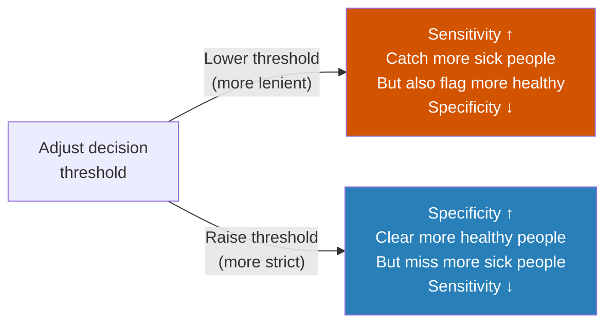

---

## 16. FPR & FNR

These are the **rates** (complement of specificity and sensitivity).

```
FPR (False Positive Rate) = FP / (TN + FP)  =  1 − Specificity
FNR (False Negative Rate) = FN / (TP + FN)  =  1 − Sensitivity
```

```mermaid
graph TD
    subgraph WANT_HIGH["Want HIGH ✅"]
        TPR5["TPR = Sensitivity = Recall
TP / (TP+FN)

Hit rate"]:::green
        TNR5["TNR = Specificity
TN / (TN+FP)

Correct rejection rate"]:::green
    end

    subgraph WANT_LOW["Want LOW ✅"]
        FPR5["FPR = 1 − Specificity
FP / (TN+FP)

False alarm rate"]:::red
        FNR5["FNR = 1 − Sensitivity
FN / (TP+FN)

Miss rate"]:::red
    end

    TPR5 <-->|"1 minus"| FNR5
    TNR5 <-->|"1 minus"| FPR5

    classDef green fill:#27AE60,color:#fff
    classDef red fill:#E74C3C,color:#fff
```

### Using our COVID numbers

```
FPR = FP / (TN+FP) = 10 / (140+10) = 10/150 = 0.067 = 6.7%
FNR = FN / (TP+FN) = 5  / (45+5)   = 5/50   = 0.10  = 10%
```

**Interpretation:**
- 6.7% of healthy people were wrongly flagged (false alarm rate)
- 10% of infected people were missed (miss rate)

### Industry Example — Factory Alarm System

```mermaid
graph TD
    ALARM["Factory Fault Detection Alarm"]

    ALARM --> FPR_IMPACT["HIGH FPR (many false alarms):
→ Alarm fires when nothing is wrong
→ Workers keep stopping production
→ Massive financial loss
→ Workers start ignoring alarms (dangerous)"]:::red

    ALARM --> FNR_IMPACT["HIGH FNR (many misses):
→ Real equipment fault goes undetected
→ Machine breaks down
→ Safety incident
→ Even bigger financial loss"]:::red

    ALARM --> GOAL["GOAL:
FPR low AND FNR low
= TPR high AND TNR high
= Model is accurate in both directions"]:::green

    classDef red fill:#E74C3C,color:#fff
    classDef green fill:#27AE60,color:#fff
```

---

## 17. ROC Curve & AUC

### Background

**ROC** = Receiver Operating Characteristic

Coined in **1941** during World War II. Military radar operators needed to decide: "Is this blip on the radar an enemy plane or just noise?" They studied the trade-off between detecting real planes (TPR) and false alarms (FPR). They called it the "receiver operating characteristic" because they were the "receivers" studying the "operating characteristic" of their radar.

### What Does the ROC Curve Show?

The ROC curve shows **how TPR and FPR trade off** as you vary the decision threshold from 0 to 1.

```mermaid
flowchart LR
    TH["Decision Threshold
(varies from 0 to 1)"] --> BOTH["At each threshold value:
compute TPR and FPR"]
    BOTH --> PLOT["Plot the point (FPR, TPR)
on a 2D graph"]
    PLOT --> CURVE["Connect all points
= ROC Curve"]
    CURVE --> AUC["Measure area
under the curve = AUC"]

    style TH fill:#2980B9,color:#fff
    style AUC fill:#8E44AD,color:#fff
```

**As you lower the threshold (predict positive more aggressively):**
- TPR goes up (catch more real positives)
- FPR also goes up (more false alarms)
- The curve moves toward the top-right

### Classifier Quality on the ROC Graph

```mermaid
graph TD
    subgraph QUALITY["ROC Curve Quality (x=FPR, y=TPR)"]
        PERFECT["🏆 Perfect Classifier
FPR=0, TPR=1
Top-left corner
AUC = 1.0"]:::gold
        EXCEL["Excellent Classifier
AUC = 0.9-1.0
Curve hugs top-left"]:::green
        GOOD["Good Classifier
AUC = 0.8-0.9
Curve bows upward"]:::blue
        FAIR["Fair Classifier
AUC = 0.7-0.8"]:::orange
        RANDOM["Random Classifier
AUC = 0.5
Diagonal line
No better than coin flip"]:::gray
        WORSE["Worse than Random
AUC < 0.5
Below diagonal"]:::red
    end

    PERFECT --> EXCEL --> GOOD --> FAIR --> RANDOM --> WORSE

    classDef gold fill:#F1C40F,color:#000
    classDef green fill:#27AE60,color:#fff
    classDef blue fill:#2980B9,color:#fff
    classDef orange fill:#F39C12,color:#fff
    classDef gray fill:#95A5A6,color:#fff
    classDef red fill:#E74C3C,color:#fff
```

### Why Does AUC = 0.5 Mean Random?

If a classifier has AUC = 0.5 (diagonal line), it means:
- When TPR = 0.3, FPR = 0.3 → for every 3 real positives caught, 3 false alarms fired
- The classifier is no better than randomly guessing
- In a 2-class problem, even without any model, flipping a coin gives 50% accuracy
- **Such a classifier is completely useless** — we didn't need to build it

### AUC and Class Overlap — Visual

```mermaid
graph TD
    OV1["Case 1: Perfect Separation

Negatives: ████████
Positives:             ████████
No overlap at all

→ AUC ≈ 1.0 — Perfect"]:::green

    OV2["Case 2: Slight Overlap

Negatives: ████████
Positives:       ████████
Small overlap zone

→ AUC ≈ 0.85 — Good"]:::blue

    OV3["Case 3: Heavy Overlap

Negatives:  ████████
Positives: ████████
Large overlap zone

→ AUC ≈ 0.65 — Fair"]:::orange

    OV4["Case 4: Complete Overlap

Negatives: ████████
Positives: ████████  (identical)
Cannot be separated

→ AUC = 0.5 — Random"]:::red

    OV1 --> OV2 --> OV3 --> OV4

    classDef green fill:#27AE60,color:#fff
    classDef blue fill:#2980B9,color:#fff
    classDef orange fill:#F39C12,color:#fff
    classDef red fill:#E74C3C,color:#fff
```

> More overlap = more confusion between classes = lower AUC.

### AUC Quality Reference

| AUC Value | Quality Label | What it means |
|-----------|--------------|---------------|
| 1.0 | Perfect | Theoretical maximum, never achieved in practice |
| 0.9 – 1.0 | Excellent | Strong classifier, very good separation |
| 0.8 – 0.9 | Good | Solid classifier, acceptable performance |
| 0.7 – 0.8 | Fair | Usable but could be improved |
| 0.6 – 0.7 | Poor | Weak classifier |
| 0.5 | Random | Useless — no better than a coin flip |

---

## 18. Quick Reference Cheat Sheet

### All Formulas

| Metric | Formula | Focuses On |
|--------|---------|-----------|
| **Precision** | TP / (TP+FP) | Quality of positive predictions |
| **Recall** | TP / (TP+FN) | Coverage of actual positives |
| **F1 Score** | 2×P×R / (P+R) | Balance of Precision and Recall |
| **Accuracy** | (TP+TN) / Total | Overall correctness |
| **Sensitivity** | TP / (TP+FN) | Same as Recall (clinical name) |
| **Specificity** | TN / (TN+FP) | Coverage of actual negatives |
| **FPR** | FP / (TN+FP) | False alarm rate |
| **FNR** | FN / (TP+FN) | Miss rate |

### Key Identities

```
Sensitivity = Recall = TPR = 1 − FNR
Specificity = TNR         = 1 − FPR

Precision ↑  →  Recall ↓       (inverse trade-off)
Sensitivity ↑  →  Specificity ↓  (same trade-off)
```

### Metric Selection Guide

```mermaid
flowchart TD
    START(["Which metric should I use?"]):::blue

    START --> Q1{"Is the dataset
balanced?"}

    Q1 -->|"Yes — equal +ve and -ve"| ACC["✅ ACCURACY
(TP+TN)/Total

Simple and fair
when classes are balanced"]:::green

    Q1 -->|"No — one class is rare"| Q2{"Which error
is more costly?"}

    Q2 -->|"False Positives costly
(wrong accusations)"| PREC["✅ PRECISION
TP/(TP+FP)

Minimize false alarms

Examples:
Spam filter
Legal convictions
Unnecessary surgery"]:::purple

    Q2 -->|"False Negatives costly
(missing real cases)"| REC["✅ RECALL
TP/(TP+FN)

Minimize misses

Examples:
Disease detection
Fraud detection
Safety systems"]:::orange

    Q2 -->|"Both FP and FN
are costly"| F1["✅ F1 SCORE
2PR/(P+R)

Balance both

Examples:
Recommendation
Cancer screening
General NLP tasks"]:::teal

    F1 --> ROC["Also plot ROC Curve
to tune threshold
and measure AUC"]:::red
    REC --> ROC
    PREC --> ROC

    classDef blue fill:#2980B9,color:#fff
    classDef green fill:#27AE60,color:#fff
    classDef purple fill:#8E44AD,color:#fff
    classDef orange fill:#D35400,color:#fff
    classDef teal fill:#16A085,color:#fff
    classDef red fill:#C0392B,color:#fff
```

### Real-World Domain Examples

| Domain | Positive Class | FP consequence | FN consequence | Best Metric |
|--------|---------------|----------------|----------------|------------|
| Email spam filter | Spam email | Legit email blocked — user misses important mail | Spam reaches inbox — annoying but not critical | **Precision** |
| COVID / flu test | Infected patient | Healthy person quarantined — 14 days isolation for nothing | Infected person walks free — spreads to others | **Recall + F1** |
| Cancer screening | Malignant tumor | Unnecessary biopsy — painful and costly | Cancer missed — patient may die | **Recall** |
| Bank fraud detection | Fraudulent transaction | Customer card declined — inconvenience | Real fraud goes through — financial loss | **Recall** |
| Legal conviction | Guilty person | Innocent person imprisoned — serious injustice | Guilty person goes free | **Precision** |
| Factory fault detection | Equipment fault | Unnecessary production halt | Real fault undetected → breakdown/accident | **Recall** |
| Movie recommendation | Relevant movie | Irrelevant movie shown — minor annoyance | Good movie not shown — missed discovery | **F1 Score** |

---

*Next topic: Classification algorithms — Decision Trees, Naive Bayes, SVM — and how their hyperparameters can be tuned to push Precision, Recall, and F1 in the desired direction.*
